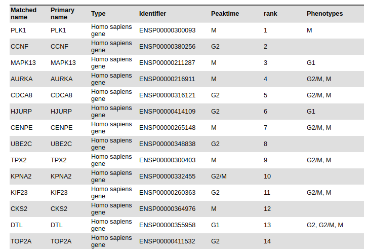

```{r setup, include=FALSE, warning=FALSE}
knitr::opts_chunk$set(echo = TRUE)
```

### License Info

This program is free software: you can redistribute it and/or modify it under 
the terms of the GNU General Public License as published by the Free Software 
Foundation, either version 3 of the License, or (at your option) any later 
version.

This program is distributed in the hope that it will be useful, but WITHOUT ANY 
WARRANTY; without even the implied warranty of MERCHANTABILITY or FITNESS FOR 
A PARTICULAR PURPOSE. See the GNU General Public License for more details.

Please check http://www.gnu.org/licenses/.

## Introduction

The present script deals with the RNAseq data from the study *"SARS-CoV-2 launches* 
*a unique transcriptional signature from in vitro, ex vivo, and in vivo systems"* 

<https://www.biorxiv.org/content/10.1101/2020.03.24.004655v1>

<https://www.ncbi.nlm.nih.gov/geo/query/acc.cgi?acc=GSE147507>

It uses a **Progeny** based approach to compute the activity of the different
cell cycles phases in the samples. In order to do so, we used the [cyclebase](https://cyclebase.org/CyclebaseSearch) database, which contains summarized 
information of genome-wide cell-cycle-related experiments. Our approach is 
applied to the four conditions under study. 

+ Human lung epithelial cells (NHBE): mock treated vs infected with SARS-CoV-2. 

+ A549 alveolar cancer cell line: mock treated vs infected with SARS-CoV-2. 

+ A549 cell line does not express ACE2, the receptor used by SARS-CoV-2 to 
penetrate into human cells. Therefore A549 were also transduced with ACE2 and 
then mock treated or infected with SARS-CoV-2

+ Calu-3 human lung epithelial cancer cell line: mock treated vs 
infected with SARS-CoV-2.

## Getting Started

We first load the required libraries. 

```{r, message=FALSE}
library(dplyr)
library(tidyr)
library(tibble)
library(progeny)
library(ggplot2)
```

## Prior Knowledge information about the cell cycle phase

From the [cyclebase](https://cyclebase.org/CyclebaseSearch) database, we 
downloaded the list of genes that show a periodic peak in a given cellular cycle
stage. The information looks as follows:

<br><br>

<br><br>

```{r}
periodicGenes <- 
    read.csv(file = "RawData/human_periodic.tsv", header = TRUE, 
        sep= "\t", stringsAsFactors = FALSE) %>%
    dplyr::filter(organism == "9606")  
    
GenesPhase <- read.csv(file = "RawData/human_periodic_cellphase.csv", 
    header = TRUE, sep = "\t", stringsAsFactors = FALSE)
```

We are now going to use this information to build a signature matrix. To do so,
we perform a -log10 transformation of the pvalues. In addition, we select
the top 35 genes (according to their pvalue) for each cell phase. We chose 35,
because one of the phases is only related to 36 significant genes. Proceeding 
this way, we start the analysis in the same conditions for all the phases.

```{r}
## Parameter to decide the number of significant genes per cell phase
top <- 35 # Because one phase has only 36 related genes. 

periodicGenes_HGNC <- periodicGenes %>% 
    dplyr::left_join(GenesPhase,  by = c("gene" = "Identifier")) %>%
    dplyr::select(Matched.name, periodicity_pvalue, Peaktime) %>% 
    dplyr::mutate(LogPvalue = -log10(periodicity_pvalue)) %>%
    dplyr::distinct(Matched.name, Peaktime,  .keep_all = TRUE) %>% 
    dplyr::group_by(Peaktime) %>% 
    dplyr::top_n(top, wt = LogPvalue) %>%
    dplyr::ungroup(Peaktime) %>%
    dplyr::select(-periodicity_pvalue) %>% 
    tidyr::spread(Peaktime, LogPvalue, fill=0) %>%
    data.frame(row.names = 1, check.names = FALSE, stringsAsFactors = FALSE)

## This step is not needed if we run Progeny with permutaitons. It is a 
## normalization by column to assure that all phases are in the same conditions.
periodicGenes_HGNC_Norm <- apply(periodicGenes_HGNC, 2, function(x) x/sum(x))
```

## Running Progeny with permutations to determine Cell Phase activity

We are now going to take the results from the differential expression analysis
for our four cell lines under study. We use the statistic to run Progeny with
permutations with the above-defined signature matrix. 

### NHBE cell line

First for the NHBE cell line:

```{r, message=FALSE}
dds_NHBEvsCOV2 <- readRDS("IntermediateFiles/dds_results_NHBEvsCOV2.rds")

## We prepare the dataframe to Run progeny
dds_NHBEvsCOV2_df <- as.data.frame(dds_NHBEvsCOV2) %>% 
    rownames_to_column(var = "GeneID") %>% 
    dplyr::select(GeneID, stat) %>% 
    dplyr::filter(!is.na(stat)) %>% 
    column_to_rownames(var = "GeneID") 

expr <- data.frame(names = row.names(dds_NHBEvsCOV2_df), row.names = NULL, 
    dds_NHBEvsCOV2_df)
model <- data.frame(names = row.names(periodicGenes_HGNC_Norm), 
    row.names = NULL, periodicGenes_HGNC_Norm)

results_NHBE <- progenyPerm(expr, model, k = 10000, z_scores = TRUE) %>% t()
colnames(results_NHBE) <- "NES"

## We prepare the data for the plot. 
Cycle_NHBEvsCOV2_zscore_df <- as.data.frame(results_NHBE) %>% 
    rownames_to_column(var = "Stage") %>%
    dplyr::arrange(NES) %>%
    dplyr::mutate(Stage = factor(Stage))
```

### A549 cell line

Now for the A549 cell line:

```{r, message=FALSE}
dds_A549vsCOV2 <- readRDS("IntermediateFiles/dds_results_A549vsCOV2.rds")

## We prepare the dataframe to Run progeny
dds_A549vsCOV2_df <- as.data.frame(dds_A549vsCOV2) %>% 
    rownames_to_column(var = "GeneID") %>% 
    dplyr::select(GeneID, stat) %>% 
    dplyr::filter(!is.na(stat)) %>% 
    column_to_rownames(var = "GeneID") 

expr <- data.frame(names = row.names(dds_A549vsCOV2_df), row.names = NULL, 
    dds_A549vsCOV2_df)
model <- data.frame(names = row.names(periodicGenes_HGNC_Norm), 
    row.names = NULL, periodicGenes_HGNC_Norm)

results_A549 <- progenyPerm(expr, model, k = 10000, z_scores = TRUE) %>% t()
colnames(results_A549) <- "NES"

## We prepare the data for the plot. 
Cycle_A549vsCOV2_zscore_df <- as.data.frame(results_A549) %>% 
    rownames_to_column(var = "Stage") %>%
    dplyr::arrange(NES) %>%
    dplyr::mutate(Stage = factor(Stage))
```

### A549 cell line transduced with ACE2 expression

We repeat the process for the A549 cell line transduced with ACE2 expression

```{r, message=FALSE}
dds_A549ACE2vsCOV2 <- 
    readRDS("IntermediateFiles/dds_results_A549ACE2vsCOV2.rds")

## We prepare the dataframe to Run progeny
dds_A549ACE2vsCOV2_df <- as.data.frame(dds_A549ACE2vsCOV2) %>% 
    rownames_to_column(var = "GeneID") %>% 
    dplyr::select(GeneID, stat) %>% 
    dplyr::filter(!is.na(stat)) %>% 
    column_to_rownames(var = "GeneID") 

expr <- data.frame(names = row.names(dds_A549ACE2vsCOV2_df), row.names = NULL, 
    dds_A549ACE2vsCOV2_df)
model <- 
    data.frame(names = row.names(periodicGenes_HGNC_Norm), row.names = NULL, 
    periodicGenes_HGNC_Norm)

results_A549ACE2 <- progenyPerm(expr, model, k = 10000, z_scores = TRUE) %>% t()
colnames(results_A549ACE2) <- "NES"

## We prepare the data for the plot. 
Cycle_A549ACE2vsCOV2_zscore_df <- as.data.frame(results_A549ACE2) %>% 
    rownames_to_column(var = "Stage") %>%
    dplyr::arrange(NES) %>%
    dplyr::mutate(Stage = factor(Stage))
```

### CALU-3 cell line

We finally repeat the process for the CALU-3 cell line

```{r, message=FALSE}
dds_CALU3vsCOV2 <- readRDS("IntermediateFiles/dds_results_CALU3vsCOV2.rds")

## We prepare the dataframe to Run progeny
dds_CALU3vsCOV2_df <- as.data.frame(dds_CALU3vsCOV2) %>% 
    rownames_to_column(var = "GeneID") %>% 
    dplyr::select(GeneID, stat) %>% 
    dplyr::filter(!is.na(stat)) %>% 
    column_to_rownames(var = "GeneID") 

expr <- data.frame(names = row.names(dds_CALU3vsCOV2_df), row.names = NULL, 
    dds_CALU3vsCOV2_df)
model <- data.frame(names = row.names(periodicGenes_HGNC_Norm), 
    row.names = NULL, periodicGenes_HGNC_Norm)

results_CALU3 <- progenyPerm(expr, model, k = 10000, z_scores = TRUE) %>% t()
colnames(results_CALU3) <- "NES"

## We prepare the data for the plot. 
Cycle_CALU3vsCOV2_zscore_df <- as.data.frame(results_CALU3) %>% 
    rownames_to_column(var = "Stage") %>%
    dplyr::arrange(NES) %>%
    dplyr::mutate(Stage = factor(Stage))
```

## Plotting the results

We display the results in a single plot

```{r, message=FALSE}
Cycle_NHBEvsCOV2_zscore_df<- Cycle_NHBEvsCOV2_zscore_df %>% 
    add_column(cellLine = "NHBE")

Cycle_A549vsCOV2_zscore_df<- Cycle_A549vsCOV2_zscore_df %>% 
    add_column(cellLine = "A549")

Cycle_A549ACE2vsCOV2_zscore_df<- Cycle_A549ACE2vsCOV2_zscore_df %>% 
    add_column(cellLine = "A549_ACE2")

Cycle_CALU3vsCOV2_zscore_df<- Cycle_CALU3vsCOV2_zscore_df %>% 
    add_column(cellLine = "CALU-3")

All_Lines <- bind_rows(Cycle_NHBEvsCOV2_zscore_df, Cycle_A549vsCOV2_zscore_df,
    Cycle_A549ACE2vsCOV2_zscore_df,Cycle_CALU3vsCOV2_zscore_df)

p <- ggplot(All_Lines,aes(x = Stage, y = NES)) + 
    geom_bar(aes(fill = NES), stat = "identity") +
    facet_wrap(~cellLine) +
    scale_fill_gradient2(low = "darkblue", high = "darkred", 
        mid = "whitesmoke", midpoint = 0) + 
    theme(axis.title = element_text(face = "bold", size = 12),
        axis.text.x = 
            element_text(angle = 45, hjust = 1, size =10, face= "bold"),
        axis.text.y = element_text(size =10, face= "bold"),
        panel.grid.major = element_blank(), 
        panel.grid.minor = element_blank()) +
    xlab("Cell Cycle Stage") 
```


```{r, dpi=300, echo=FALSE}
p
```


## Session Info Details

```{r, echo=FALSE, eval=TRUE}
sessionInfo()
```


