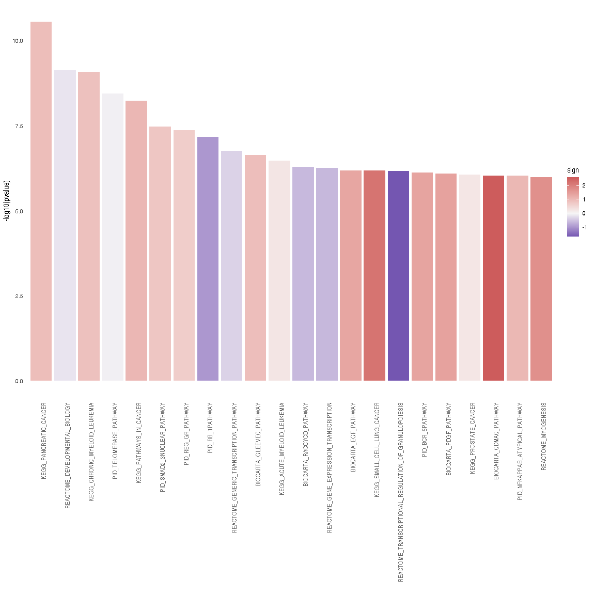
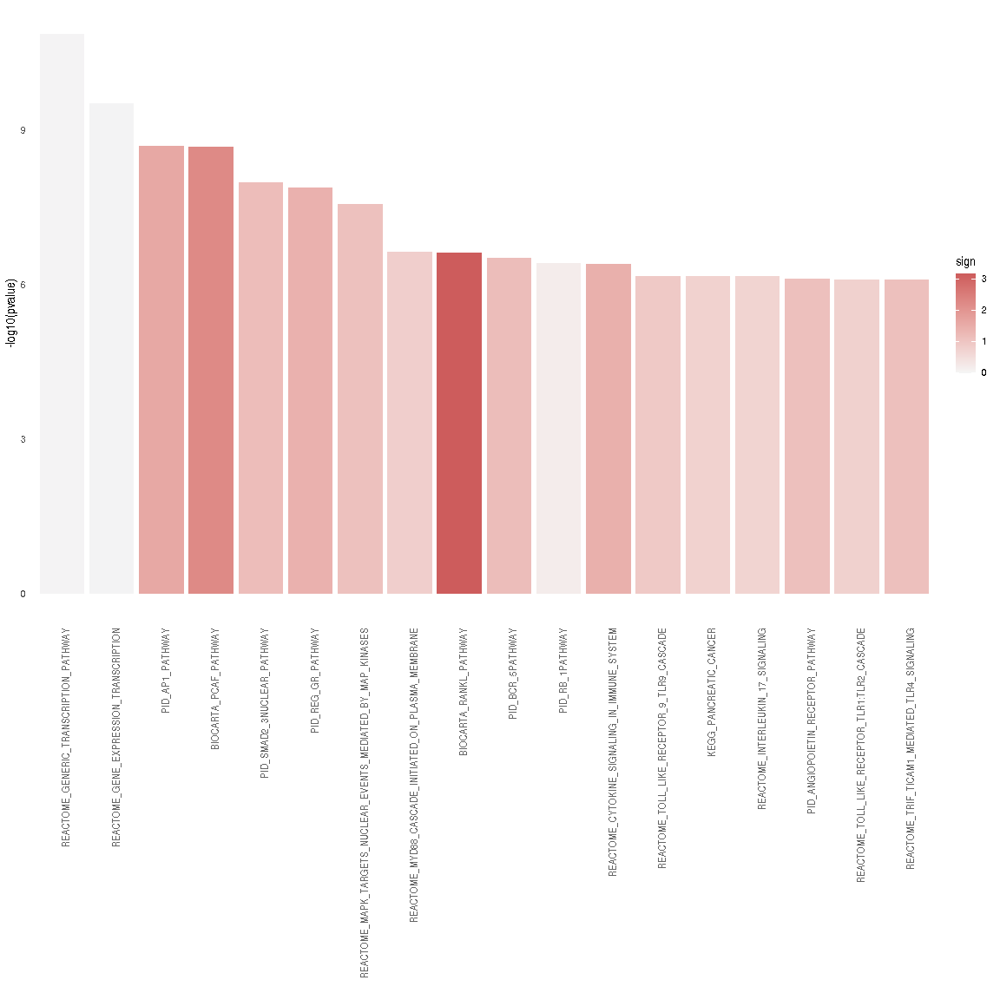
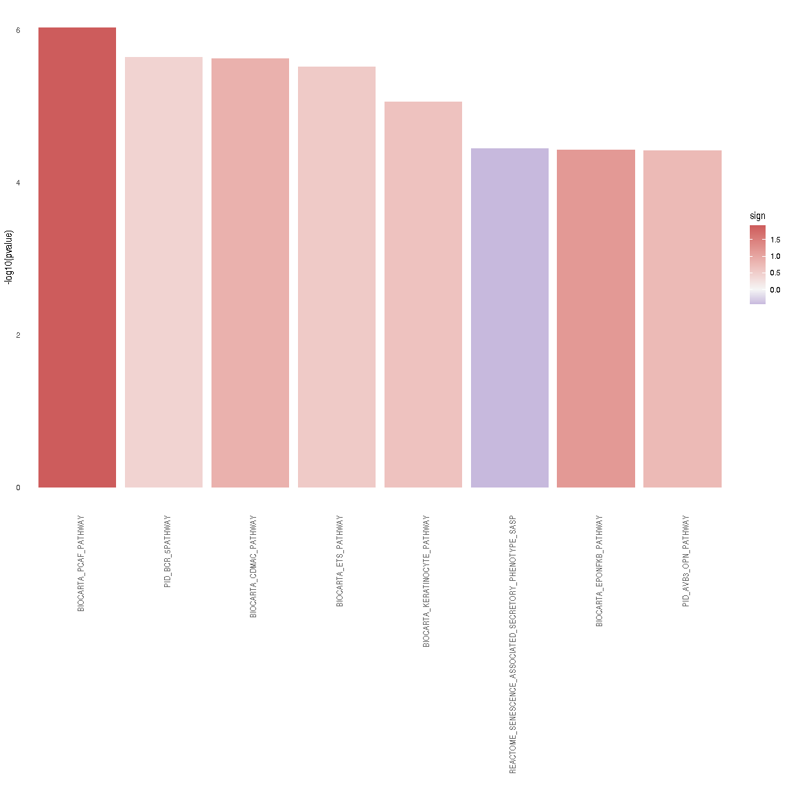
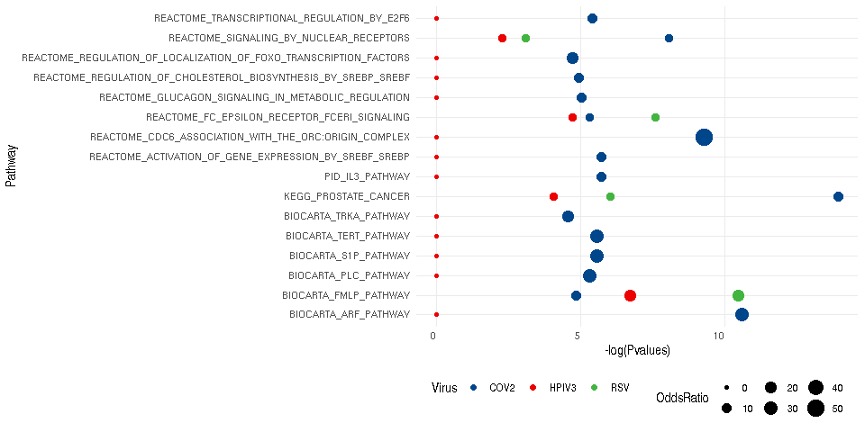
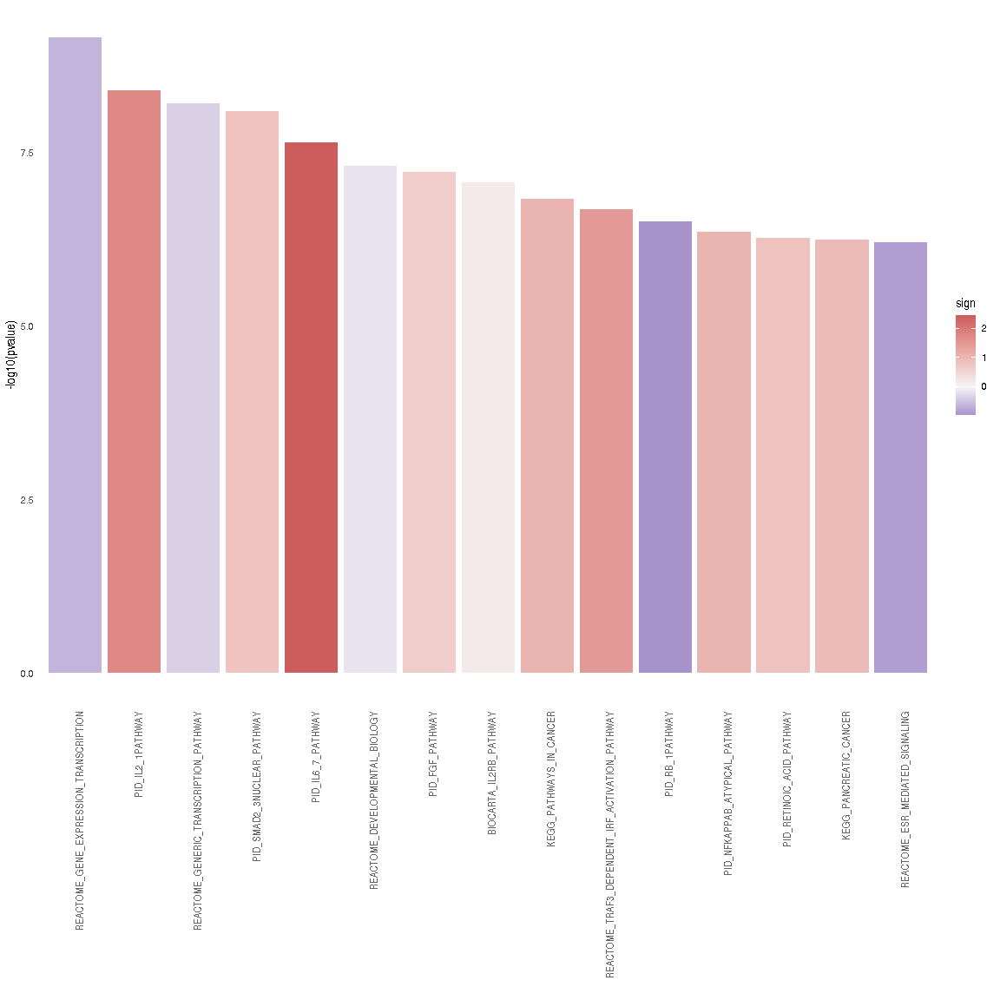
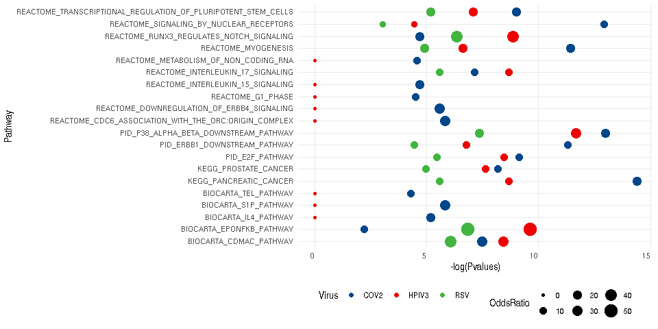

SARS-CoV-2 vs RSV vs HPIV3: Enrichment of CARNIVAL results
================
Alberto Valdeolivas: <alberto.valdeolivas@bioquant.uni-heidelberg.de>;
Date:
04/05/2020

### License Info

This program is free software: you can redistribute it and/or modify it
under the terms of the GNU General Public License as published by the
Free Software Foundation, either version 3 of the License, or (at your
option) any later version.

This program is distributed in the hope that it will be useful, but
WITHOUT ANY WARRANTY; without even the implied warranty of
MERCHANTABILITY or FITNESS FOR A PARTICULAR PURPOSE. See the GNU General
Public License for more details.

Please check <http://www.gnu.org/licenses/>.

## Introduction

The present script takes the RNAseq data from the study *"SARS-CoV-2
launches* *a unique transcriptional signature from in vitro, ex vivo,
and in vivo systems"*

<https://www.biorxiv.org/content/10.1101/2020.03.24.004655v1>

<https://www.ncbi.nlm.nih.gov/geo/query/acc.cgi?acc=GSE147507>

The goal of this set of scripts is to compare the transcriptional effect
of different viral infections: SARS-CoV-2, Respiratory syncytial virus
(RSV) and Human parainfluenza virus type 3 (HPIV3). In this script, we
use the nodes from the **CARNIVAL** output to run an enrichment analysis
for the conditions under study:

  - A549 alveolar cancer cell line: mock treated vs infected with
    SARS-CoV-2.

  - A549 alveolar cancer cell line: mock treated vs infected with RSV.

  - A549 alveolar cancer cell line: mock treated vs infected with HPIV3.

## Reading input data for Enrichment Analysis

To perform the enrichment analysis, we need to read the following input
files:

  - Output from CARNIVAL: to obtain the significant genes and the
    background genes

  - Datasets from MSigDB: describing the pathways in which our
    significant genes are known to be involved in.

  - Differential expression analysis: To evaluate the activity of the
    genes involved in the different enriched pathaways.

We first load the required packages and we define some functions.

``` r
library(readr)
library(piano)
library(dplyr)
library(ggplot2)
library(omicToolsTest)
library(limma)
library(kableExtra)
library(tidyr)
library(ggsci)

## Function to extract the nodes that appear in CARNIVAL network and the 
## background genes (all genes present in the prior knowledge network).
## It returns a list with two objects: the success and the background genes.
extractCARNIVALnodes <- function(CarnivalResults){

    CarnivalNetwork <- 
        as.data.frame(CarnivalResults$weightedSIF, stringsAsFactors = FALSE)
    
    colnames(CarnivalNetwork) <- c("source", "sign", "target", "Weight")

    ## We define the set of nodes interesting for our condition
    sucesses <- unique(c(gsub("_.*","",CarnivalNetwork$source), 
        gsub("_.*","",CarnivalNetwork$target)))

    CarnivalAttributes <- as.data.frame(CarnivalResults$nodesAttributes, 
        stringsAsFactors = FALSE)

    ## We define the background as all the genes in our prior knowledge network.
    bg <- unique(gsub("_.*","",CarnivalAttributes$Node))     
    
    return(list(sucesses = sucesses, bg= bg))
}

### Function to print a barplot with the enriched pathways.
BarplotEnrichment <- function(PathwaysSelect, Interesting_pathways){ 
    
    p <- ggplot(PathwaysSelect, aes(x = reorder(pathway, pvalue), 
            y = -log10(pvalue))) + 
        geom_bar(aes(fill = sign), stat = "identity") +
        scale_fill_gradient2(low = "darkblue", high = "indianred", 
            mid = "whitesmoke", midpoint = 0) + 
        theme_minimal() +
        theme(axis.text.x = element_text(angle = 90, hjust = 1, 
            colour = ifelse(levels(reorder(PathwaysSelect$pathway, 
                PathwaysSelect$pvalue)) %in% Interesting_pathways, 
                "red", "grey40"),
            face = ifelse(levels(reorder(PathwaysSelect$pathway, 
                PathwaysSelect$pvalue)) %in% Interesting_pathways, 
                "bold", "plain")),
        panel.grid.major = element_blank(), 
        panel.grid.minor = element_blank()) + 
        xlab("")
    return(p)
}    


### We modify the runGSAhyper from Piano to make it return the odds ratio and
### the confident level. 
runGSAhyper_V2 <- function (genes, pvalues, pcutoff, universe, gsc, gsSizeLim = c(1, 
    Inf), adjMethod = "fdr") 
{
    if (length(gsSizeLim) != 2) 
        stop("argument gsSizeLim should be a vector of length 2")
    if (missing(genes)) {
        stop("argument genes is required")
    }
    else {
        genes <- as.vector(as.matrix(genes))
        if (!is(genes, "character")) 
            stop("argument genes should be a character vector")
        if (length(unique(genes)) != length(genes)) 
            stop("argument genes should contain no duplicated entries")
    }
    if (missing(pvalues)) {
        pvalues <- rep(0, length(genes))
    }
    else {
        pvalues <- as.vector(as.matrix(pvalues))
        if (!is(pvalues, "numeric")) 
            stop("argument pvalues should be a numeric vector")
        if (length(pvalues) != length(genes)) 
            stop("argument pvalues should be the same length as argument genes")
        if (max(pvalues) > 1 | min(pvalues) < 0) 
            stop("pvalues need to lie between 0 and 1")
    }
    if (missing(pcutoff)) {
        if (all(pvalues %in% c(0, 1))) {
            pcutoff <- 0
        }
        else {
            pcutoff <- 0.05
        }
    }
    else {
        if (length(pcutoff) != 1 & !is(pcutoff, "numeric")) 
            stop("argument pcutoff should be a numeric of length 1")
        if (max(pcutoff) > 1 | min(pcutoff) < 0) 
            stop("argument pcutoff needs to lie between 0 and 1")
    }
    if (missing(gsc)) {
        stop("argument gsc needs to be given")
    }
    else {
        if (!is(gsc, "GSC")) 
            stop("argument gsc should be of class GSC, as returned by the loadGSC function")
    }
    if (missing(universe)) {
        if (!all(pvalues == 0)) {
            universe <- genes
            message("Using all genes in argument genes as universe.")
        }
        else {
            universe <- unique(unlist(gsc$gsc))
            message("Using all genes present in argument gsc as universe.")
        }
    }
    else {
        if (!is(universe, "character")) 
            stop("argument universe should be a character vector")
        if (!all(pvalues == 0)) 
            stop("if universe is given, genes should be only the genes of interest, i.e. pvalues should all be set to 0.")
    }
    if (!all(unique(unlist(gsc$gsc)) %in% universe)) 
        warning("there are genes in gsc that are not in the universe, these will be removed before analysis")
    if (!all(genes %in% universe)) {
        warning("not all genes given by argument genes are present in universe, these will be added to universe")
        universe <- c(universe, genes[!genes %in% universe])
    }
    if (length(unique(universe)) != length(universe)) 
        stop("argument universe should contain no duplicated entries")
    tmp <- try(adjMethod <- match.arg(adjMethod, c("holm", "hochberg", 
        "hommel", "bonferroni", "BH", "BY", "fdr", "none"), 
        several.ok = FALSE), silent = TRUE)
    if (is(tmp, "try-error")) {
        stop("argument adjMethod set to unknown method")
    }
    pvalues[pvalues == 0] <- -1e-10
    goi <- genes[pvalues < pcutoff]
    if (length(goi) < 1) 
        stop("no genes selected due to too strict pcutoff")
    bg <- universe[!universe %in% goi]
    gsc <- gsc$gsc
    delInd <- vector()
    for (i in 1:length(gsc)) {
        gs <- gsc[[i]]
        gs <- gs[gs %in% universe]
        if (length(gs) < gsSizeLim[1] | length(gs) > gsSizeLim[2]) 
            delInd <- c(delInd, i)
        gsc[[i]] <- gs
    }
    gsc <- gsc[!c(1:length(gsc)) %in% delInd]
    message(paste("Analyzing the overrepresentation of ", length(goi), 
        " genes of interest in ", length(gsc), " gene sets, using a background of ", 
        length(bg), " non-interesting genes.", sep = ""))
    p <- rep(NA, length(gsc))
    names(p) <- names(gsc)
    estimate <- rep(NA, length(gsc))
    names(estimate) <- names(gsc) 
    Cinterval <- rep(NA, length(gsc))
    names(Cinterval) <- names(gsc) 
    padj <- rep(NA, length(gsc))
    names(padj) <- names(gsc)
    contTabList <- list()
    resTab <- matrix(nrow = length(gsc), ncol = 8)
    colnames(resTab) <- c("p-value", "Adjusted p-value", "Significant (in gene set)", 
        "Non-significant (in gene set)", "Significant (not in gene set)", 
        "Non-significant (not in gene set)", "OddsRatio","ConfidentInterval")
    rownames(resTab) <- names(gsc)
    for (i in 1:length(gsc)) {
        gs <- gsc[[i]]
        nogs <- universe[!universe %in% gs]
        ctab <- rbind(c(sum(goi %in% gs), sum(goi %in% nogs)), 
            c(sum(bg %in% gs), sum(bg %in% nogs)))
        resultsfisher <- fisher.test(ctab, alternative = "greater")
        p[i] <- resultsfisher$p.value
        estimate[i] <- resultsfisher$estimate
        Cinterval[i] <- resultsfisher$conf.int[1]
        rownames(ctab) <- c("Significant", "Non-significant")
        colnames(ctab) <- c("Genes in gene set", "Genes not in gene set")
        contTabList[[i]] <- ctab
        resTab[i, ] <- c(p[i], NA, sum(goi %in% gs), sum(bg %in% 
            gs), sum(goi %in% nogs), sum(bg %in% nogs), estimate[i], Cinterval[i])
    }
    padj <- p.adjust(p, method = adjMethod)
    resTab[, 2] <- padj
    res <- list()
    res$pvalues <- p
    res$p.adj <- padj
    res$resTab <- resTab
    res$contingencyTable <- contTabList
    res$gsc <- gsc
    return(res)
}
```

### Reading and formatting CARNIVAL output

We read the CARNIVAL results generated in the previous script. We define
two different gene sets in order tor conduct the enrichment. The first
set contains the nodes that appear in the CARNIVAL output and are
therefore relevant in the context of our input transcriptomic data. The
second set contains all the genes in our prior knowledge network which
are used as the backgroud.

``` r
## SARS-CoV-2
CarnivalResultsA549vsCOV2_noinput <- 
    readRDS("ResultsCARNIVAL/A549vsCOV2_noinput.rds")
NodesA549vsCOV2_noinput <- extractCARNIVALnodes(CarnivalResultsA549vsCOV2_noinput)

CarnivalResultsA549vsCOV2_RIGIlike_receptors_input <- 
    readRDS("ResultsCARNIVAL/A549vsCOV2_RIGIlike_receptors_input.rds")
NodesA549vsCOV2_RIGIlike_receptors_input <- 
    extractCARNIVALnodes(CarnivalResultsA549vsCOV2_RIGIlike_receptors_input)  

## RSV
CarnivalResultsA549vsRSV_noinput <- 
    readRDS("ResultsCARNIVAL/A549vsRSV_noinput.rds")
NodesA549vsRSV_noinput <- extractCARNIVALnodes(CarnivalResultsA549vsRSV_noinput)

CarnivalResultsA549vsRSV_RIGIlike_receptors_input <- 
    readRDS("ResultsCARNIVAL/A549vsRSV_RIGIlike_receptors_input.rds")
NodesA549vsRSV_RIGIlike_receptors_input <- 
    extractCARNIVALnodes(CarnivalResultsA549vsRSV_RIGIlike_receptors_input) 

## SARS-CoV-2
CarnivalResultsA549vsHPIV3_noinput <- 
    readRDS("ResultsCARNIVAL/A549vsHPIV3_noinput.rds")
NodesA549vsHPIV3_noinput <- extractCARNIVALnodes(CarnivalResultsA549vsHPIV3_noinput)

CarnivalResultsA549vsHPIV3_RIGIlike_receptors_input <- 
    readRDS("ResultsCARNIVAL/A549vsHPIV3_RIGIlike_receptors_input.rds")
NodesA549vsHPIV3_RIGIlike_receptors_input <- 
    extractCARNIVALnodes(CarnivalResultsA549vsHPIV3_RIGIlike_receptors_input)
```

### Reading Pathway data sets from MSigDB

We downloaded from MSigDB <https://www.gsea-msigdb.org/> the following
dataset: c2.cp.v7.0.symbols.gmt. It contains several pathways from
different resources and the genes that are known to be involved in those
pathways.

``` r
pathways <- gmt_to_csv("../RawData/c2.cp.v7.0.symbols.gmt")
```

    ##   |                                                                              |                                                                      |   0%  |                                                                              |                                                                      |   1%  |                                                                              |=                                                                     |   1%  |                                                                              |=                                                                     |   2%  |                                                                              |==                                                                    |   2%  |                                                                              |==                                                                    |   3%  |                                                                              |==                                                                    |   4%  |                                                                              |===                                                                   |   4%  |                                                                              |===                                                                   |   5%  |                                                                              |====                                                                  |   5%  |                                                                              |====                                                                  |   6%  |                                                                              |=====                                                                 |   6%  |                                                                              |=====                                                                 |   7%  |                                                                              |=====                                                                 |   8%  |                                                                              |======                                                                |   8%  |                                                                              |======                                                                |   9%  |                                                                              |=======                                                               |   9%  |                                                                              |=======                                                               |  10%  |                                                                              |=======                                                               |  11%  |                                                                              |========                                                              |  11%  |                                                                              |========                                                              |  12%  |                                                                              |=========                                                             |  12%  |                                                                              |=========                                                             |  13%  |                                                                              |=========                                                             |  14%  |                                                                              |==========                                                            |  14%  |                                                                              |==========                                                            |  15%  |                                                                              |===========                                                           |  15%  |                                                                              |===========                                                           |  16%  |                                                                              |============                                                          |  16%  |                                                                              |============                                                          |  17%  |                                                                              |============                                                          |  18%  |                                                                              |=============                                                         |  18%  |                                                                              |=============                                                         |  19%  |                                                                              |==============                                                        |  19%  |                                                                              |==============                                                        |  20%  |                                                                              |==============                                                        |  21%  |                                                                              |===============                                                       |  21%  |                                                                              |===============                                                       |  22%  |                                                                              |================                                                      |  22%  |                                                                              |================                                                      |  23%  |                                                                              |================                                                      |  24%  |                                                                              |=================                                                     |  24%  |                                                                              |=================                                                     |  25%  |                                                                              |==================                                                    |  25%  |                                                                              |==================                                                    |  26%  |                                                                              |===================                                                   |  26%  |                                                                              |===================                                                   |  27%  |                                                                              |===================                                                   |  28%  |                                                                              |====================                                                  |  28%  |                                                                              |====================                                                  |  29%  |                                                                              |=====================                                                 |  29%  |                                                                              |=====================                                                 |  30%  |                                                                              |=====================                                                 |  31%  |                                                                              |======================                                                |  31%  |                                                                              |======================                                                |  32%  |                                                                              |=======================                                               |  32%  |                                                                              |=======================                                               |  33%  |                                                                              |=======================                                               |  34%  |                                                                              |========================                                              |  34%  |                                                                              |========================                                              |  35%  |                                                                              |=========================                                             |  35%  |                                                                              |=========================                                             |  36%  |                                                                              |==========================                                            |  36%  |                                                                              |==========================                                            |  37%  |                                                                              |==========================                                            |  38%  |                                                                              |===========================                                           |  38%  |                                                                              |===========================                                           |  39%  |                                                                              |============================                                          |  39%  |                                                                              |============================                                          |  40%  |                                                                              |============================                                          |  41%  |                                                                              |=============================                                         |  41%  |                                                                              |=============================                                         |  42%  |                                                                              |==============================                                        |  42%  |                                                                              |==============================                                        |  43%  |                                                                              |==============================                                        |  44%  |                                                                              |===============================                                       |  44%  |                                                                              |===============================                                       |  45%  |                                                                              |================================                                      |  45%  |                                                                              |================================                                      |  46%  |                                                                              |=================================                                     |  46%  |                                                                              |=================================                                     |  47%  |                                                                              |=================================                                     |  48%  |                                                                              |==================================                                    |  48%  |                                                                              |==================================                                    |  49%  |                                                                              |===================================                                   |  49%  |                                                                              |===================================                                   |  50%  |                                                                              |===================================                                   |  51%  |                                                                              |====================================                                  |  51%  |                                                                              |====================================                                  |  52%  |                                                                              |=====================================                                 |  52%  |                                                                              |=====================================                                 |  53%  |                                                                              |=====================================                                 |  54%  |                                                                              |======================================                                |  54%  |                                                                              |======================================                                |  55%  |                                                                              |=======================================                               |  55%  |                                                                              |=======================================                               |  56%  |                                                                              |========================================                              |  56%  |                                                                              |========================================                              |  57%  |                                                                              |========================================                              |  58%  |                                                                              |=========================================                             |  58%  |                                                                              |=========================================                             |  59%  |                                                                              |==========================================                            |  59%  |                                                                              |==========================================                            |  60%  |                                                                              |==========================================                            |  61%  |                                                                              |===========================================                           |  61%  |                                                                              |===========================================                           |  62%  |                                                                              |============================================                          |  62%  |                                                                              |============================================                          |  63%  |                                                                              |============================================                          |  64%  |                                                                              |=============================================                         |  64%  |                                                                              |=============================================                         |  65%  |                                                                              |==============================================                        |  65%  |                                                                              |==============================================                        |  66%  |                                                                              |===============================================                       |  66%  |                                                                              |===============================================                       |  67%  |                                                                              |===============================================                       |  68%  |                                                                              |================================================                      |  68%  |                                                                              |================================================                      |  69%  |                                                                              |=================================================                     |  69%  |                                                                              |=================================================                     |  70%  |                                                                              |=================================================                     |  71%  |                                                                              |==================================================                    |  71%  |                                                                              |==================================================                    |  72%  |                                                                              |===================================================                   |  72%  |                                                                              |===================================================                   |  73%  |                                                                              |===================================================                   |  74%  |                                                                              |====================================================                  |  74%  |                                                                              |====================================================                  |  75%  |                                                                              |=====================================================                 |  75%  |                                                                              |=====================================================                 |  76%  |                                                                              |======================================================                |  76%  |                                                                              |======================================================                |  77%  |                                                                              |======================================================                |  78%  |                                                                              |=======================================================               |  78%  |                                                                              |=======================================================               |  79%  |                                                                              |========================================================              |  79%  |                                                                              |========================================================              |  80%  |                                                                              |========================================================              |  81%  |                                                                              |=========================================================             |  81%  |                                                                              |=========================================================             |  82%  |                                                                              |==========================================================            |  82%  |                                                                              |==========================================================            |  83%  |                                                                              |==========================================================            |  84%  |                                                                              |===========================================================           |  84%  |                                                                              |===========================================================           |  85%  |                                                                              |============================================================          |  85%  |                                                                              |============================================================          |  86%  |                                                                              |=============================================================         |  86%  |                                                                              |=============================================================         |  87%  |                                                                              |=============================================================         |  88%  |                                                                              |==============================================================        |  88%  |                                                                              |==============================================================        |  89%  |                                                                              |===============================================================       |  89%  |                                                                              |===============================================================       |  90%  |                                                                              |===============================================================       |  91%  |                                                                              |================================================================      |  91%  |                                                                              |================================================================      |  92%  |                                                                              |=================================================================     |  92%  |                                                                              |=================================================================     |  93%  |                                                                              |=================================================================     |  94%  |                                                                              |==================================================================    |  94%  |                                                                              |==================================================================    |  95%  |                                                                              |===================================================================   |  95%  |                                                                              |===================================================================   |  96%  |                                                                              |====================================================================  |  96%  |                                                                              |====================================================================  |  97%  |                                                                              |====================================================================  |  98%  |                                                                              |===================================================================== |  98%  |                                                                              |===================================================================== |  99%  |                                                                              |======================================================================|  99%  |                                                                              |======================================================================| 100%

### Reading and formatting statistic from DEG

We read the results from the differential expression analysis. The
statistic of the genes will be mapped later on in the different
significant pathways.

``` r
## Differential expression table
dds_A549vsCOV2 <- readRDS("IntermediateFiles/dds_results_A549vsCOV2.rds") %>%
    as.data.frame() %>% 
    dplyr::select(stat)
dds_A549vsRSV <- readRDS("IntermediateFiles/dds_results_A549vsRSV.rds") %>%
    as.data.frame() %>% 
    dplyr::select(stat)
dds_A549vsHPIV3 <- readRDS("IntermediateFiles/dds_results_A549vsHPIV3.rds") %>%
    as.data.frame() %>% 
    dplyr::select(stat)
```

## Performing Enrichment Analysis and plotting the Results

Using the **Piano** R package, we run a gene set analysis (GSA) based on
a list of significant genes (CARNIVAL nodes) and a gene set collection
(background). It uses Fisher’s exact test.

### CARNIVAL output with no perturbation

#### SARS-CoV-2 infection

``` r
## We run GSA hyper Geometric test
sig_pathways_A549vsCOV2_noinput <- runGSAhyper_V2(NodesA549vsCOV2_noinput$sucesses, 
    universe = NodesA549vsCOV2_noinput$bg, gsc = loadGSC(pathways))
sig_pathways_df_A549vsCOV2_noinput <- 
    as.data.frame(sig_pathways_A549vsCOV2_noinput$resTab)

## We map the t-stastic into the resulted enriched pathways.
sig_pathways_df_A549vsCOV2_noinput$sign <- 
    unlist(lapply(row.names(sig_pathways_df_A549vsCOV2_noinput), 
    function(x, kinases, pathways){
        return(mean(dds_A549vsCOV2[row.names(dds_A549vsCOV2) %in% pathways[pathways$term == x,1],1], na.rm = TRUE))
    },kinases = kinases, pathways = pathways))

sig_pathways_df_A549vsCOV2_noinput <- 
    sig_pathways_df_A549vsCOV2_noinput[!is.nan(sig_pathways_df_A549vsCOV2_noinput$sign),]
```

We format the results and we prepare them to be plotted. For
visualization purposes, we just select pathways with adjusted p-values
lower than 0.0001.

``` r
PathwaysSelect_A549vsCOV2_noinput <- sig_pathways_df_A549vsCOV2_noinput %>%
    tibble::rownames_to_column(var = "pathway") %>%
    dplyr::select(pathway, `p-value`, `Adjusted p-value`, sign) %>%
    dplyr::filter(`Adjusted p-value` <= 0.0001) %>%
    dplyr::rename(pvalue = `p-value`, AdjPvalu = `Adjusted p-value`) %>% 
    dplyr::mutate(pathway = as.factor(pathway))
```

We finally plot the results highlighting the most relevant pathways.

``` r
Interesting_pathways_A549vsCOV2_noinput <- c()

p_A549vsCOV2_noinput <- BarplotEnrichment(PathwaysSelect_A549vsCOV2_noinput, 
    Interesting_pathways_A549vsCOV2_noinput)
```

<!-- -->

#### RSV infection

``` r
## We run GSA hyper Geometric test
sig_pathways_A549vsRSV_noinput <- runGSAhyper_V2(NodesA549vsRSV_noinput$sucesses, 
    universe = NodesA549vsRSV_noinput$bg, gsc = loadGSC(pathways))
sig_pathways_df_A549vsRSV_noinput <- 
    as.data.frame(sig_pathways_A549vsRSV_noinput$resTab)

## We map the t-stastic into the resulted enriched pathways.
sig_pathways_df_A549vsRSV_noinput$sign <- 
    unlist(lapply(row.names(sig_pathways_df_A549vsRSV_noinput), 
    function(x, kinases, pathways){
        return(mean(dds_A549vsRSV[row.names(dds_A549vsRSV) %in% pathways[pathways$term == x,1],1], na.rm = TRUE))
    },kinases = kinases, pathways = pathways))

sig_pathways_df_A549vsRSV_noinput <- 
    sig_pathways_df_A549vsRSV_noinput[!is.nan(sig_pathways_df_A549vsRSV_noinput$sign),]
```

We format the results and we prepare them to be plotted. For
visualization purposes, we just select pathways with adjusted p-values
lower than 0.0001.

``` r
PathwaysSelect_A549vsRSV_noinput <- sig_pathways_df_A549vsRSV_noinput %>%
    tibble::rownames_to_column(var = "pathway") %>%
    dplyr::select(pathway, `p-value`, `Adjusted p-value`, sign) %>%
    dplyr::filter(`Adjusted p-value` <= 0.0001) %>%
    dplyr::rename(pvalue = `p-value`, AdjPvalu = `Adjusted p-value`) %>% 
    dplyr::mutate(pathway = as.factor(pathway))
```

We finally plot the results highlighting the most relevant pathways.

``` r
Interesting_pathways_A549vsRSV_noinput <- c()

p_A549vsRSV_noinput <- BarplotEnrichment(PathwaysSelect_A549vsRSV_noinput, 
    Interesting_pathways_A549vsRSV_noinput)
```

<!-- -->

#### HPIV3 infection

``` r
## We run GSA hyper Geometric test
sig_pathways_A549vsHPIV3_noinput <- runGSAhyper_V2(NodesA549vsHPIV3_noinput$sucesses, 
    universe = NodesA549vsHPIV3_noinput$bg, gsc = loadGSC(pathways))
sig_pathways_df_A549vsHPIV3_noinput <- 
    as.data.frame(sig_pathways_A549vsHPIV3_noinput$resTab)

## We map the t-stastic into the resulted enriched pathways.
sig_pathways_df_A549vsHPIV3_noinput$sign <- 
    unlist(lapply(row.names(sig_pathways_df_A549vsHPIV3_noinput), 
    function(x, kinases, pathways){
        return(mean(dds_A549vsHPIV3[row.names(dds_A549vsHPIV3) %in% pathways[pathways$term == x,1],1], na.rm = TRUE))
    },kinases = kinases, pathways = pathways))

sig_pathways_df_A549vsHPIV3_noinput <- 
    sig_pathways_df_A549vsHPIV3_noinput[!is.nan(sig_pathways_df_A549vsHPIV3_noinput$sign),]
```

We format the results and we prepare them to be plotted. For
visualization purposes, we just select pathways with adjusted p-values
lower than 0.025.

``` r
PathwaysSelect_A549vsHPIV3_noinput <- sig_pathways_df_A549vsHPIV3_noinput %>%
    tibble::rownames_to_column(var = "pathway") %>%
    dplyr::select(pathway, `p-value`, `Adjusted p-value`, sign) %>%
    dplyr::filter(`Adjusted p-value` <= 0.025) %>%
    dplyr::rename(pvalue = `p-value`, AdjPvalu = `Adjusted p-value`) %>% 
    dplyr::mutate(pathway = as.factor(pathway))
```

We finally plot the results highlighting the most relevant pathways.

``` r
Interesting_pathways_A549vsHPIV3_noinput <- c()

p_A549vsHPIV3_noinput <- BarplotEnrichment(PathwaysSelect_A549vsHPIV3_noinput, 
    Interesting_pathways_A549vsHPIV3_noinput)
```

<!-- -->

### Pathways with different behaviour in SARS-CoV-2 and the other infections

We now compare the enrichment results of the SARS-CoV-2 VS the other two
viral infections (HPIV3 and RSV) in order to identify specific
deregulated pathways during SARS-CoV-2 infection. To do so, we use limma
on the odds ratios from the fisher’s exact test carried out in the
previous enrichments. We sort the results based on the larger difference
in odds ratios between conditions. In addition, we only consider the
pathways that are significantly enriched in any of the conditions
(Adjusted p-value \< 0.1).

``` r
AllEnrichments_noinput <- bind_cols(
    sig_pathways_df_A549vsCOV2_noinput %>% 
        tibble::rownames_to_column(var = "Pathway") %>% 
        dplyr::rename(OddsRatio_COV2 = "OddsRatio") %>% 
        dplyr::select(Pathway, OddsRatio_COV2),
    sig_pathways_df_A549vsRSV_noinput  %>% 
        dplyr::rename(OddsRatio_RSV = "OddsRatio") %>% 
        dplyr::select(OddsRatio_RSV),
    sig_pathways_df_A549vsHPIV3_noinput  %>% 
        dplyr::rename(OddsRatio_HPIV3 = "OddsRatio") %>% 
        dplyr::select(OddsRatio_HPIV3)) %>% 
    dplyr::filter(!(OddsRatio_COV2 == 0 & OddsRatio_RSV == 0 & OddsRatio_HPIV3 == 0)) %>% 
    tibble::column_to_rownames(var = "Pathway")
# rownames(AllEnrichments_noinput) <- rownames(sig_pathways_df_A549vsCOV2_noinput)
design <- cbind(Grp1=1,Grp2vs1=c(1,-1,-1))

## Limma model
fit_noinput <- lmFit(AllEnrichments_noinput,design)
fit_noinput <- eBayes(fit_noinput)
Results_noinput <- topTable(fit_noinput, sort.by = "B",resort.by="AveExpr", 
    number = 100)

## We tidy up the results and we include the p-values from the enrichments.
Results_noinput_OddsRatio <- 
    AllEnrichments_noinput[rownames(Results_noinput),] %>% 
    tibble::rownames_to_column(var = "Pathway") %>%
    dplyr::left_join((sig_pathways_df_A549vsCOV2_noinput %>% 
        tibble::rownames_to_column(var = "Pathway"))) %>% 
    dplyr::select(Pathway, OddsRatio_COV2, OddsRatio_RSV, 
                  OddsRatio_HPIV3, `Adjusted p-value`, `p-value`) %>% 
    dplyr::rename(Adjpvalue_COV2 = "Adjusted p-value") %>% 
    dplyr::rename(Pvalue_COV2 = "p-value") %>% 
    dplyr::left_join((sig_pathways_df_A549vsRSV_noinput %>% 
        tibble::rownames_to_column(var = "Pathway"))) %>% 
    dplyr::select(Pathway, OddsRatio_COV2, OddsRatio_RSV, 
        OddsRatio_HPIV3, Adjpvalue_COV2, Pvalue_COV2, `Adjusted p-value`, `p-value`) %>% 
    dplyr::rename(Adjpvalue_RSV = "Adjusted p-value") %>% 
    dplyr::rename(Pvalue_RSV = "p-value") %>%
    dplyr::left_join((sig_pathways_df_A549vsHPIV3_noinput %>% 
        tibble::rownames_to_column(var = "Pathway"))) %>% 
    dplyr::select(Pathway, OddsRatio_COV2, OddsRatio_RSV, 
        OddsRatio_HPIV3, Adjpvalue_COV2, Pvalue_COV2, Adjpvalue_RSV , Pvalue_RSV,
        `Adjusted p-value`, `p-value`) %>% 
    dplyr::rename(Adjpvalue_HPIV3 = "Adjusted p-value") %>%
    dplyr::rename(Pvalue_HPIV3 = "p-value") %>%
    dplyr::filter(Adjpvalue_COV2 < 0.1 | (Adjpvalue_RSV < 0.1 & Adjpvalue_HPIV3 <0.1))
    
## We presenth the results in a table
knitr::kable(Results_noinput_OddsRatio,  digits = 3, longtable = TRUE, 
    padding = 0) %>% 
    kable_styling(bootstrap_options = 
        c("striped", "hover", "condensed", "responsive"),
        full_width = F, font_size = 8)
```

<table class="table table-striped table-hover table-condensed table-responsive" style="font-size: 8px; width: auto !important; margin-left: auto; margin-right: auto;">

<thead>

<tr>

<th style="text-align:left;">

Pathway

</th>

<th style="text-align:right;">

OddsRatio\_COV2

</th>

<th style="text-align:right;">

OddsRatio\_RSV

</th>

<th style="text-align:right;">

OddsRatio\_HPIV3

</th>

<th style="text-align:right;">

Adjpvalue\_COV2

</th>

<th style="text-align:right;">

Pvalue\_COV2

</th>

<th style="text-align:right;">

Adjpvalue\_RSV

</th>

<th style="text-align:right;">

Pvalue\_RSV

</th>

<th style="text-align:right;">

Adjpvalue\_HPIV3

</th>

<th style="text-align:right;">

Pvalue\_HPIV3

</th>

</tr>

</thead>

<tbody>

<tr>

<td style="text-align:left;">

REACTOME\_CDC6\_ASSOCIATION\_WITH\_THE\_ORC:ORIGIN\_COMPLEX

</td>

<td style="text-align:right;">

50.336

</td>

<td style="text-align:right;">

0.000

</td>

<td style="text-align:right;">

0.000

</td>

<td style="text-align:right;">

0.003

</td>

<td style="text-align:right;">

0.000

</td>

<td style="text-align:right;">

1.000

</td>

<td style="text-align:right;">

1.000

</td>

<td style="text-align:right;">

1.000

</td>

<td style="text-align:right;">

1.000

</td>

</tr>

<tr>

<td style="text-align:left;">

BIOCARTA\_ARF\_PATHWAY

</td>

<td style="text-align:right;">

30.952

</td>

<td style="text-align:right;">

0.000

</td>

<td style="text-align:right;">

0.000

</td>

<td style="text-align:right;">

0.001

</td>

<td style="text-align:right;">

0.000

</td>

<td style="text-align:right;">

1.000

</td>

<td style="text-align:right;">

1.000

</td>

<td style="text-align:right;">

1.000

</td>

<td style="text-align:right;">

1.000

</td>

</tr>

<tr>

<td style="text-align:left;">

BIOCARTA\_TERT\_PATHWAY

</td>

<td style="text-align:right;">

27.705

</td>

<td style="text-align:right;">

0.000

</td>

<td style="text-align:right;">

0.000

</td>

<td style="text-align:right;">

0.043

</td>

<td style="text-align:right;">

0.004

</td>

<td style="text-align:right;">

1.000

</td>

<td style="text-align:right;">

1.000

</td>

<td style="text-align:right;">

1.000

</td>

<td style="text-align:right;">

1.000

</td>

</tr>

<tr>

<td style="text-align:left;">

BIOCARTA\_S1P\_PATHWAY

</td>

<td style="text-align:right;">

27.705

</td>

<td style="text-align:right;">

0.000

</td>

<td style="text-align:right;">

0.000

</td>

<td style="text-align:right;">

0.043

</td>

<td style="text-align:right;">

0.004

</td>

<td style="text-align:right;">

1.000

</td>

<td style="text-align:right;">

1.000

</td>

<td style="text-align:right;">

1.000

</td>

<td style="text-align:right;">

1.000

</td>

</tr>

<tr>

<td style="text-align:left;">

BIOCARTA\_PLC\_PATHWAY

</td>

<td style="text-align:right;">

23.761

</td>

<td style="text-align:right;">

0.000

</td>

<td style="text-align:right;">

0.000

</td>

<td style="text-align:right;">

0.052

</td>

<td style="text-align:right;">

0.005

</td>

<td style="text-align:right;">

1.000

</td>

<td style="text-align:right;">

1.000

</td>

<td style="text-align:right;">

1.000

</td>

<td style="text-align:right;">

1.000

</td>

</tr>

<tr>

<td style="text-align:left;">

REACTOME\_REGULATION\_OF\_LOCALIZATION\_OF\_FOXO\_TRANSCRIPTION\_FACTORS

</td>

<td style="text-align:right;">

16.633

</td>

<td style="text-align:right;">

0.000

</td>

<td style="text-align:right;">

0.000

</td>

<td style="text-align:right;">

0.078

</td>

<td style="text-align:right;">

0.009

</td>

<td style="text-align:right;">

1.000

</td>

<td style="text-align:right;">

1.000

</td>

<td style="text-align:right;">

1.000

</td>

<td style="text-align:right;">

1.000

</td>

</tr>

<tr>

<td style="text-align:left;">

BIOCARTA\_TRKA\_PATHWAY

</td>

<td style="text-align:right;">

15.124

</td>

<td style="text-align:right;">

0.000

</td>

<td style="text-align:right;">

0.000

</td>

<td style="text-align:right;">

0.087

</td>

<td style="text-align:right;">

0.010

</td>

<td style="text-align:right;">

1.000

</td>

<td style="text-align:right;">

1.000

</td>

<td style="text-align:right;">

1.000

</td>

<td style="text-align:right;">

1.000

</td>

</tr>

<tr>

<td style="text-align:left;">

KEGG\_PROSTATE\_CANCER

</td>

<td style="text-align:right;">

10.404

</td>

<td style="text-align:right;">

5.905

</td>

<td style="text-align:right;">

5.991

</td>

<td style="text-align:right;">

0.000

</td>

<td style="text-align:right;">

0.000

</td>

<td style="text-align:right;">

0.035

</td>

<td style="text-align:right;">

0.002

</td>

<td style="text-align:right;">

0.252

</td>

<td style="text-align:right;">

0.017

</td>

</tr>

<tr>

<td style="text-align:left;">

PID\_IL3\_PATHWAY

</td>

<td style="text-align:right;">

11.465

</td>

<td style="text-align:right;">

0.000

</td>

<td style="text-align:right;">

0.000

</td>

<td style="text-align:right;">

0.038

</td>

<td style="text-align:right;">

0.003

</td>

<td style="text-align:right;">

1.000

</td>

<td style="text-align:right;">

1.000

</td>

<td style="text-align:right;">

1.000

</td>

<td style="text-align:right;">

1.000

</td>

</tr>

<tr>

<td style="text-align:left;">

REACTOME\_ACTIVATION\_OF\_GENE\_EXPRESSION\_BY\_SREBF\_SREBP

</td>

<td style="text-align:right;">

11.465

</td>

<td style="text-align:right;">

0.000

</td>

<td style="text-align:right;">

0.000

</td>

<td style="text-align:right;">

0.038

</td>

<td style="text-align:right;">

0.003

</td>

<td style="text-align:right;">

1.000

</td>

<td style="text-align:right;">

1.000

</td>

<td style="text-align:right;">

1.000

</td>

<td style="text-align:right;">

1.000

</td>

</tr>

<tr>

<td style="text-align:left;">

REACTOME\_TRANSCRIPTIONAL\_REGULATION\_BY\_E2F6

</td>

<td style="text-align:right;">

10.092

</td>

<td style="text-align:right;">

0.000

</td>

<td style="text-align:right;">

0.000

</td>

<td style="text-align:right;">

0.048

</td>

<td style="text-align:right;">

0.005

</td>

<td style="text-align:right;">

1.000

</td>

<td style="text-align:right;">

1.000

</td>

<td style="text-align:right;">

1.000

</td>

<td style="text-align:right;">

1.000

</td>

</tr>

<tr>

<td style="text-align:left;">

REACTOME\_GLUCAGON\_SIGNALING\_IN\_METABOLIC\_REGULATION

</td>

<td style="text-align:right;">

8.694

</td>

<td style="text-align:right;">

0.000

</td>

<td style="text-align:right;">

0.000

</td>

<td style="text-align:right;">

0.064

</td>

<td style="text-align:right;">

0.007

</td>

<td style="text-align:right;">

1.000

</td>

<td style="text-align:right;">

1.000

</td>

<td style="text-align:right;">

1.000

</td>

<td style="text-align:right;">

1.000

</td>

</tr>

<tr>

<td style="text-align:left;">

BIOCARTA\_FMLP\_PATHWAY

</td>

<td style="text-align:right;">

8.131

</td>

<td style="text-align:right;">

16.808

</td>

<td style="text-align:right;">

16.343

</td>

<td style="text-align:right;">

0.071

</td>

<td style="text-align:right;">

0.008

</td>

<td style="text-align:right;">

0.001

</td>

<td style="text-align:right;">

0.000

</td>

<td style="text-align:right;">

0.058

</td>

<td style="text-align:right;">

0.001

</td>

</tr>

<tr>

<td style="text-align:left;">

REACTOME\_REGULATION\_OF\_CHOLESTEROL\_BIOSYNTHESIS\_BY\_SREBP\_SREBF

</td>

<td style="text-align:right;">

8.403

</td>

<td style="text-align:right;">

0.000

</td>

<td style="text-align:right;">

0.000

</td>

<td style="text-align:right;">

0.067

</td>

<td style="text-align:right;">

0.007

</td>

<td style="text-align:right;">

1.000

</td>

<td style="text-align:right;">

1.000

</td>

<td style="text-align:right;">

1.000

</td>

<td style="text-align:right;">

1.000

</td>

</tr>

<tr>

<td style="text-align:left;">

REACTOME\_FC\_EPSILON\_RECEPTOR\_FCERI\_SIGNALING

</td>

<td style="text-align:right;">

4.134

</td>

<td style="text-align:right;">

5.595

</td>

<td style="text-align:right;">

5.386

</td>

<td style="text-align:right;">

0.052

</td>

<td style="text-align:right;">

0.005

</td>

<td style="text-align:right;">

0.011

</td>

<td style="text-align:right;">

0.000

</td>

<td style="text-align:right;">

0.164

</td>

<td style="text-align:right;">

0.009

</td>

</tr>

<tr>

<td style="text-align:left;">

REACTOME\_SIGNALING\_BY\_NUCLEAR\_RECEPTORS

</td>

<td style="text-align:right;">

4.656

</td>

<td style="text-align:right;">

2.713

</td>

<td style="text-align:right;">

2.789

</td>

<td style="text-align:right;">

0.006

</td>

<td style="text-align:right;">

0.000

</td>

<td style="text-align:right;">

0.293

</td>

<td style="text-align:right;">

0.046

</td>

<td style="text-align:right;">

0.829

</td>

<td style="text-align:right;">

0.104

</td>

</tr>

</tbody>

</table>

And we finally plot the results

``` r
df_to_plot_OddsRatios_noinput <- Results_noinput_OddsRatio %>% 
    pivot_longer(cols = c(OddsRatio_COV2, OddsRatio_RSV,
    OddsRatio_HPIV3), names_to = "Virus", values_to = "OddsRatio") %>% 
    dplyr::select(Pathway, Virus, OddsRatio) %>%
    dplyr::mutate(Virus = sub("OddsRatio_","", Virus))

df_to_plot_Pvalues_noinput <- Results_noinput_OddsRatio %>% 
    pivot_longer(cols = c(Pvalue_COV2, Pvalue_RSV,
    Pvalue_HPIV3), names_to = "Virus", values_to = "Pvalues") %>% 
    dplyr::select(Pathway, Virus, Pvalues) %>%
    dplyr::mutate(Virus = sub("Pvalue_","", Virus))

df_to_plot_noinput <- 
    left_join(df_to_plot_OddsRatios_noinput, df_to_plot_Pvalues_noinput)

PointPlot_noinput <- ggplot(df_to_plot_noinput, aes(Pathway, -log(Pvalues))) + 
    geom_point(aes(color = Virus, size = OddsRatio)) + 
    coord_flip() + 
    theme_minimal() + 
    theme(legend.position = "bottom",  legend.justification = "center") +
    scale_color_lancet() +
    theme(axis.text.x = element_text(hjust = 1, size =8),
        axis.text.y = element_text(size =8),
        panel.grid.minor = element_blank()) 
```

<!-- -->

### CARNIVAL output with perturbations on the RIG-I-like receptors

#### SARS-CoV-2 infection

``` r
## We run GSA hyper Geometric test
sig_pathways_A549vsCOV2_RIGIlike_receptors_input <- 
runGSAhyper_V2(NodesA549vsCOV2_RIGIlike_receptors_input$sucesses, 
    universe = NodesA549vsCOV2_RIGIlike_receptors_input$bg, 
    gsc = loadGSC(pathways))
sig_pathways_df_A549vsCOV2_RIGIlike_receptors_input <- 
    as.data.frame(sig_pathways_A549vsCOV2_RIGIlike_receptors_input$resTab)

## We map the t-stastic into the resulted enriched pathways.
sig_pathways_df_A549vsCOV2_RIGIlike_receptors_input$sign <- 
    unlist(lapply(row.names(sig_pathways_df_A549vsCOV2_RIGIlike_receptors_input), 
    function(x, kinases, pathways){
        return(mean(dds_A549vsCOV2[row.names(dds_A549vsCOV2) %in% pathways[pathways$term == x,1],1], na.rm = TRUE))
    },kinases = kinases, pathways = pathways))

sig_pathways_df_A549vsCOV2_RIGIlike_receptors_input <- 
    sig_pathways_df_A549vsCOV2_RIGIlike_receptors_input[!is.nan(sig_pathways_df_A549vsCOV2_RIGIlike_receptors_input$sign),]
```

We format the results and we prepare them to be plotted. For
visualization purposes, we just select pathways with adjusted p-values
lower than 0.0001.

``` r
PathwaysSelect_A549vsCOV2_RIGIlike_receptors_input <- 
    sig_pathways_df_A549vsCOV2_RIGIlike_receptors_input %>%
    tibble::rownames_to_column(var = "pathway") %>%
    dplyr::select(pathway, `p-value`, `Adjusted p-value`, sign) %>%
    dplyr::filter(`Adjusted p-value` <= 0.0001) %>%
    dplyr::rename(pvalue = `p-value`, AdjPvalu = `Adjusted p-value`) %>% 
    dplyr::mutate(pathway = as.factor(pathway))
```

We finally plot the results highlighting the most relevant pathways.

``` r
Interesting_pathways_A549vsCOV2_RIGIlike_receptors_input <- c()

p_A549vsCOV2_RIGIlike_receptors_input <- 
    BarplotEnrichment(PathwaysSelect_A549vsCOV2_RIGIlike_receptors_input, 
    Interesting_pathways_A549vsCOV2_RIGIlike_receptors_input)
```

<!-- -->

#### RSV infection

``` r
## We run GSA hyper Geometric test
sig_pathways_A549vsRSV_RIGIlike_receptors_input <- 
    runGSAhyper_V2(NodesA549vsRSV_RIGIlike_receptors_input$sucesses, 
    universe = NodesA549vsRSV_RIGIlike_receptors_input$bg, 
    gsc = loadGSC(pathways))
sig_pathways_df_A549vsRSV_RIGIlike_receptors_input <- 
    as.data.frame(sig_pathways_A549vsRSV_RIGIlike_receptors_input$resTab)

## We map the t-stastic into the resulted enriched pathways.
sig_pathways_df_A549vsRSV_RIGIlike_receptors_input$sign <- 
    unlist(lapply(row.names(sig_pathways_df_A549vsRSV_RIGIlike_receptors_input), 
    function(x, kinases, pathways){
        return(mean(dds_A549vsRSV[row.names(dds_A549vsRSV) %in% pathways[pathways$term == x,1],1], na.rm = TRUE))
    },kinases = kinases, pathways = pathways))

sig_pathways_df_A549vsRSV_RIGIlike_receptors_input <- 
    sig_pathways_df_A549vsRSV_RIGIlike_receptors_input[!is.nan(sig_pathways_df_A549vsRSV_RIGIlike_receptors_input$sign),]
```

We format the results and we prepare them to be plotted. For
visualization purposes, we just select pathways with adjusted p-values
lower than 0.01.

``` r
PathwaysSelect_A549vsRSV_RIGIlike_receptors_input <- 
    sig_pathways_df_A549vsRSV_RIGIlike_receptors_input %>%
    tibble::rownames_to_column(var = "pathway") %>%
    dplyr::select(pathway, `p-value`, `Adjusted p-value`, sign) %>%
    dplyr::filter(`Adjusted p-value` <= 0.01) %>%
    dplyr::rename(pvalue = `p-value`, AdjPvalu = `Adjusted p-value`) %>% 
    dplyr::mutate(pathway = as.factor(pathway))
```

We finally plot the results highlighting the most relevant pathways.

``` r
Interesting_pathways_A549vsRSV_RIGIlike_receptors_input <- c()

p_A549vsRSV_RIGIlike_receptors_input <- 
    BarplotEnrichment(PathwaysSelect_A549vsRSV_RIGIlike_receptors_input, 
    Interesting_pathways_A549vsRSV_RIGIlike_receptors_input)
```

<!-- -->

#### HPIV3 infection

``` r
## We run GSA hyper Geometric test
sig_pathways_A549vsHPIV3_RIGIlike_receptors_input <- runGSAhyper_V2(NodesA549vsHPIV3_RIGIlike_receptors_input$sucesses, 
    universe = NodesA549vsHPIV3_RIGIlike_receptors_input$bg, 
    gsc = loadGSC(pathways))
sig_pathways_df_A549vsHPIV3_RIGIlike_receptors_input <- 
    as.data.frame(sig_pathways_A549vsHPIV3_RIGIlike_receptors_input$resTab)

## We map the t-stastic into the resulted enriched pathways.
sig_pathways_df_A549vsHPIV3_RIGIlike_receptors_input$sign <- 
    unlist(lapply(row.names(sig_pathways_df_A549vsHPIV3_RIGIlike_receptors_input), 
    function(x, kinases, pathways){
        return(mean(dds_A549vsHPIV3[row.names(dds_A549vsHPIV3) %in% pathways[pathways$term == x,1],1], na.rm = TRUE))
    },kinases = kinases, pathways = pathways))

sig_pathways_df_A549vsHPIV3_RIGIlike_receptors_input <- 
    sig_pathways_df_A549vsHPIV3_RIGIlike_receptors_input[!is.nan(sig_pathways_df_A549vsHPIV3_RIGIlike_receptors_input$sign),]
```

We format the results and we prepare them to be plotted. For
visualization purposes, we just select pathways with adjusted p-values
lower than 0.0005

``` r
PathwaysSelect_A549vsHPIV3_RIGIlike_receptors_input <- 
    sig_pathways_df_A549vsHPIV3_RIGIlike_receptors_input %>%
    tibble::rownames_to_column(var = "pathway") %>%
    dplyr::select(pathway, `p-value`, `Adjusted p-value`, sign) %>%
    dplyr::filter(`Adjusted p-value` <= 0.0005) %>%
    dplyr::rename(pvalue = `p-value`, AdjPvalu = `Adjusted p-value`) %>% 
    dplyr::mutate(pathway = as.factor(pathway))
```

We finally plot the results highlighting the most relevant pathways.

``` r
Interesting_pathways_A549vsHPIV3_RIGIlike_receptors_input <- c()

p_A549vsHPIV3_RIGIlike_receptors_input <- 
    BarplotEnrichment(PathwaysSelect_A549vsHPIV3_RIGIlike_receptors_input, 
    Interesting_pathways_A549vsHPIV3_RIGIlike_receptors_input)
```

<!-- -->

### Pathways with different behaviour in SARS-CoV-2 and the other infections

We now compare the enrichment results of the SARS-CoV-2 VS the other two
viral infections (HPIV3 and RSV) in order to identify specific
deregulated pathways during SARS-CoV-2 infection. To do so, we use limma
on the odds ratios from the fisher’s exact test carried out in the
previous enrichments. We sort the results based on the larger difference
in odds ratios between conditions. In addition, we only consider the
pathways that are significantly enriched in any of the conditions
(Adjusted p-value \< 0.1).

``` r
AllEnrichments_RIGIlike_receptors_input <- bind_cols(
    sig_pathways_df_A549vsCOV2_RIGIlike_receptors_input %>% 
        tibble::rownames_to_column(var = "Pathway") %>% 
        dplyr::rename(OddsRatio_COV2 = "OddsRatio") %>% 
        dplyr::select(Pathway, OddsRatio_COV2),
    sig_pathways_df_A549vsRSV_RIGIlike_receptors_input  %>% 
        dplyr::rename(OddsRatio_RSV = "OddsRatio") %>% 
        dplyr::select(OddsRatio_RSV),
    sig_pathways_df_A549vsHPIV3_RIGIlike_receptors_input  %>% 
        dplyr::rename(OddsRatio_HPIV3 = "OddsRatio") %>% 
        dplyr::select(OddsRatio_HPIV3)) %>% 
    dplyr::filter(!(OddsRatio_COV2 == 0 & OddsRatio_RSV == 0 & OddsRatio_HPIV3 == 0)) %>% 
    tibble::column_to_rownames(var = "Pathway")
# rownames(AllEnrichments_RIGIlike_receptors_input) <- rownames(sig_pathways_df_A549vsCOV2_RIGIlike_receptors_input)
design <- cbind(Grp1=1,Grp2vs1=c(1,-1,-1))

## Limma model
fit_RIGIlike_receptors_input <- lmFit(AllEnrichments_RIGIlike_receptors_input,design)
fit_RIGIlike_receptors_input <- eBayes(fit_RIGIlike_receptors_input)
Results_RIGIlike_receptors_input <- topTable(fit_RIGIlike_receptors_input, 
    sort.by = "B",resort.by="AveExpr", number = 100)

## We tidy up the results and we include the p-values from the enrichments.
Results_RIGIlike_receptors_input_OddsRatio <- 
    AllEnrichments_RIGIlike_receptors_input[rownames(Results_RIGIlike_receptors_input),] %>% 
    tibble::rownames_to_column(var = "Pathway") %>%
    dplyr::left_join((sig_pathways_df_A549vsCOV2_RIGIlike_receptors_input %>% 
        tibble::rownames_to_column(var = "Pathway"))) %>% 
    dplyr::select(Pathway, OddsRatio_COV2, OddsRatio_RSV, 
                  OddsRatio_HPIV3, `Adjusted p-value`, `p-value`) %>% 
    dplyr::rename(Adjpvalue_COV2 = "Adjusted p-value") %>% 
    dplyr::rename(Pvalue_COV2 = "p-value") %>% 
    dplyr::left_join((sig_pathways_df_A549vsRSV_RIGIlike_receptors_input %>% 
        tibble::rownames_to_column(var = "Pathway"))) %>% 
    dplyr::select(Pathway, OddsRatio_COV2, OddsRatio_RSV, 
        OddsRatio_HPIV3, Adjpvalue_COV2, Pvalue_COV2, `Adjusted p-value`, `p-value`) %>% 
    dplyr::rename(Adjpvalue_RSV = "Adjusted p-value") %>% 
    dplyr::rename(Pvalue_RSV = "p-value") %>%
    dplyr::left_join((sig_pathways_df_A549vsHPIV3_RIGIlike_receptors_input %>% 
        tibble::rownames_to_column(var = "Pathway"))) %>% 
    dplyr::select(Pathway, OddsRatio_COV2, OddsRatio_RSV, 
        OddsRatio_HPIV3, Adjpvalue_COV2, Pvalue_COV2, Adjpvalue_RSV , Pvalue_RSV,
        `Adjusted p-value`, `p-value`) %>% 
    dplyr::rename(Adjpvalue_HPIV3 = "Adjusted p-value") %>%
    dplyr::rename(Pvalue_HPIV3 = "p-value") %>%
    dplyr::filter(Adjpvalue_COV2 < 0.1 | (Adjpvalue_RSV < 0.1 & Adjpvalue_HPIV3 <0.1))


## We presenth the results in a table
knitr::kable(Results_RIGIlike_receptors_input_OddsRatio,  digits = 3, longtable = TRUE, 
    padding = 0) %>% 
    kable_styling(bootstrap_options = 
        c("striped", "hover", "condensed", "responsive"),
        full_width = F, font_size = 8)
```

<table class="table table-striped table-hover table-condensed table-responsive" style="font-size: 8px; width: auto !important; margin-left: auto; margin-right: auto;">

<thead>

<tr>

<th style="text-align:left;">

Pathway

</th>

<th style="text-align:right;">

OddsRatio\_COV2

</th>

<th style="text-align:right;">

OddsRatio\_RSV

</th>

<th style="text-align:right;">

OddsRatio\_HPIV3

</th>

<th style="text-align:right;">

Adjpvalue\_COV2

</th>

<th style="text-align:right;">

Pvalue\_COV2

</th>

<th style="text-align:right;">

Adjpvalue\_RSV

</th>

<th style="text-align:right;">

Pvalue\_RSV

</th>

<th style="text-align:right;">

Adjpvalue\_HPIV3

</th>

<th style="text-align:right;">

Pvalue\_HPIV3

</th>

</tr>

</thead>

<tbody>

<tr>

<td style="text-align:left;">

BIOCARTA\_EPONFKB\_PATHWAY

</td>

<td style="text-align:right;">

9.509

</td>

<td style="text-align:right;">

51.791

</td>

<td style="text-align:right;">

51.548

</td>

<td style="text-align:right;">

0.408

</td>

<td style="text-align:right;">

0.110

</td>

<td style="text-align:right;">

0.049

</td>

<td style="text-align:right;">

0.001

</td>

<td style="text-align:right;">

0.005

</td>

<td style="text-align:right;">

0.000

</td>

</tr>

<tr>

<td style="text-align:left;">

BIOCARTA\_S1P\_PATHWAY

</td>

<td style="text-align:right;">

32.102

</td>

<td style="text-align:right;">

0.000

</td>

<td style="text-align:right;">

0.000

</td>

<td style="text-align:right;">

0.031

</td>

<td style="text-align:right;">

0.003

</td>

<td style="text-align:right;">

1.000

</td>

<td style="text-align:right;">

1.000

</td>

<td style="text-align:right;">

1.000

</td>

<td style="text-align:right;">

1.000

</td>

</tr>

<tr>

<td style="text-align:left;">

REACTOME\_CDC6\_ASSOCIATION\_WITH\_THE\_ORC:ORIGIN\_COMPLEX

</td>

<td style="text-align:right;">

32.102

</td>

<td style="text-align:right;">

0.000

</td>

<td style="text-align:right;">

0.000

</td>

<td style="text-align:right;">

0.031

</td>

<td style="text-align:right;">

0.003

</td>

<td style="text-align:right;">

1.000

</td>

<td style="text-align:right;">

1.000

</td>

<td style="text-align:right;">

1.000

</td>

<td style="text-align:right;">

1.000

</td>

</tr>

<tr>

<td style="text-align:left;">

REACTOME\_DOWNREGULATION\_OF\_ERBB4\_SIGNALING

</td>

<td style="text-align:right;">

27.507

</td>

<td style="text-align:right;">

0.000

</td>

<td style="text-align:right;">

0.000

</td>

<td style="text-align:right;">

0.037

</td>

<td style="text-align:right;">

0.004

</td>

<td style="text-align:right;">

1.000

</td>

<td style="text-align:right;">

1.000

</td>

<td style="text-align:right;">

1.000

</td>

<td style="text-align:right;">

1.000

</td>

</tr>

<tr>

<td style="text-align:left;">

BIOCARTA\_IL4\_PATHWAY

</td>

<td style="text-align:right;">

21.398

</td>

<td style="text-align:right;">

0.000

</td>

<td style="text-align:right;">

0.000

</td>

<td style="text-align:right;">

0.049

</td>

<td style="text-align:right;">

0.006

</td>

<td style="text-align:right;">

1.000

</td>

<td style="text-align:right;">

1.000

</td>

<td style="text-align:right;">

1.000

</td>

<td style="text-align:right;">

1.000

</td>

</tr>

<tr>

<td style="text-align:left;">

KEGG\_PANCREATIC\_CANCER

</td>

<td style="text-align:right;">

13.506

</td>

<td style="text-align:right;">

10.768

</td>

<td style="text-align:right;">

10.989

</td>

<td style="text-align:right;">

0.000

</td>

<td style="text-align:right;">

0.000

</td>

<td style="text-align:right;">

0.108

</td>

<td style="text-align:right;">

0.004

</td>

<td style="text-align:right;">

0.007

</td>

<td style="text-align:right;">

0.000

</td>

</tr>

<tr>

<td style="text-align:left;">

REACTOME\_INTERLEUKIN\_15\_SIGNALING

</td>

<td style="text-align:right;">

16.059

</td>

<td style="text-align:right;">

0.000

</td>

<td style="text-align:right;">

0.000

</td>

<td style="text-align:right;">

0.071

</td>

<td style="text-align:right;">

0.009

</td>

<td style="text-align:right;">

1.000

</td>

<td style="text-align:right;">

1.000

</td>

<td style="text-align:right;">

1.000

</td>

<td style="text-align:right;">

1.000

</td>

</tr>

<tr>

<td style="text-align:left;">

PID\_E2F\_PATHWAY

</td>

<td style="text-align:right;">

9.084

</td>

<td style="text-align:right;">

10.304

</td>

<td style="text-align:right;">

10.502

</td>

<td style="text-align:right;">

0.003

</td>

<td style="text-align:right;">

0.000

</td>

<td style="text-align:right;">

0.115

</td>

<td style="text-align:right;">

0.004

</td>

<td style="text-align:right;">

0.008

</td>

<td style="text-align:right;">

0.000

</td>

</tr>

<tr>

<td style="text-align:left;">

REACTOME\_INTERLEUKIN\_17\_SIGNALING

</td>

<td style="text-align:right;">

7.690

</td>

<td style="text-align:right;">

10.768

</td>

<td style="text-align:right;">

10.989

</td>

<td style="text-align:right;">

0.013

</td>

<td style="text-align:right;">

0.001

</td>

<td style="text-align:right;">

0.108

</td>

<td style="text-align:right;">

0.004

</td>

<td style="text-align:right;">

0.007

</td>

<td style="text-align:right;">

0.000

</td>

</tr>

<tr>

<td style="text-align:left;">

REACTOME\_RUNX3\_REGULATES\_NOTCH\_SIGNALING

</td>

<td style="text-align:right;">

16.059

</td>

<td style="text-align:right;">

38.932

</td>

<td style="text-align:right;">

37.573

</td>

<td style="text-align:right;">

0.071

</td>

<td style="text-align:right;">

0.009

</td>

<td style="text-align:right;">

0.067

</td>

<td style="text-align:right;">

0.002

</td>

<td style="text-align:right;">

0.006

</td>

<td style="text-align:right;">

0.000

</td>

</tr>

<tr>

<td style="text-align:left;">

KEGG\_PROSTATE\_CANCER

</td>

<td style="text-align:right;">

7.500

</td>

<td style="text-align:right;">

8.573

</td>

<td style="text-align:right;">

8.693

</td>

<td style="text-align:right;">

0.006

</td>

<td style="text-align:right;">

0.000

</td>

<td style="text-align:right;">

0.160

</td>

<td style="text-align:right;">

0.007

</td>

<td style="text-align:right;">

0.013

</td>

<td style="text-align:right;">

0.000

</td>

</tr>

<tr>

<td style="text-align:left;">

PID\_ERBB1\_DOWNSTREAM\_PATHWAY

</td>

<td style="text-align:right;">

8.590

</td>

<td style="text-align:right;">

7.040

</td>

<td style="text-align:right;">

7.109

</td>

<td style="text-align:right;">

0.001

</td>

<td style="text-align:right;">

0.000

</td>

<td style="text-align:right;">

0.233

</td>

<td style="text-align:right;">

0.012

</td>

<td style="text-align:right;">

0.021

</td>

<td style="text-align:right;">

0.001

</td>

</tr>

<tr>

<td style="text-align:left;">

BIOCARTA\_TEL\_PATHWAY

</td>

<td style="text-align:right;">

12.845

</td>

<td style="text-align:right;">

0.000

</td>

<td style="text-align:right;">

0.000

</td>

<td style="text-align:right;">

0.094

</td>

<td style="text-align:right;">

0.013

</td>

<td style="text-align:right;">

1.000

</td>

<td style="text-align:right;">

1.000

</td>

<td style="text-align:right;">

1.000

</td>

<td style="text-align:right;">

1.000

</td>

</tr>

<tr>

<td style="text-align:left;">

REACTOME\_REGULATION\_OF\_GENE\_EXPRESSION\_IN\_LATE\_STAGE\_BRANCHING\_MORPHOGENESIS\_PANCREATIC\_BUD\_PRECURSOR\_CELLS

</td>

<td style="text-align:right;">

14.826

</td>

<td style="text-align:right;">

35.894

</td>

<td style="text-align:right;">

34.448

</td>

<td style="text-align:right;">

0.079

</td>

<td style="text-align:right;">

0.010

</td>

<td style="text-align:right;">

0.074

</td>

<td style="text-align:right;">

0.002

</td>

<td style="text-align:right;">

0.007

</td>

<td style="text-align:right;">

0.000

</td>

</tr>

<tr>

<td style="text-align:left;">

PID\_P38\_ALPHA\_BETA\_DOWNSTREAM\_PATHWAY

</td>

<td style="text-align:right;">

19.096

</td>

<td style="text-align:right;">

20.701

</td>

<td style="text-align:right;">

21.739

</td>

<td style="text-align:right;">

0.000

</td>

<td style="text-align:right;">

0.000

</td>

<td style="text-align:right;">

0.038

</td>

<td style="text-align:right;">

0.001

</td>

<td style="text-align:right;">

0.001

</td>

<td style="text-align:right;">

0.000

</td>

</tr>

<tr>

<td style="text-align:left;">

BIOCARTA\_CDMAC\_PATHWAY

</td>

<td style="text-align:right;">

22.543

</td>

<td style="text-align:right;">

33.346

</td>

<td style="text-align:right;">

31.804

</td>

<td style="text-align:right;">

0.010

</td>

<td style="text-align:right;">

0.001

</td>

<td style="text-align:right;">

0.076

</td>

<td style="text-align:right;">

0.002

</td>

<td style="text-align:right;">

0.008

</td>

<td style="text-align:right;">

0.000

</td>

</tr>

<tr>

<td style="text-align:left;">

REACTOME\_SIGNALING\_BY\_NUCLEAR\_RECEPTORS

</td>

<td style="text-align:right;">

6.994

</td>

<td style="text-align:right;">

3.990

</td>

<td style="text-align:right;">

3.996

</td>

<td style="text-align:right;">

0.000

</td>

<td style="text-align:right;">

0.000

</td>

<td style="text-align:right;">

0.506

</td>

<td style="text-align:right;">

0.048

</td>

<td style="text-align:right;">

0.114

</td>

<td style="text-align:right;">

0.012

</td>

</tr>

<tr>

<td style="text-align:left;">

REACTOME\_MYOGENESIS

</td>

<td style="text-align:right;">

20.918

</td>

<td style="text-align:right;">

17.288

</td>

<td style="text-align:right;">

15.896

</td>

<td style="text-align:right;">

0.001

</td>

<td style="text-align:right;">

0.000

</td>

<td style="text-align:right;">

0.168

</td>

<td style="text-align:right;">

0.007

</td>

<td style="text-align:right;">

0.023

</td>

<td style="text-align:right;">

0.001

</td>

</tr>

<tr>

<td style="text-align:left;">

REACTOME\_TRANSCRIPTIONAL\_REGULATION\_OF\_PLURIPOTENT\_STEM\_CELLS

</td>

<td style="text-align:right;">

18.872

</td>

<td style="text-align:right;">

20.289

</td>

<td style="text-align:right;">

18.791

</td>

<td style="text-align:right;">

0.003

</td>

<td style="text-align:right;">

0.000

</td>

<td style="text-align:right;">

0.137

</td>

<td style="text-align:right;">

0.006

</td>

<td style="text-align:right;">

0.017

</td>

<td style="text-align:right;">

0.001

</td>

</tr>

<tr>

<td style="text-align:left;">

REACTOME\_METABOLISM\_OF\_NON\_CODING\_RNA

</td>

<td style="text-align:right;">

7.309

</td>

<td style="text-align:right;">

0.000

</td>

<td style="text-align:right;">

0.000

</td>

<td style="text-align:right;">

0.077

</td>

<td style="text-align:right;">

0.010

</td>

<td style="text-align:right;">

1.000

</td>

<td style="text-align:right;">

1.000

</td>

<td style="text-align:right;">

1.000

</td>

<td style="text-align:right;">

1.000

</td>

</tr>

<tr>

<td style="text-align:left;">

REACTOME\_G1\_PHASE

</td>

<td style="text-align:right;">

7.130

</td>

<td style="text-align:right;">

0.000

</td>

<td style="text-align:right;">

0.000

</td>

<td style="text-align:right;">

0.080

</td>

<td style="text-align:right;">

0.011

</td>

<td style="text-align:right;">

1.000

</td>

<td style="text-align:right;">

1.000

</td>

<td style="text-align:right;">

1.000

</td>

<td style="text-align:right;">

1.000

</td>

</tr>

</tbody>

</table>

And we finally plot the results

``` r
df_to_plot_OddsRatios_RIGIlike_receptors_input <- Results_RIGIlike_receptors_input_OddsRatio %>% 
    pivot_longer(cols = c(OddsRatio_COV2, OddsRatio_RSV,
    OddsRatio_HPIV3), names_to = "Virus", values_to = "OddsRatio") %>% 
    dplyr::select(Pathway, Virus, OddsRatio) %>%
    dplyr::mutate(Virus = sub("OddsRatio_","", Virus))

df_to_plot_Pvalues_RIGIlike_receptors_input <- Results_RIGIlike_receptors_input_OddsRatio %>% 
    pivot_longer(cols = c(Pvalue_COV2, Pvalue_RSV,
    Pvalue_HPIV3), names_to = "Virus", values_to = "Pvalues") %>% 
    dplyr::select(Pathway, Virus, Pvalues) %>%
    dplyr::mutate(Virus = sub("Pvalue_","", Virus))

df_to_plot_RIGIlike_receptors_input <- 
    left_join(df_to_plot_OddsRatios_RIGIlike_receptors_input, 
              df_to_plot_Pvalues_RIGIlike_receptors_input)

## For now I am going to take out REACTOME_REGULATION_OF
df_to_plot_RIGIlike_receptors_input <-
    dplyr::filter(df_to_plot_RIGIlike_receptors_input, 
    Pathway != "REACTOME_REGULATION_OF_GENE_EXPRESSION_IN_LATE_STAGE_BRANCHING_MORPHOGENESIS_PANCREATIC_BUD_PRECURSOR_CELLS")

PointPlot_RIGIlike_receptors_input <- ggplot(df_to_plot_RIGIlike_receptors_input, aes(Pathway, -log(Pvalues))) + 
    geom_point(aes(color = Virus, size = OddsRatio)) + 
    coord_flip() + 
    theme_minimal() + 
    theme(legend.position = "bottom",  legend.justification = "center") +
    scale_color_lancet() +
    theme(axis.text.x = element_text(hjust = 1, size =8),
        axis.text.y = element_text(size =8),
        panel.grid.minor = element_blank()) 
```

<!-- -->

## Session Info Details

    ## R version 3.6.3 (2020-02-29)
    ## Platform: x86_64-pc-linux-gnu (64-bit)
    ## Running under: Ubuntu 18.04.4 LTS
    ## 
    ## Matrix products: default
    ## BLAS:   /usr/local/lib/R/lib/libRblas.so
    ## LAPACK: /usr/local/lib/R/lib/libRlapack.so
    ## 
    ## locale:
    ##  [1] LC_CTYPE=en_GB.UTF-8       LC_NUMERIC=C              
    ##  [3] LC_TIME=en_GB.UTF-8        LC_COLLATE=en_GB.UTF-8    
    ##  [5] LC_MONETARY=en_GB.UTF-8    LC_MESSAGES=en_GB.UTF-8   
    ##  [7] LC_PAPER=en_GB.UTF-8       LC_NAME=C                 
    ##  [9] LC_ADDRESS=C               LC_TELEPHONE=C            
    ## [11] LC_MEASUREMENT=en_GB.UTF-8 LC_IDENTIFICATION=C       
    ## 
    ## attached base packages:
    ## [1] parallel  stats4    stats     graphics  grDevices utils     datasets 
    ## [8] methods   base     
    ## 
    ## other attached packages:
    ##  [1] DESeq2_1.26.0               SummarizedExperiment_1.16.0
    ##  [3] DelayedArray_0.12.0         BiocParallel_1.20.0        
    ##  [5] matrixStats_0.56.0          Biobase_2.46.0             
    ##  [7] GenomicRanges_1.38.0        GenomeInfoDb_1.22.0        
    ##  [9] IRanges_2.20.1              S4Vectors_0.24.1           
    ## [11] BiocGenerics_0.32.0         ggsci_2.9                  
    ## [13] tidyr_1.0.2                 kableExtra_1.1.0           
    ## [15] limma_3.42.0                omicToolsTest_0.1.0        
    ## [17] ggplot2_3.3.0               dplyr_0.8.5                
    ## [19] piano_2.2.0                 readr_1.3.1                
    ## 
    ## loaded via a namespace (and not attached):
    ##   [1] backports_1.1.5        Hmisc_4.4-0            fastmatch_1.1-0       
    ##   [4] BiocFileCache_1.10.2   plyr_1.8.6             igraph_1.2.5          
    ##   [7] GSEABase_1.48.0        shinydashboard_0.7.1   splines_3.6.3         
    ##  [10] digest_0.6.25          htmltools_0.4.0        gdata_2.18.0          
    ##  [13] fansi_0.4.1            magrittr_1.5           checkmate_2.0.0       
    ##  [16] memoise_1.1.0          cluster_2.1.0          annotate_1.64.0       
    ##  [19] jpeg_0.1-8.1           colorspace_1.4-1       blob_1.2.1            
    ##  [22] rvest_0.3.5            rappdirs_0.3.1         ggrepel_0.8.2         
    ##  [25] xfun_0.12              crayon_1.3.4           RCurl_1.98-1.1        
    ##  [28] jsonlite_1.6.1         graph_1.64.0           genefilter_1.68.0     
    ##  [31] survival_3.1-11        glue_1.4.0             gtable_0.3.0          
    ##  [34] zlibbioc_1.32.0        XVector_0.26.0         webshot_0.5.2         
    ##  [37] scales_1.1.0           pheatmap_1.0.12        DBI_1.1.0             
    ##  [40] relations_0.6-9        Rcpp_1.0.4             viridisLite_0.3.0     
    ##  [43] xtable_1.8-4           htmlTable_1.13.3       foreign_0.8-76        
    ##  [46] bit_1.1-15.2           Formula_1.2-3          DT_0.13               
    ##  [49] htmlwidgets_1.5.1      httr_1.4.1             fgsea_1.12.0          
    ##  [52] gplots_3.0.3           RColorBrewer_1.1-2     acepack_1.4.1         
    ##  [55] ellipsis_0.3.0         pkgconfig_2.0.3        reshape_0.8.8         
    ##  [58] XML_3.99-0.3           farver_2.0.3           nnet_7.3-13           
    ##  [61] dbplyr_1.4.2           locfit_1.5-9.4         tidyselect_1.0.0      
    ##  [64] labeling_0.3           rlang_0.4.5            later_1.0.0           
    ##  [67] AnnotationDbi_1.48.0   munsell_0.5.0          tools_3.6.3           
    ##  [70] visNetwork_2.0.9       cli_2.0.2              RSQLite_2.2.0         
    ##  [73] evaluate_0.14          stringr_1.4.0          fastmap_1.0.1         
    ##  [76] yaml_2.2.1             knitr_1.28             bit64_0.9-7           
    ##  [79] caTools_1.18.0         purrr_0.3.3            mime_0.9              
    ##  [82] UniProt.ws_2.26.0      slam_0.1-47            xml2_1.3.2            
    ##  [85] compiler_3.6.3         rstudioapi_0.11        curl_4.3              
    ##  [88] png_0.1-7              marray_1.64.0          tibble_3.0.0          
    ##  [91] geneplotter_1.64.0     stringi_1.4.6          highr_0.8             
    ##  [94] lattice_0.20-41        Matrix_1.2-18          shinyjs_1.1           
    ##  [97] vctrs_0.2.4            pillar_1.4.3           lifecycle_0.2.0       
    ## [100] data.table_1.12.8      cowplot_1.0.0          bitops_1.0-6          
    ## [103] httpuv_1.5.2           R6_2.4.1               latticeExtra_0.6-29   
    ## [106] promises_1.1.0         KernSmooth_2.23-16     gridExtra_2.3         
    ## [109] gtools_3.8.2           assertthat_0.2.1       withr_2.1.2           
    ## [112] GenomeInfoDbData_1.2.2 hms_0.5.3              grid_3.6.3            
    ## [115] rpart_4.1-15           rmarkdown_2.1          sets_1.0-18           
    ## [118] shiny_1.4.0.2          snowfall_1.84-6.1      base64enc_0.1-3
