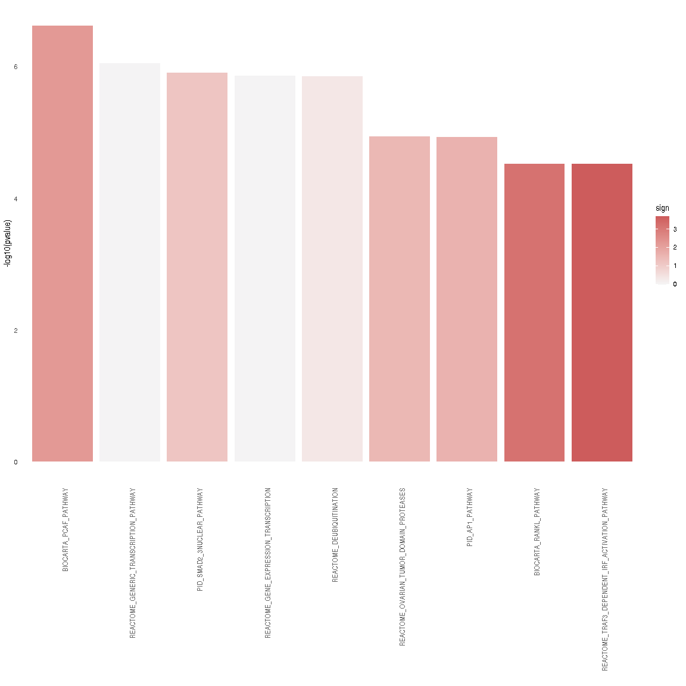
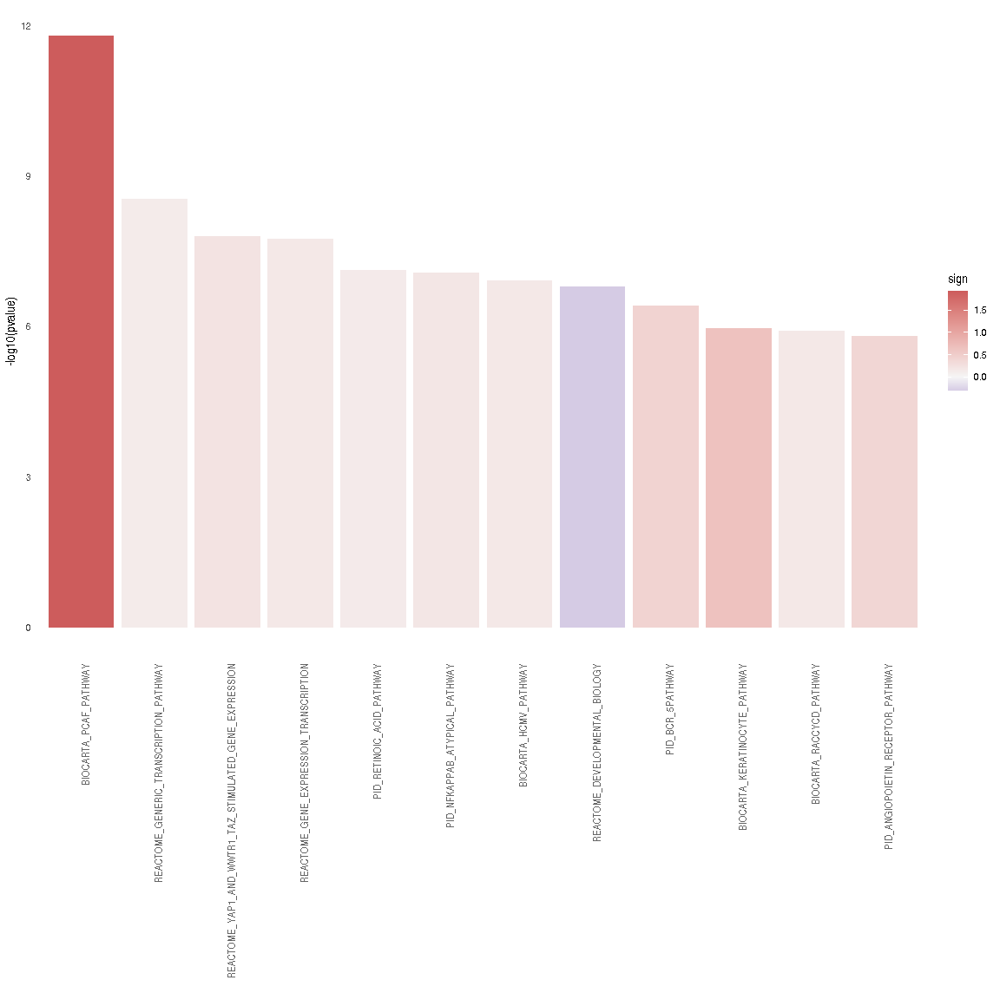

SARS-CoV-2 vs RSV vs HPIV3: Enrichment of CARNIVAL results
================
Alberto Valdeolivas: <alberto.valdeolivas@bioquant.uni-heidelberg.de>;
Date:
04/05/2020

### License Info

This program is free software: you can redistribute it and/or modify it
under the terms of the GNU General Public License as published by the
Free Software Foundation, either version 3 of the License, or (at your
option) any later version.

This program is distributed in the hope that it will be useful, but
WITHOUT ANY WARRANTY; without even the implied warranty of
MERCHANTABILITY or FITNESS FOR A PARTICULAR PURPOSE. See the GNU General
Public License for more details.

Please check <http://www.gnu.org/licenses/>.

## Introduction

The present script takes the RNAseq data from the study *"SARS-CoV-2
launches* *a unique transcriptional signature from in vitro, ex vivo,
and in vivo systems"*

<https://www.biorxiv.org/content/10.1101/2020.03.24.004655v1>

<https://www.ncbi.nlm.nih.gov/geo/query/acc.cgi?acc=GSE147507>

The goal of this set of scripts is to compare the transcriptional effect
of different viral infections: SARS-CoV-2, Respiratory syncytial virus
(RSV) and Human parainfluenza virus type 3 (HPIV3). In this script, we
use the nodes from the **CARNIVAL** output to run an enrichment analysis
for the conditions under study:

  - A549 alveolar cancer cell line: mock treated vs infected with
    SARS-CoV-2.

  - A549 alveolar cancer cell line: mock treated vs infected with RSV.

  - A549 alveolar cancer cell line: mock treated vs infected with HPIV3.

## Reading input data for Enrichment Analysis

To perform the enrichment analysis, we need to read the following input
files:

  - Output from CARNIVAL: to obtain the significant genes and the
    background genes

  - Datasets from MSigDB: describing the pathways in which our
    significant genes are known to be involved in.

  - Differential expression analysis: To evaluate the activity of the
    genes involved in the different enriched pathaways.

We first load the required packages and we define some functions.

``` r
library(readr)
library(piano)
library(dplyr)
library(ggplot2)
library(omicToolsTest)

## Function to extract the nodes that appear in CARNIVAL network and the 
## background genes (all genes present in the prior knowledge network).
## It returns a list with two objects: the success and the background genes.
extractCARNIVALnodes <- function(CarnivalResults){

    CarnivalNetwork <- 
        as.data.frame(CarnivalResults$weightedSIF, stringsAsFactors = FALSE)
    
    colnames(CarnivalNetwork) <- c("source", "sign", "target", "Weight")

    ## We define the set of nodes interesting for our condition
    sucesses <- unique(c(gsub("_.*","",CarnivalNetwork$source), 
        gsub("_.*","",CarnivalNetwork$target)))

    CarnivalAttributes <- as.data.frame(CarnivalResults$nodesAttributes, 
        stringsAsFactors = FALSE)

    ## We define the background as all the genes in our prior knowledge network.
    bg <- unique(gsub("_.*","",CarnivalAttributes$Node))     
    
    return(list(sucesses = sucesses, bg= bg))
}

### Function to print a barplot with the enriched pathways.
BarplotEnrichment <- function(PathwaysSelect, Interesting_pathways){ 
    
    p <- ggplot(PathwaysSelect, aes(x = reorder(pathway, pvalue), 
            y = -log10(pvalue))) + 
        geom_bar(aes(fill = sign), stat = "identity") +
        scale_fill_gradient2(low = "darkblue", high = "indianred", 
            mid = "whitesmoke", midpoint = 0) + 
        theme_minimal() +
        theme(axis.text.x = element_text(angle = 90, hjust = 1, 
            colour = ifelse(levels(reorder(PathwaysSelect$pathway, 
                PathwaysSelect$pvalue)) %in% Interesting_pathways, 
                "red", "grey40"),
            face = ifelse(levels(reorder(PathwaysSelect$pathway, 
                PathwaysSelect$pvalue)) %in% Interesting_pathways, 
                "bold", "plain")),
        panel.grid.major = element_blank(), 
        panel.grid.minor = element_blank()) + 
        xlab("")
    return(p)
}    
```

### Reading and formatting CARNIVAL output

We read the CARNIVAL results generated in the previous script. We define
two different gene sets in order tor conduct the enrichment. The first
set contains the nodes that appear in the CARNIVAL output and are
therefore relevant in the context of our input transcriptomic data. The
second set contains all the genes in our prior knowledge network which
are used as the backgroud.

``` r
## SARS-CoV-2
CarnivalResultsA549vsCOV2_noinput <- 
    readRDS("ResultsCARNIVAL/A549vsCOV2_noinput.rds")
NodesA549vsCOV2_noinput <- extractCARNIVALnodes(CarnivalResultsA549vsCOV2_noinput)

CarnivalResultsA549vsCOV2_RIGIlike_receptors_input <- 
    readRDS("ResultsCARNIVAL/A549vsCOV2_RIGIlike_receptors_input.rds")
NodesA549vsCOV2_RIGIlike_receptors_input <- 
    extractCARNIVALnodes(CarnivalResultsA549vsCOV2_RIGIlike_receptors_input)  

## RSV
CarnivalResultsA549vsRSV_noinput <- 
    readRDS("ResultsCARNIVAL/A549vsRSV_noinput.rds")
NodesA549vsRSV_noinput <- extractCARNIVALnodes(CarnivalResultsA549vsRSV_noinput)

CarnivalResultsA549vsRSV_RIGIlike_receptors_input <- 
    readRDS("ResultsCARNIVAL/A549vsRSV_RIGIlike_receptors_input.rds")
NodesA549vsRSV_RIGIlike_receptors_input <- 
    extractCARNIVALnodes(CarnivalResultsA549vsRSV_RIGIlike_receptors_input) 

## SARS-CoV-2
CarnivalResultsA549vsHPIV3_noinput <- 
    readRDS("ResultsCARNIVAL/A549vsHPIV3_noinput.rds")
NodesA549vsHPIV3_noinput <- extractCARNIVALnodes(CarnivalResultsA549vsHPIV3_noinput)

CarnivalResultsA549vsHPIV3_RIGIlike_receptors_input <- 
    readRDS("ResultsCARNIVAL/A549vsHPIV3_RIGIlike_receptors_input.rds")
NodesA549vsHPIV3_RIGIlike_receptors_input <- 
    extractCARNIVALnodes(CarnivalResultsA549vsHPIV3_RIGIlike_receptors_input)
```

### Reading Pathway data sets from MSigDB

We downloaded from MSigDB <https://www.gsea-msigdb.org/> the following
dataset: c2.cp.v7.0.symbols.gmt. It contains several pathways from
different resources and the genes that are known to be involved in those
pathways.

``` r
pathways <- gmt_to_csv("../RawData/c2.cp.v7.0.symbols.gmt")
```

    ##   |                                                                              |                                                                      |   0%  |                                                                              |                                                                      |   1%  |                                                                              |=                                                                     |   1%  |                                                                              |=                                                                     |   2%  |                                                                              |==                                                                    |   2%  |                                                                              |==                                                                    |   3%  |                                                                              |==                                                                    |   4%  |                                                                              |===                                                                   |   4%  |                                                                              |===                                                                   |   5%  |                                                                              |====                                                                  |   5%  |                                                                              |====                                                                  |   6%  |                                                                              |=====                                                                 |   6%  |                                                                              |=====                                                                 |   7%  |                                                                              |=====                                                                 |   8%  |                                                                              |======                                                                |   8%  |                                                                              |======                                                                |   9%  |                                                                              |=======                                                               |   9%  |                                                                              |=======                                                               |  10%  |                                                                              |=======                                                               |  11%  |                                                                              |========                                                              |  11%  |                                                                              |========                                                              |  12%  |                                                                              |=========                                                             |  12%  |                                                                              |=========                                                             |  13%  |                                                                              |=========                                                             |  14%  |                                                                              |==========                                                            |  14%  |                                                                              |==========                                                            |  15%  |                                                                              |===========                                                           |  15%  |                                                                              |===========                                                           |  16%  |                                                                              |============                                                          |  16%  |                                                                              |============                                                          |  17%  |                                                                              |============                                                          |  18%  |                                                                              |=============                                                         |  18%  |                                                                              |=============                                                         |  19%  |                                                                              |==============                                                        |  19%  |                                                                              |==============                                                        |  20%  |                                                                              |==============                                                        |  21%  |                                                                              |===============                                                       |  21%  |                                                                              |===============                                                       |  22%  |                                                                              |================                                                      |  22%  |                                                                              |================                                                      |  23%  |                                                                              |================                                                      |  24%  |                                                                              |=================                                                     |  24%  |                                                                              |=================                                                     |  25%  |                                                                              |==================                                                    |  25%  |                                                                              |==================                                                    |  26%  |                                                                              |===================                                                   |  26%  |                                                                              |===================                                                   |  27%  |                                                                              |===================                                                   |  28%  |                                                                              |====================                                                  |  28%  |                                                                              |====================                                                  |  29%  |                                                                              |=====================                                                 |  29%  |                                                                              |=====================                                                 |  30%  |                                                                              |=====================                                                 |  31%  |                                                                              |======================                                                |  31%  |                                                                              |======================                                                |  32%  |                                                                              |=======================                                               |  32%  |                                                                              |=======================                                               |  33%  |                                                                              |=======================                                               |  34%  |                                                                              |========================                                              |  34%  |                                                                              |========================                                              |  35%  |                                                                              |=========================                                             |  35%  |                                                                              |=========================                                             |  36%  |                                                                              |==========================                                            |  36%  |                                                                              |==========================                                            |  37%  |                                                                              |==========================                                            |  38%  |                                                                              |===========================                                           |  38%  |                                                                              |===========================                                           |  39%  |                                                                              |============================                                          |  39%  |                                                                              |============================                                          |  40%  |                                                                              |============================                                          |  41%  |                                                                              |=============================                                         |  41%  |                                                                              |=============================                                         |  42%  |                                                                              |==============================                                        |  42%  |                                                                              |==============================                                        |  43%  |                                                                              |==============================                                        |  44%  |                                                                              |===============================                                       |  44%  |                                                                              |===============================                                       |  45%  |                                                                              |================================                                      |  45%  |                                                                              |================================                                      |  46%  |                                                                              |=================================                                     |  46%  |                                                                              |=================================                                     |  47%  |                                                                              |=================================                                     |  48%  |                                                                              |==================================                                    |  48%  |                                                                              |==================================                                    |  49%  |                                                                              |===================================                                   |  49%  |                                                                              |===================================                                   |  50%  |                                                                              |===================================                                   |  51%  |                                                                              |====================================                                  |  51%  |                                                                              |====================================                                  |  52%  |                                                                              |=====================================                                 |  52%  |                                                                              |=====================================                                 |  53%  |                                                                              |=====================================                                 |  54%  |                                                                              |======================================                                |  54%  |                                                                              |======================================                                |  55%  |                                                                              |=======================================                               |  55%  |                                                                              |=======================================                               |  56%  |                                                                              |========================================                              |  56%  |                                                                              |========================================                              |  57%  |                                                                              |========================================                              |  58%  |                                                                              |=========================================                             |  58%  |                                                                              |=========================================                             |  59%  |                                                                              |==========================================                            |  59%  |                                                                              |==========================================                            |  60%  |                                                                              |==========================================                            |  61%  |                                                                              |===========================================                           |  61%  |                                                                              |===========================================                           |  62%  |                                                                              |============================================                          |  62%  |                                                                              |============================================                          |  63%  |                                                                              |============================================                          |  64%  |                                                                              |=============================================                         |  64%  |                                                                              |=============================================                         |  65%  |                                                                              |==============================================                        |  65%  |                                                                              |==============================================                        |  66%  |                                                                              |===============================================                       |  66%  |                                                                              |===============================================                       |  67%  |                                                                              |===============================================                       |  68%  |                                                                              |================================================                      |  68%  |                                                                              |================================================                      |  69%  |                                                                              |=================================================                     |  69%  |                                                                              |=================================================                     |  70%  |                                                                              |=================================================                     |  71%  |                                                                              |==================================================                    |  71%  |                                                                              |==================================================                    |  72%  |                                                                              |===================================================                   |  72%  |                                                                              |===================================================                   |  73%  |                                                                              |===================================================                   |  74%  |                                                                              |====================================================                  |  74%  |                                                                              |====================================================                  |  75%  |                                                                              |=====================================================                 |  75%  |                                                                              |=====================================================                 |  76%  |                                                                              |======================================================                |  76%  |                                                                              |======================================================                |  77%  |                                                                              |======================================================                |  78%  |                                                                              |=======================================================               |  78%  |                                                                              |=======================================================               |  79%  |                                                                              |========================================================              |  79%  |                                                                              |========================================================              |  80%  |                                                                              |========================================================              |  81%  |                                                                              |=========================================================             |  81%  |                                                                              |=========================================================             |  82%  |                                                                              |==========================================================            |  82%  |                                                                              |==========================================================            |  83%  |                                                                              |==========================================================            |  84%  |                                                                              |===========================================================           |  84%  |                                                                              |===========================================================           |  85%  |                                                                              |============================================================          |  85%  |                                                                              |============================================================          |  86%  |                                                                              |=============================================================         |  86%  |                                                                              |=============================================================         |  87%  |                                                                              |=============================================================         |  88%  |                                                                              |==============================================================        |  88%  |                                                                              |==============================================================        |  89%  |                                                                              |===============================================================       |  89%  |                                                                              |===============================================================       |  90%  |                                                                              |===============================================================       |  91%  |                                                                              |================================================================      |  91%  |                                                                              |================================================================      |  92%  |                                                                              |=================================================================     |  92%  |                                                                              |=================================================================     |  93%  |                                                                              |=================================================================     |  94%  |                                                                              |==================================================================    |  94%  |                                                                              |==================================================================    |  95%  |                                                                              |===================================================================   |  95%  |                                                                              |===================================================================   |  96%  |                                                                              |====================================================================  |  96%  |                                                                              |====================================================================  |  97%  |                                                                              |====================================================================  |  98%  |                                                                              |===================================================================== |  98%  |                                                                              |===================================================================== |  99%  |                                                                              |======================================================================|  99%  |                                                                              |======================================================================| 100%

### Reading and formatting statistic from DEG

We read the results from the differential expression analysis. The
statistic of the genes will be mapped later on in the different
significant pathways.

``` r
## Differential expression table
dds_A549vsCOV2 <- readRDS("IntermediateFiles/dds_results_A549vsCOV2.rds") %>%
    as.data.frame() %>% 
    select(stat)
dds_A549vsRSV <- readRDS("IntermediateFiles/dds_results_A549vsRSV.rds") %>%
    as.data.frame() %>% 
    select(stat)
dds_A549vsHPIV3 <- readRDS("IntermediateFiles/dds_results_A549vsHPIV3.rds") %>%
    as.data.frame() %>% 
    select(stat)
```

## Performing Enrichment Analysis and plotting the Results

Using the **Piano** R package, we run a gene set analysis (GSA) based on
a list of significant genes (CARNIVAL nodes) and a gene set collection
(background). It uses Fisher’s exact test.

### CARNIVAL output with no perturbation

#### SARS-CoV-2 infection

``` r
## We run GSA hyper Geometric test
sig_pathways_A549vsCOV2_noinput <- runGSAhyper(NodesA549vsCOV2_noinput$sucesses, 
    universe = NodesA549vsCOV2_noinput$bg, gsc = loadGSC(pathways))
sig_pathways_df_A549vsCOV2_noinput <- 
    as.data.frame(sig_pathways_A549vsCOV2_noinput$resTab)

## We map the t-stastic into the resulted enriched pathways.
sig_pathways_df_A549vsCOV2_noinput$sign <- 
    unlist(lapply(row.names(sig_pathways_df_A549vsCOV2_noinput), 
    function(x, kinases, pathways){
        return(mean(dds_A549vsCOV2[row.names(dds_A549vsCOV2) %in% pathways[pathways$term == x,1],1], na.rm = TRUE))
    },kinases = kinases, pathways = pathways))

sig_pathways_df_A549vsCOV2_noinput <- 
    sig_pathways_df_A549vsCOV2_noinput[!is.nan(sig_pathways_df_A549vsCOV2_noinput$sign),]
```

We format the results and we prepare them to be plotted. For
visualization purposes, we just select pathways with adjusted p-values
lower than 0.0001.

``` r
PathwaysSelect_A549vsCOV2_noinput <- sig_pathways_df_A549vsCOV2_noinput %>%
    tibble::rownames_to_column(var = "pathway") %>%
    dplyr::select(pathway, `p-value`, `Adjusted p-value`, sign) %>%
    dplyr::filter(`Adjusted p-value` <= 0.0001) %>%
    dplyr::rename(pvalue = `p-value`, AdjPvalu = `Adjusted p-value`) %>% 
    dplyr::mutate(pathway = as.factor(pathway))
```

We finally plot the results highlighting the most relevant pathways.

``` r
Interesting_pathways_A549vsCOV2_noinput <- c()

p_A549vsCOV2_noinput <- BarplotEnrichment(PathwaysSelect_A549vsCOV2_noinput, 
    Interesting_pathways_A549vsCOV2_noinput)
```

<!-- -->

#### RSV infection

``` r
## We run GSA hyper Geometric test
sig_pathways_A549vsRSV_noinput <- runGSAhyper(NodesA549vsRSV_noinput$sucesses, 
    universe = NodesA549vsRSV_noinput$bg, gsc = loadGSC(pathways))
sig_pathways_df_A549vsRSV_noinput <- 
    as.data.frame(sig_pathways_A549vsRSV_noinput$resTab)

## We map the t-stastic into the resulted enriched pathways.
sig_pathways_df_A549vsRSV_noinput$sign <- 
    unlist(lapply(row.names(sig_pathways_df_A549vsRSV_noinput), 
    function(x, kinases, pathways){
        return(mean(dds_A549vsRSV[row.names(dds_A549vsRSV) %in% pathways[pathways$term == x,1],1], na.rm = TRUE))
    },kinases = kinases, pathways = pathways))

sig_pathways_df_A549vsRSV_noinput <- 
    sig_pathways_df_A549vsRSV_noinput[!is.nan(sig_pathways_df_A549vsRSV_noinput$sign),]
```

We format the results and we prepare them to be plotted. For
visualization purposes, we just select pathways with adjusted p-values
lower than 0.0001.

``` r
PathwaysSelect_A549vsRSV_noinput <- sig_pathways_df_A549vsRSV_noinput %>%
    tibble::rownames_to_column(var = "pathway") %>%
    dplyr::select(pathway, `p-value`, `Adjusted p-value`, sign) %>%
    dplyr::filter(`Adjusted p-value` <= 0.0001) %>%
    dplyr::rename(pvalue = `p-value`, AdjPvalu = `Adjusted p-value`) %>% 
    dplyr::mutate(pathway = as.factor(pathway))
```

We finally plot the results highlighting the most relevant pathways.

``` r
Interesting_pathways_A549vsRSV_noinput <- c()

p_A549vsRSV_noinput <- BarplotEnrichment(PathwaysSelect_A549vsRSV_noinput, 
    Interesting_pathways_A549vsRSV_noinput)
```

<!-- -->

#### HPIV3 infection

``` r
## We run GSA hyper Geometric test
sig_pathways_A549vsHPIV3_noinput <- runGSAhyper(NodesA549vsHPIV3_noinput$sucesses, 
    universe = NodesA549vsHPIV3_noinput$bg, gsc = loadGSC(pathways))
sig_pathways_df_A549vsHPIV3_noinput <- 
    as.data.frame(sig_pathways_A549vsHPIV3_noinput$resTab)

## We map the t-stastic into the resulted enriched pathways.
sig_pathways_df_A549vsHPIV3_noinput$sign <- 
    unlist(lapply(row.names(sig_pathways_df_A549vsHPIV3_noinput), 
    function(x, kinases, pathways){
        return(mean(dds_A549vsHPIV3[row.names(dds_A549vsHPIV3) %in% pathways[pathways$term == x,1],1], na.rm = TRUE))
    },kinases = kinases, pathways = pathways))

sig_pathways_df_A549vsHPIV3_noinput <- 
    sig_pathways_df_A549vsHPIV3_noinput[!is.nan(sig_pathways_df_A549vsHPIV3_noinput$sign),]
```

We format the results and we prepare them to be plotted. For
visualization purposes, we just select pathways with adjusted p-values
lower than 0.025.

``` r
PathwaysSelect_A549vsHPIV3_noinput <- sig_pathways_df_A549vsHPIV3_noinput %>%
    tibble::rownames_to_column(var = "pathway") %>%
    dplyr::select(pathway, `p-value`, `Adjusted p-value`, sign) %>%
    dplyr::filter(`Adjusted p-value` <= 0.025) %>%
    dplyr::rename(pvalue = `p-value`, AdjPvalu = `Adjusted p-value`) %>% 
    dplyr::mutate(pathway = as.factor(pathway))
```

We finally plot the results highlighting the most relevant pathways.

``` r
Interesting_pathways_A549vsHPIV3_noinput <- c()

p_A549vsHPIV3_noinput <- BarplotEnrichment(PathwaysSelect_A549vsHPIV3_noinput, 
    Interesting_pathways_A549vsHPIV3_noinput)
```

<!-- -->

### CARNIVAL output with perturbations on the RIG-I-like receptors

#### SARS-CoV-2 infection

``` r
## We run GSA hyper Geometric test
sig_pathways_A549vsCOV2_RIGIlike_receptors_input <- 
runGSAhyper(NodesA549vsCOV2_RIGIlike_receptors_input$sucesses, 
    universe = NodesA549vsCOV2_RIGIlike_receptors_input$bg, 
    gsc = loadGSC(pathways))
sig_pathways_df_A549vsCOV2_RIGIlike_receptors_input <- 
    as.data.frame(sig_pathways_A549vsCOV2_RIGIlike_receptors_input$resTab)

## We map the t-stastic into the resulted enriched pathways.
sig_pathways_df_A549vsCOV2_RIGIlike_receptors_input$sign <- 
    unlist(lapply(row.names(sig_pathways_df_A549vsCOV2_RIGIlike_receptors_input), 
    function(x, kinases, pathways){
        return(mean(dds_A549vsCOV2[row.names(dds_A549vsCOV2) %in% pathways[pathways$term == x,1],1], na.rm = TRUE))
    },kinases = kinases, pathways = pathways))

sig_pathways_df_A549vsCOV2_RIGIlike_receptors_input <- 
    sig_pathways_df_A549vsCOV2_RIGIlike_receptors_input[!is.nan(sig_pathways_df_A549vsCOV2_RIGIlike_receptors_input$sign),]
```

We format the results and we prepare them to be plotted. For
visualization purposes, we just select pathways with adjusted p-values
lower than 0.0001.

``` r
PathwaysSelect_A549vsCOV2_RIGIlike_receptors_input <- 
    sig_pathways_df_A549vsCOV2_RIGIlike_receptors_input %>%
    tibble::rownames_to_column(var = "pathway") %>%
    dplyr::select(pathway, `p-value`, `Adjusted p-value`, sign) %>%
    dplyr::filter(`Adjusted p-value` <= 0.0001) %>%
    dplyr::rename(pvalue = `p-value`, AdjPvalu = `Adjusted p-value`) %>% 
    dplyr::mutate(pathway = as.factor(pathway))
```

We finally plot the results highlighting the most relevant pathways.

``` r
Interesting_pathways_A549vsCOV2_RIGIlike_receptors_input <- c()

p_A549vsCOV2_RIGIlike_receptors_input <- 
    BarplotEnrichment(PathwaysSelect_A549vsCOV2_RIGIlike_receptors_input, 
    Interesting_pathways_A549vsCOV2_RIGIlike_receptors_input)
```

<!-- -->

#### RSV infection

``` r
## We run GSA hyper Geometric test
sig_pathways_A549vsRSV_RIGIlike_receptors_input <- 
    runGSAhyper(NodesA549vsRSV_RIGIlike_receptors_input$sucesses, 
    universe = NodesA549vsRSV_RIGIlike_receptors_input$bg, 
    gsc = loadGSC(pathways))
sig_pathways_df_A549vsRSV_RIGIlike_receptors_input <- 
    as.data.frame(sig_pathways_A549vsRSV_RIGIlike_receptors_input$resTab)

## We map the t-stastic into the resulted enriched pathways.
sig_pathways_df_A549vsRSV_RIGIlike_receptors_input$sign <- 
    unlist(lapply(row.names(sig_pathways_df_A549vsRSV_RIGIlike_receptors_input), 
    function(x, kinases, pathways){
        return(mean(dds_A549vsRSV[row.names(dds_A549vsRSV) %in% pathways[pathways$term == x,1],1], na.rm = TRUE))
    },kinases = kinases, pathways = pathways))

sig_pathways_df_A549vsRSV_RIGIlike_receptors_input <- 
    sig_pathways_df_A549vsRSV_RIGIlike_receptors_input[!is.nan(sig_pathways_df_A549vsRSV_RIGIlike_receptors_input$sign),]
```

We format the results and we prepare them to be plotted. For
visualization purposes, we just select pathways with adjusted p-values
lower than 0.01.

``` r
PathwaysSelect_A549vsRSV_RIGIlike_receptors_input <- 
    sig_pathways_df_A549vsRSV_RIGIlike_receptors_input %>%
    tibble::rownames_to_column(var = "pathway") %>%
    dplyr::select(pathway, `p-value`, `Adjusted p-value`, sign) %>%
    dplyr::filter(`Adjusted p-value` <= 0.01) %>%
    dplyr::rename(pvalue = `p-value`, AdjPvalu = `Adjusted p-value`) %>% 
    dplyr::mutate(pathway = as.factor(pathway))
```

We finally plot the results highlighting the most relevant pathways.

``` r
Interesting_pathways_A549vsRSV_RIGIlike_receptors_input <- c()

p_A549vsRSV_RIGIlike_receptors_input <- 
    BarplotEnrichment(PathwaysSelect_A549vsRSV_RIGIlike_receptors_input, 
    Interesting_pathways_A549vsRSV_RIGIlike_receptors_input)
```

<!-- -->

#### HPIV3 infection

``` r
## We run GSA hyper Geometric test
sig_pathways_A549vsHPIV3_RIGIlike_receptors_input <- runGSAhyper(NodesA549vsHPIV3_RIGIlike_receptors_input$sucesses, 
    universe = NodesA549vsHPIV3_RIGIlike_receptors_input$bg, 
    gsc = loadGSC(pathways))
sig_pathways_df_A549vsHPIV3_RIGIlike_receptors_input <- 
    as.data.frame(sig_pathways_A549vsHPIV3_RIGIlike_receptors_input$resTab)

## We map the t-stastic into the resulted enriched pathways.
sig_pathways_df_A549vsHPIV3_RIGIlike_receptors_input$sign <- 
    unlist(lapply(row.names(sig_pathways_df_A549vsHPIV3_RIGIlike_receptors_input), 
    function(x, kinases, pathways){
        return(mean(dds_A549vsHPIV3[row.names(dds_A549vsHPIV3) %in% pathways[pathways$term == x,1],1], na.rm = TRUE))
    },kinases = kinases, pathways = pathways))

sig_pathways_df_A549vsHPIV3_RIGIlike_receptors_input <- 
    sig_pathways_df_A549vsHPIV3_RIGIlike_receptors_input[!is.nan(sig_pathways_df_A549vsHPIV3_RIGIlike_receptors_input$sign),]
```

We format the results and we prepare them to be plotted. For
visualization purposes, we just select pathways with adjusted p-values
lower than 0.0005

``` r
PathwaysSelect_A549vsHPIV3_RIGIlike_receptors_input <- 
    sig_pathways_df_A549vsHPIV3_RIGIlike_receptors_input %>%
    tibble::rownames_to_column(var = "pathway") %>%
    dplyr::select(pathway, `p-value`, `Adjusted p-value`, sign) %>%
    dplyr::filter(`Adjusted p-value` <= 0.0005) %>%
    dplyr::rename(pvalue = `p-value`, AdjPvalu = `Adjusted p-value`) %>% 
    dplyr::mutate(pathway = as.factor(pathway))
```

We finally plot the results highlighting the most relevant pathways.

``` r
Interesting_pathways_A549vsHPIV3_RIGIlike_receptors_input <- c()

p_A549vsHPIV3_RIGIlike_receptors_input <- 
    BarplotEnrichment(PathwaysSelect_A549vsHPIV3_RIGIlike_receptors_input, 
    Interesting_pathways_A549vsHPIV3_RIGIlike_receptors_input)
```

<!-- -->

## Session Info Details

    ## R version 3.6.3 (2020-02-29)
    ## Platform: x86_64-pc-linux-gnu (64-bit)
    ## Running under: Ubuntu 18.04.4 LTS
    ## 
    ## Matrix products: default
    ## BLAS:   /usr/local/lib/R/lib/libRblas.so
    ## LAPACK: /usr/local/lib/R/lib/libRlapack.so
    ## 
    ## locale:
    ##  [1] LC_CTYPE=en_GB.UTF-8       LC_NUMERIC=C              
    ##  [3] LC_TIME=en_GB.UTF-8        LC_COLLATE=en_GB.UTF-8    
    ##  [5] LC_MONETARY=en_GB.UTF-8    LC_MESSAGES=en_GB.UTF-8   
    ##  [7] LC_PAPER=en_GB.UTF-8       LC_NAME=C                 
    ##  [9] LC_ADDRESS=C               LC_TELEPHONE=C            
    ## [11] LC_MEASUREMENT=en_GB.UTF-8 LC_IDENTIFICATION=C       
    ## 
    ## attached base packages:
    ## [1] parallel  stats4    stats     graphics  grDevices utils     datasets 
    ## [8] methods   base     
    ## 
    ## other attached packages:
    ##  [1] DESeq2_1.26.0               SummarizedExperiment_1.16.0
    ##  [3] DelayedArray_0.12.0         BiocParallel_1.20.0        
    ##  [5] matrixStats_0.56.0          Biobase_2.46.0             
    ##  [7] GenomicRanges_1.38.0        GenomeInfoDb_1.22.0        
    ##  [9] IRanges_2.20.1              S4Vectors_0.24.1           
    ## [11] BiocGenerics_0.32.0         omicToolsTest_0.1.0        
    ## [13] ggplot2_3.3.0               dplyr_0.8.5                
    ## [15] piano_2.2.0                 readr_1.3.1                
    ## 
    ## loaded via a namespace (and not attached):
    ##   [1] fgsea_1.12.0           colorspace_1.4-1       ellipsis_0.3.0        
    ##   [4] htmlTable_1.13.3       XVector_0.26.0         base64enc_0.1-3       
    ##   [7] rstudioapi_0.11        farver_2.0.3           ggrepel_0.8.2         
    ##  [10] DT_0.13                bit64_0.9-7            AnnotationDbi_1.48.0  
    ##  [13] fansi_0.4.1            splines_3.6.3          geneplotter_1.64.0    
    ##  [16] knitr_1.28             Formula_1.2-3          jsonlite_1.6.1        
    ##  [19] annotate_1.64.0        cluster_2.1.0          dbplyr_1.4.2          
    ##  [22] png_0.1-7              pheatmap_1.0.12        shinydashboard_0.7.1  
    ##  [25] snowfall_1.84-6.1      graph_1.64.0           shiny_1.4.0.2         
    ##  [28] compiler_3.6.3         httr_1.4.1             backports_1.1.5       
    ##  [31] assertthat_0.2.1       Matrix_1.2-18          fastmap_1.0.1         
    ##  [34] limma_3.42.0           cli_2.0.2              later_1.0.0           
    ##  [37] acepack_1.4.1          visNetwork_2.0.9       htmltools_0.4.0       
    ##  [40] tools_3.6.3            igraph_1.2.5           gtable_0.3.0          
    ##  [43] glue_1.4.0             GenomeInfoDbData_1.2.2 rappdirs_0.3.1        
    ##  [46] fastmatch_1.1-0        Rcpp_1.0.4             slam_0.1-47           
    ##  [49] vctrs_0.2.4            gdata_2.18.0           xfun_0.12             
    ##  [52] stringr_1.4.0          mime_0.9               lifecycle_0.2.0       
    ##  [55] gtools_3.8.2           XML_3.99-0.3           zlibbioc_1.32.0       
    ##  [58] scales_1.1.0           hms_0.5.3              promises_1.1.0        
    ##  [61] relations_0.6-9        RColorBrewer_1.1-2     sets_1.0-18           
    ##  [64] yaml_2.2.1             curl_4.3               memoise_1.1.0         
    ##  [67] gridExtra_2.3          rpart_4.1-15           latticeExtra_0.6-29   
    ##  [70] reshape_0.8.8          stringi_1.4.6          RSQLite_2.2.0         
    ##  [73] genefilter_1.68.0      checkmate_2.0.0        caTools_1.18.0        
    ##  [76] rlang_0.4.5            pkgconfig_2.0.3        bitops_1.0-6          
    ##  [79] evaluate_0.14          lattice_0.20-41        purrr_0.3.3           
    ##  [82] labeling_0.3           htmlwidgets_1.5.1      cowplot_1.0.0         
    ##  [85] bit_1.1-15.2           tidyselect_1.0.0       GSEABase_1.48.0       
    ##  [88] plyr_1.8.6             magrittr_1.5           R6_2.4.1              
    ##  [91] gplots_3.0.3           UniProt.ws_2.26.0      Hmisc_4.4-0           
    ##  [94] DBI_1.1.0              foreign_0.8-76         pillar_1.4.3          
    ##  [97] withr_2.1.2            nnet_7.3-13            survival_3.1-11       
    ## [100] RCurl_1.98-1.1         tibble_3.0.0           crayon_1.3.4          
    ## [103] KernSmooth_2.23-16     BiocFileCache_1.10.2   rmarkdown_2.1         
    ## [106] jpeg_0.1-8.1           locfit_1.5-9.4         grid_3.6.3            
    ## [109] data.table_1.12.8      marray_1.64.0          blob_1.2.1            
    ## [112] digest_0.6.25          xtable_1.8-4           httpuv_1.5.2          
    ## [115] munsell_0.5.0          shinyjs_1.1
