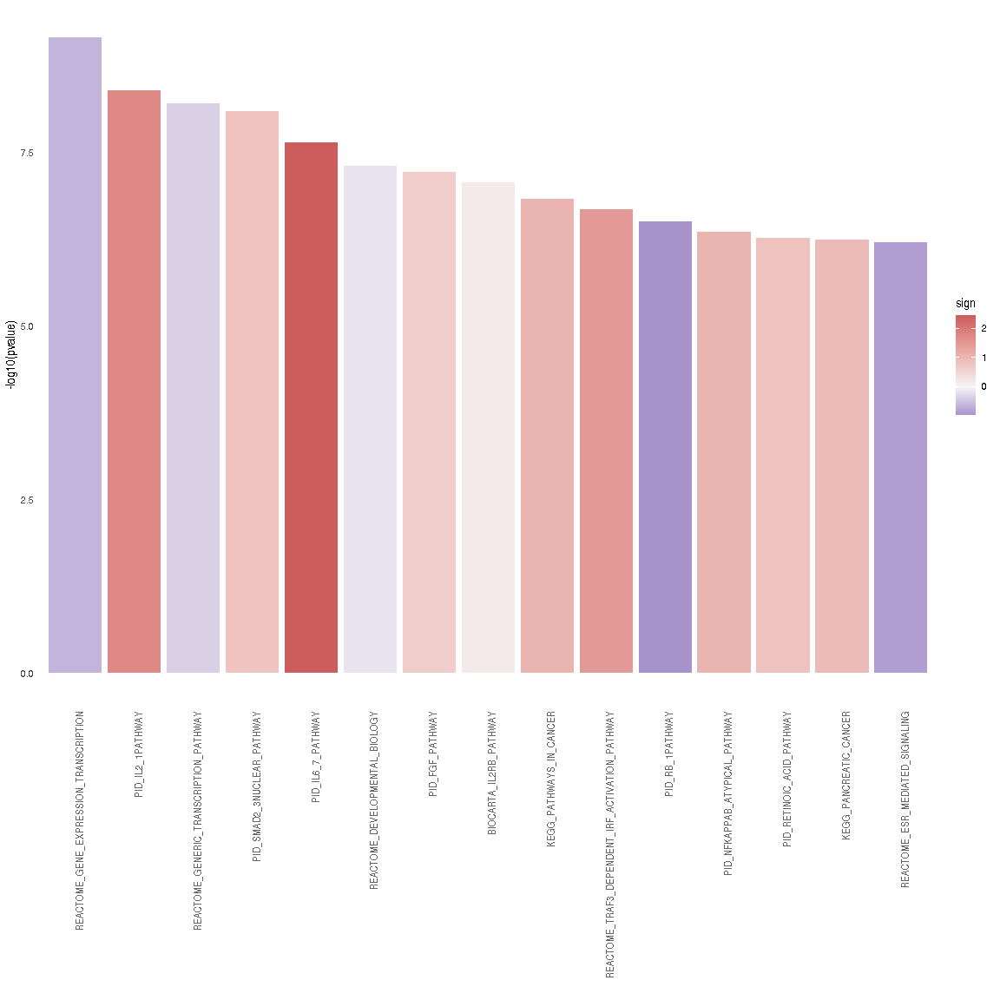
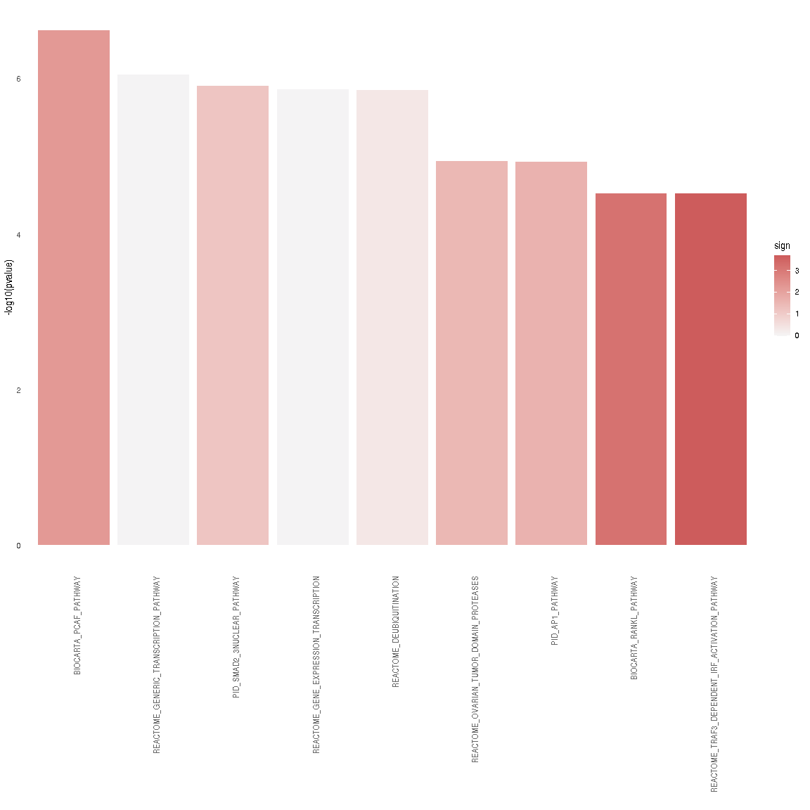
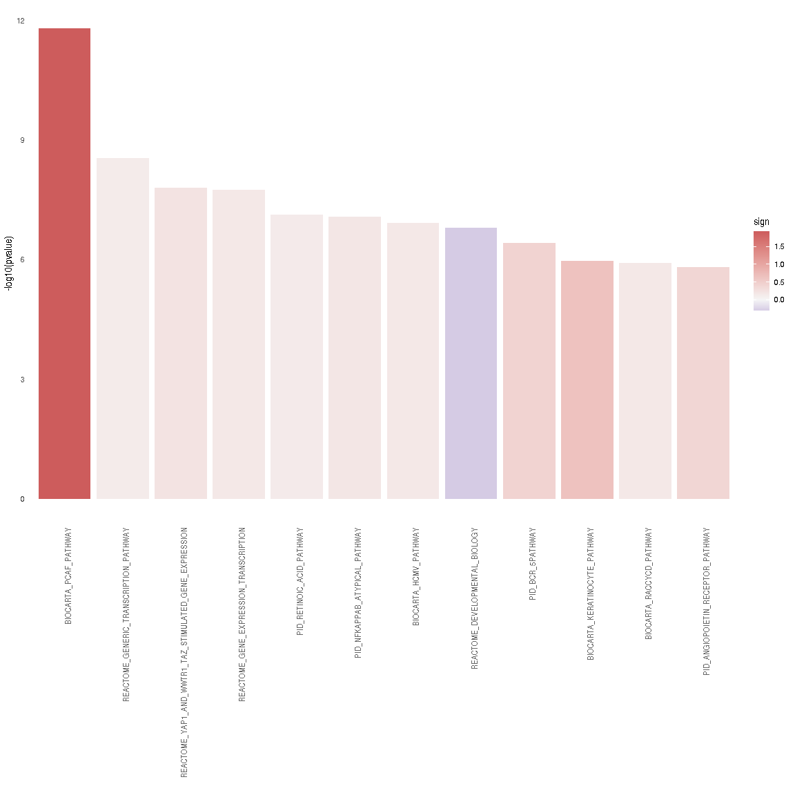

SARS-CoV-2 vs RSV vs HPIV3: Enrichment of CARNIVAL results
================
Alberto Valdeolivas: <alberto.valdeolivas@bioquant.uni-heidelberg.de>;
Date:
04/05/2020

### License Info

This program is free software: you can redistribute it and/or modify it
under the terms of the GNU General Public License as published by the
Free Software Foundation, either version 3 of the License, or (at your
option) any later version.

This program is distributed in the hope that it will be useful, but
WITHOUT ANY WARRANTY; without even the implied warranty of
MERCHANTABILITY or FITNESS FOR A PARTICULAR PURPOSE. See the GNU General
Public License for more details.

Please check <http://www.gnu.org/licenses/>.

## Introduction

The present script takes the RNAseq data from the study *"SARS-CoV-2
launches* *a unique transcriptional signature from in vitro, ex vivo,
and in vivo systems"*

<https://www.biorxiv.org/content/10.1101/2020.03.24.004655v1>

<https://www.ncbi.nlm.nih.gov/geo/query/acc.cgi?acc=GSE147507>

The goal of this set of scripts is to compare the transcriptional effect
of different viral infections: SARS-CoV-2, Respiratory syncytial virus
(RSV) and Human parainfluenza virus type 3 (HPIV3). In this script, we
use the nodes from the **CARNIVAL** output to run an enrichment analysis
for the conditions under study:

  - A549 alveolar cancer cell line: mock treated vs infected with
    SARS-CoV-2.

  - A549 alveolar cancer cell line: mock treated vs infected with RSV.

  - A549 alveolar cancer cell line: mock treated vs infected with HPIV3.

## Reading input data for Enrichment Analysis

To perform the enrichment analysis, we need to read the following input
files:

  - Output from CARNIVAL: to obtain the significant genes and the
    background genes

  - Datasets from MSigDB: describing the pathways in which our
    significant genes are known to be involved in.

  - Differential expression analysis: To evaluate the activity of the
    genes involved in the different enriched pathaways.

We first load the required packages and we define some functions.

``` r
library(readr)
library(piano)
library(dplyr)
library(ggplot2)
library(omicToolsTest)
library(limma)
library(kableExtra)

## Function to extract the nodes that appear in CARNIVAL network and the 
## background genes (all genes present in the prior knowledge network).
## It returns a list with two objects: the success and the background genes.
extractCARNIVALnodes <- function(CarnivalResults){

    CarnivalNetwork <- 
        as.data.frame(CarnivalResults$weightedSIF, stringsAsFactors = FALSE)
    
    colnames(CarnivalNetwork) <- c("source", "sign", "target", "Weight")

    ## We define the set of nodes interesting for our condition
    sucesses <- unique(c(gsub("_.*","",CarnivalNetwork$source), 
        gsub("_.*","",CarnivalNetwork$target)))

    CarnivalAttributes <- as.data.frame(CarnivalResults$nodesAttributes, 
        stringsAsFactors = FALSE)

    ## We define the background as all the genes in our prior knowledge network.
    bg <- unique(gsub("_.*","",CarnivalAttributes$Node))     
    
    return(list(sucesses = sucesses, bg= bg))
}

### Function to print a barplot with the enriched pathways.
BarplotEnrichment <- function(PathwaysSelect, Interesting_pathways){ 
    
    p <- ggplot(PathwaysSelect, aes(x = reorder(pathway, pvalue), 
            y = -log10(pvalue))) + 
        geom_bar(aes(fill = sign), stat = "identity") +
        scale_fill_gradient2(low = "darkblue", high = "indianred", 
            mid = "whitesmoke", midpoint = 0) + 
        theme_minimal() +
        theme(axis.text.x = element_text(angle = 90, hjust = 1, 
            colour = ifelse(levels(reorder(PathwaysSelect$pathway, 
                PathwaysSelect$pvalue)) %in% Interesting_pathways, 
                "red", "grey40"),
            face = ifelse(levels(reorder(PathwaysSelect$pathway, 
                PathwaysSelect$pvalue)) %in% Interesting_pathways, 
                "bold", "plain")),
        panel.grid.major = element_blank(), 
        panel.grid.minor = element_blank()) + 
        xlab("")
    return(p)
}    
```

### Reading and formatting CARNIVAL output

We read the CARNIVAL results generated in the previous script. We define
two different gene sets in order tor conduct the enrichment. The first
set contains the nodes that appear in the CARNIVAL output and are
therefore relevant in the context of our input transcriptomic data. The
second set contains all the genes in our prior knowledge network which
are used as the backgroud.

``` r
## SARS-CoV-2
CarnivalResultsA549vsCOV2_noinput <- 
    readRDS("ResultsCARNIVAL/A549vsCOV2_noinput.rds")
NodesA549vsCOV2_noinput <- extractCARNIVALnodes(CarnivalResultsA549vsCOV2_noinput)

CarnivalResultsA549vsCOV2_RIGIlike_receptors_input <- 
    readRDS("ResultsCARNIVAL/A549vsCOV2_RIGIlike_receptors_input.rds")
NodesA549vsCOV2_RIGIlike_receptors_input <- 
    extractCARNIVALnodes(CarnivalResultsA549vsCOV2_RIGIlike_receptors_input)  

## RSV
CarnivalResultsA549vsRSV_noinput <- 
    readRDS("ResultsCARNIVAL/A549vsRSV_noinput.rds")
NodesA549vsRSV_noinput <- extractCARNIVALnodes(CarnivalResultsA549vsRSV_noinput)

CarnivalResultsA549vsRSV_RIGIlike_receptors_input <- 
    readRDS("ResultsCARNIVAL/A549vsRSV_RIGIlike_receptors_input.rds")
NodesA549vsRSV_RIGIlike_receptors_input <- 
    extractCARNIVALnodes(CarnivalResultsA549vsRSV_RIGIlike_receptors_input) 

## SARS-CoV-2
CarnivalResultsA549vsHPIV3_noinput <- 
    readRDS("ResultsCARNIVAL/A549vsHPIV3_noinput.rds")
NodesA549vsHPIV3_noinput <- extractCARNIVALnodes(CarnivalResultsA549vsHPIV3_noinput)

CarnivalResultsA549vsHPIV3_RIGIlike_receptors_input <- 
    readRDS("ResultsCARNIVAL/A549vsHPIV3_RIGIlike_receptors_input.rds")
NodesA549vsHPIV3_RIGIlike_receptors_input <- 
    extractCARNIVALnodes(CarnivalResultsA549vsHPIV3_RIGIlike_receptors_input)
```

### Reading Pathway data sets from MSigDB

We downloaded from MSigDB <https://www.gsea-msigdb.org/> the following
dataset: c2.cp.v7.0.symbols.gmt. It contains several pathways from
different resources and the genes that are known to be involved in those
pathways.

``` r
pathways <- gmt_to_csv("../RawData/c2.cp.v7.0.symbols.gmt")
```

    ##   |                                                                              |                                                                      |   0%  |                                                                              |                                                                      |   1%  |                                                                              |=                                                                     |   1%  |                                                                              |=                                                                     |   2%  |                                                                              |==                                                                    |   2%  |                                                                              |==                                                                    |   3%  |                                                                              |==                                                                    |   4%  |                                                                              |===                                                                   |   4%  |                                                                              |===                                                                   |   5%  |                                                                              |====                                                                  |   5%  |                                                                              |====                                                                  |   6%  |                                                                              |=====                                                                 |   6%  |                                                                              |=====                                                                 |   7%  |                                                                              |=====                                                                 |   8%  |                                                                              |======                                                                |   8%  |                                                                              |======                                                                |   9%  |                                                                              |=======                                                               |   9%  |                                                                              |=======                                                               |  10%  |                                                                              |=======                                                               |  11%  |                                                                              |========                                                              |  11%  |                                                                              |========                                                              |  12%  |                                                                              |=========                                                             |  12%  |                                                                              |=========                                                             |  13%  |                                                                              |=========                                                             |  14%  |                                                                              |==========                                                            |  14%  |                                                                              |==========                                                            |  15%  |                                                                              |===========                                                           |  15%  |                                                                              |===========                                                           |  16%  |                                                                              |============                                                          |  16%  |                                                                              |============                                                          |  17%  |                                                                              |============                                                          |  18%  |                                                                              |=============                                                         |  18%  |                                                                              |=============                                                         |  19%  |                                                                              |==============                                                        |  19%  |                                                                              |==============                                                        |  20%  |                                                                              |==============                                                        |  21%  |                                                                              |===============                                                       |  21%  |                                                                              |===============                                                       |  22%  |                                                                              |================                                                      |  22%  |                                                                              |================                                                      |  23%  |                                                                              |================                                                      |  24%  |                                                                              |=================                                                     |  24%  |                                                                              |=================                                                     |  25%  |                                                                              |==================                                                    |  25%  |                                                                              |==================                                                    |  26%  |                                                                              |===================                                                   |  26%  |                                                                              |===================                                                   |  27%  |                                                                              |===================                                                   |  28%  |                                                                              |====================                                                  |  28%  |                                                                              |====================                                                  |  29%  |                                                                              |=====================                                                 |  29%  |                                                                              |=====================                                                 |  30%  |                                                                              |=====================                                                 |  31%  |                                                                              |======================                                                |  31%  |                                                                              |======================                                                |  32%  |                                                                              |=======================                                               |  32%  |                                                                              |=======================                                               |  33%  |                                                                              |=======================                                               |  34%  |                                                                              |========================                                              |  34%  |                                                                              |========================                                              |  35%  |                                                                              |=========================                                             |  35%  |                                                                              |=========================                                             |  36%  |                                                                              |==========================                                            |  36%  |                                                                              |==========================                                            |  37%  |                                                                              |==========================                                            |  38%  |                                                                              |===========================                                           |  38%  |                                                                              |===========================                                           |  39%  |                                                                              |============================                                          |  39%  |                                                                              |============================                                          |  40%  |                                                                              |============================                                          |  41%  |                                                                              |=============================                                         |  41%  |                                                                              |=============================                                         |  42%  |                                                                              |==============================                                        |  42%  |                                                                              |==============================                                        |  43%  |                                                                              |==============================                                        |  44%  |                                                                              |===============================                                       |  44%  |                                                                              |===============================                                       |  45%  |                                                                              |================================                                      |  45%  |                                                                              |================================                                      |  46%  |                                                                              |=================================                                     |  46%  |                                                                              |=================================                                     |  47%  |                                                                              |=================================                                     |  48%  |                                                                              |==================================                                    |  48%  |                                                                              |==================================                                    |  49%  |                                                                              |===================================                                   |  49%  |                                                                              |===================================                                   |  50%  |                                                                              |===================================                                   |  51%  |                                                                              |====================================                                  |  51%  |                                                                              |====================================                                  |  52%  |                                                                              |=====================================                                 |  52%  |                                                                              |=====================================                                 |  53%  |                                                                              |=====================================                                 |  54%  |                                                                              |======================================                                |  54%  |                                                                              |======================================                                |  55%  |                                                                              |=======================================                               |  55%  |                                                                              |=======================================                               |  56%  |                                                                              |========================================                              |  56%  |                                                                              |========================================                              |  57%  |                                                                              |========================================                              |  58%  |                                                                              |=========================================                             |  58%  |                                                                              |=========================================                             |  59%  |                                                                              |==========================================                            |  59%  |                                                                              |==========================================                            |  60%  |                                                                              |==========================================                            |  61%  |                                                                              |===========================================                           |  61%  |                                                                              |===========================================                           |  62%  |                                                                              |============================================                          |  62%  |                                                                              |============================================                          |  63%  |                                                                              |============================================                          |  64%  |                                                                              |=============================================                         |  64%  |                                                                              |=============================================                         |  65%  |                                                                              |==============================================                        |  65%  |                                                                              |==============================================                        |  66%  |                                                                              |===============================================                       |  66%  |                                                                              |===============================================                       |  67%  |                                                                              |===============================================                       |  68%  |                                                                              |================================================                      |  68%  |                                                                              |================================================                      |  69%  |                                                                              |=================================================                     |  69%  |                                                                              |=================================================                     |  70%  |                                                                              |=================================================                     |  71%  |                                                                              |==================================================                    |  71%  |                                                                              |==================================================                    |  72%  |                                                                              |===================================================                   |  72%  |                                                                              |===================================================                   |  73%  |                                                                              |===================================================                   |  74%  |                                                                              |====================================================                  |  74%  |                                                                              |====================================================                  |  75%  |                                                                              |=====================================================                 |  75%  |                                                                              |=====================================================                 |  76%  |                                                                              |======================================================                |  76%  |                                                                              |======================================================                |  77%  |                                                                              |======================================================                |  78%  |                                                                              |=======================================================               |  78%  |                                                                              |=======================================================               |  79%  |                                                                              |========================================================              |  79%  |                                                                              |========================================================              |  80%  |                                                                              |========================================================              |  81%  |                                                                              |=========================================================             |  81%  |                                                                              |=========================================================             |  82%  |                                                                              |==========================================================            |  82%  |                                                                              |==========================================================            |  83%  |                                                                              |==========================================================            |  84%  |                                                                              |===========================================================           |  84%  |                                                                              |===========================================================           |  85%  |                                                                              |============================================================          |  85%  |                                                                              |============================================================          |  86%  |                                                                              |=============================================================         |  86%  |                                                                              |=============================================================         |  87%  |                                                                              |=============================================================         |  88%  |                                                                              |==============================================================        |  88%  |                                                                              |==============================================================        |  89%  |                                                                              |===============================================================       |  89%  |                                                                              |===============================================================       |  90%  |                                                                              |===============================================================       |  91%  |                                                                              |================================================================      |  91%  |                                                                              |================================================================      |  92%  |                                                                              |=================================================================     |  92%  |                                                                              |=================================================================     |  93%  |                                                                              |=================================================================     |  94%  |                                                                              |==================================================================    |  94%  |                                                                              |==================================================================    |  95%  |                                                                              |===================================================================   |  95%  |                                                                              |===================================================================   |  96%  |                                                                              |====================================================================  |  96%  |                                                                              |====================================================================  |  97%  |                                                                              |====================================================================  |  98%  |                                                                              |===================================================================== |  98%  |                                                                              |===================================================================== |  99%  |                                                                              |======================================================================|  99%  |                                                                              |======================================================================| 100%

### Reading and formatting statistic from DEG

We read the results from the differential expression analysis. The
statistic of the genes will be mapped later on in the different
significant pathways.

``` r
## Differential expression table
dds_A549vsCOV2 <- readRDS("IntermediateFiles/dds_results_A549vsCOV2.rds") %>%
    as.data.frame() %>% 
    select(stat)
dds_A549vsRSV <- readRDS("IntermediateFiles/dds_results_A549vsRSV.rds") %>%
    as.data.frame() %>% 
    select(stat)
dds_A549vsHPIV3 <- readRDS("IntermediateFiles/dds_results_A549vsHPIV3.rds") %>%
    as.data.frame() %>% 
    select(stat)
```

## Performing Enrichment Analysis and plotting the Results

Using the **Piano** R package, we run a gene set analysis (GSA) based on
a list of significant genes (CARNIVAL nodes) and a gene set collection
(background). It uses Fisher’s exact test.

### CARNIVAL output with no perturbation

#### SARS-CoV-2 infection

``` r
## We run GSA hyper Geometric test
sig_pathways_A549vsCOV2_noinput <- runGSAhyper(NodesA549vsCOV2_noinput$sucesses, 
    universe = NodesA549vsCOV2_noinput$bg, gsc = loadGSC(pathways))
sig_pathways_df_A549vsCOV2_noinput <- 
    as.data.frame(sig_pathways_A549vsCOV2_noinput$resTab)

## We map the t-stastic into the resulted enriched pathways.
sig_pathways_df_A549vsCOV2_noinput$sign <- 
    unlist(lapply(row.names(sig_pathways_df_A549vsCOV2_noinput), 
    function(x, kinases, pathways){
        return(mean(dds_A549vsCOV2[row.names(dds_A549vsCOV2) %in% pathways[pathways$term == x,1],1], na.rm = TRUE))
    },kinases = kinases, pathways = pathways))

sig_pathways_df_A549vsCOV2_noinput <- 
    sig_pathways_df_A549vsCOV2_noinput[!is.nan(sig_pathways_df_A549vsCOV2_noinput$sign),]
```

We format the results and we prepare them to be plotted. For
visualization purposes, we just select pathways with adjusted p-values
lower than 0.0001.

``` r
PathwaysSelect_A549vsCOV2_noinput <- sig_pathways_df_A549vsCOV2_noinput %>%
    tibble::rownames_to_column(var = "pathway") %>%
    dplyr::select(pathway, `p-value`, `Adjusted p-value`, sign) %>%
    dplyr::filter(`Adjusted p-value` <= 0.0001) %>%
    dplyr::rename(pvalue = `p-value`, AdjPvalu = `Adjusted p-value`) %>% 
    dplyr::mutate(pathway = as.factor(pathway))
```

We finally plot the results highlighting the most relevant pathways.

``` r
Interesting_pathways_A549vsCOV2_noinput <- c()

p_A549vsCOV2_noinput <- BarplotEnrichment(PathwaysSelect_A549vsCOV2_noinput, 
    Interesting_pathways_A549vsCOV2_noinput)
```

<!-- -->

#### RSV infection

``` r
## We run GSA hyper Geometric test
sig_pathways_A549vsRSV_noinput <- runGSAhyper(NodesA549vsRSV_noinput$sucesses, 
    universe = NodesA549vsRSV_noinput$bg, gsc = loadGSC(pathways))
sig_pathways_df_A549vsRSV_noinput <- 
    as.data.frame(sig_pathways_A549vsRSV_noinput$resTab)

## We map the t-stastic into the resulted enriched pathways.
sig_pathways_df_A549vsRSV_noinput$sign <- 
    unlist(lapply(row.names(sig_pathways_df_A549vsRSV_noinput), 
    function(x, kinases, pathways){
        return(mean(dds_A549vsRSV[row.names(dds_A549vsRSV) %in% pathways[pathways$term == x,1],1], na.rm = TRUE))
    },kinases = kinases, pathways = pathways))

sig_pathways_df_A549vsRSV_noinput <- 
    sig_pathways_df_A549vsRSV_noinput[!is.nan(sig_pathways_df_A549vsRSV_noinput$sign),]
```

We format the results and we prepare them to be plotted. For
visualization purposes, we just select pathways with adjusted p-values
lower than 0.0001.

``` r
PathwaysSelect_A549vsRSV_noinput <- sig_pathways_df_A549vsRSV_noinput %>%
    tibble::rownames_to_column(var = "pathway") %>%
    dplyr::select(pathway, `p-value`, `Adjusted p-value`, sign) %>%
    dplyr::filter(`Adjusted p-value` <= 0.0001) %>%
    dplyr::rename(pvalue = `p-value`, AdjPvalu = `Adjusted p-value`) %>% 
    dplyr::mutate(pathway = as.factor(pathway))
```

We finally plot the results highlighting the most relevant pathways.

``` r
Interesting_pathways_A549vsRSV_noinput <- c()

p_A549vsRSV_noinput <- BarplotEnrichment(PathwaysSelect_A549vsRSV_noinput, 
    Interesting_pathways_A549vsRSV_noinput)
```

<!-- -->

#### HPIV3 infection

``` r
## We run GSA hyper Geometric test
sig_pathways_A549vsHPIV3_noinput <- runGSAhyper(NodesA549vsHPIV3_noinput$sucesses, 
    universe = NodesA549vsHPIV3_noinput$bg, gsc = loadGSC(pathways))
sig_pathways_df_A549vsHPIV3_noinput <- 
    as.data.frame(sig_pathways_A549vsHPIV3_noinput$resTab)

## We map the t-stastic into the resulted enriched pathways.
sig_pathways_df_A549vsHPIV3_noinput$sign <- 
    unlist(lapply(row.names(sig_pathways_df_A549vsHPIV3_noinput), 
    function(x, kinases, pathways){
        return(mean(dds_A549vsHPIV3[row.names(dds_A549vsHPIV3) %in% pathways[pathways$term == x,1],1], na.rm = TRUE))
    },kinases = kinases, pathways = pathways))

sig_pathways_df_A549vsHPIV3_noinput <- 
    sig_pathways_df_A549vsHPIV3_noinput[!is.nan(sig_pathways_df_A549vsHPIV3_noinput$sign),]
```

We format the results and we prepare them to be plotted. For
visualization purposes, we just select pathways with adjusted p-values
lower than 0.025.

``` r
PathwaysSelect_A549vsHPIV3_noinput <- sig_pathways_df_A549vsHPIV3_noinput %>%
    tibble::rownames_to_column(var = "pathway") %>%
    dplyr::select(pathway, `p-value`, `Adjusted p-value`, sign) %>%
    dplyr::filter(`Adjusted p-value` <= 0.025) %>%
    dplyr::rename(pvalue = `p-value`, AdjPvalu = `Adjusted p-value`) %>% 
    dplyr::mutate(pathway = as.factor(pathway))
```

We finally plot the results highlighting the most relevant pathways.

``` r
Interesting_pathways_A549vsHPIV3_noinput <- c()

p_A549vsHPIV3_noinput <- BarplotEnrichment(PathwaysSelect_A549vsHPIV3_noinput, 
    Interesting_pathways_A549vsHPIV3_noinput)
```

<!-- -->

### Pathways with different behaviour in SARS-CoV-2 and the other infections

We now compare the enrichment results of the SARS-CoV-2 VS the other two
viral infections (HPIV3 and RSV) in order to identify specific
deregulated pathways during SARS-CoV-2 infection. To do so, we take the
-log10 pvalue of the previous enrichment analysis for our three
conditions and we perform a limma test. We display below the top 50
deregulated pathways between SARS-CoV-2 infection on one hand and
RSV-HPIV3 infections in the other hand.

``` r
## We collect 
AllEnrichments_noinput <- bind_cols(
    sig_pathways_df_A549vsCOV2_noinput %>% 
        tibble::rownames_to_column(var = "Pathway") %>% 
        dplyr::mutate(Log10pValue_COV2 = -log10(`p-value`)) %>% 
        dplyr::select(Pathway, Log10pValue_COV2),
    sig_pathways_df_A549vsRSV_noinput  %>% 
        dplyr::mutate(Log10pValue_RSV = -log10(`p-value`)) %>% 
        dplyr::select(Log10pValue_RSV),
    sig_pathways_df_A549vsHPIV3_noinput  %>% 
        dplyr::mutate(Log10pValue_HPIV3 = -log10(`p-value`)) %>% 
        dplyr::select(Log10pValue_HPIV3)) %>% 
    dplyr::filter(!(Log10pValue_COV2 == 0 & Log10pValue_RSV == 0 & Log10pValue_HPIV3 == 0)) %>% 
    tibble::column_to_rownames(var = "Pathway")
# rownames(AllEnrichments_noinput) <- rownames(sig_pathways_df_A549vsCOV2_noinput)
design <- cbind(Grp1=1,Grp2vs1=c(1,-1,-1))

## Limma model
fit_noinput <- lmFit(AllEnrichments_noinput,design)
fit_noinput <- eBayes(fit_noinput)
Results_noinput <- topTable(fit_noinput,number=50)

## We tidy up the results and we include the p-values from the enrichments.
Results_noinputLog10pvalue <- 
    AllEnrichments_noinput[rownames(Results_noinput),] %>% 
    tibble::rownames_to_column(var = "Pathway") %>%
    dplyr::left_join((sig_pathways_df_A549vsCOV2_noinput %>% 
        tibble::rownames_to_column(var = "Pathway"))) %>% 
    dplyr::select(Pathway, Log10pValue_COV2, Log10pValue_RSV, 
                  Log10pValue_HPIV3, `Adjusted p-value`) %>% 
    dplyr::rename(AdjPvalue_COV2 = `Adjusted p-value`)
## We presenth the results in a table
knitr::kable(Results_noinputLog10pvalue,  digits = 3, longtable = TRUE, 
    padding = 0) %>% 
    kable_styling(bootstrap_options = 
        c("striped", "hover", "condensed", "responsive"),
        full_width = F, font_size = 8)
```

<table class="table table-striped table-hover table-condensed table-responsive" style="font-size: 8px; width: auto !important; margin-left: auto; margin-right: auto;">

<thead>

<tr>

<th style="text-align:left;">

Pathway

</th>

<th style="text-align:right;">

Log10pValue\_COV2

</th>

<th style="text-align:right;">

Log10pValue\_RSV

</th>

<th style="text-align:right;">

Log10pValue\_HPIV3

</th>

<th style="text-align:right;">

AdjPvalue\_COV2

</th>

</tr>

</thead>

<tbody>

<tr>

<td style="text-align:left;">

BIOCARTA\_KERATINOCYTE\_PATHWAY

</td>

<td style="text-align:right;">

3.666

</td>

<td style="text-align:right;">

5.062

</td>

<td style="text-align:right;">

5.058

</td>

<td style="text-align:right;">

0.005

</td>

</tr>

<tr>

<td style="text-align:left;">

BIOCARTA\_ARF\_PATHWAY

</td>

<td style="text-align:right;">

4.605

</td>

<td style="text-align:right;">

0.000

</td>

<td style="text-align:right;">

0.000

</td>

<td style="text-align:right;">

0.001

</td>

</tr>

<tr>

<td style="text-align:left;">

REACTOME\_CDC6\_ASSOCIATION\_WITH\_THE\_ORC:ORIGIN\_COMPLEX

</td>

<td style="text-align:right;">

4.035

</td>

<td style="text-align:right;">

0.000

</td>

<td style="text-align:right;">

0.000

</td>

<td style="text-align:right;">

0.003

</td>

</tr>

<tr>

<td style="text-align:left;">

KEGG\_LEISHMANIA\_INFECTION

</td>

<td style="text-align:right;">

3.191

</td>

<td style="text-align:right;">

3.422

</td>

<td style="text-align:right;">

3.348

</td>

<td style="text-align:right;">

0.011

</td>

</tr>

<tr>

<td style="text-align:left;">

KEGG\_CHRONIC\_MYELOID\_LEUKEMIA

</td>

<td style="text-align:right;">

9.085

</td>

<td style="text-align:right;">

2.107

</td>

<td style="text-align:right;">

1.975

</td>

<td style="text-align:right;">

0.000

</td>

</tr>

<tr>

<td style="text-align:left;">

PID\_IL3\_PATHWAY

</td>

<td style="text-align:right;">

2.486

</td>

<td style="text-align:right;">

0.000

</td>

<td style="text-align:right;">

0.000

</td>

<td style="text-align:right;">

0.038

</td>

</tr>

<tr>

<td style="text-align:left;">

REACTOME\_ACTIVATION\_OF\_GENE\_EXPRESSION\_BY\_SREBF\_SREBP

</td>

<td style="text-align:right;">

2.486

</td>

<td style="text-align:right;">

0.000

</td>

<td style="text-align:right;">

0.000

</td>

<td style="text-align:right;">

0.038

</td>

</tr>

<tr>

<td style="text-align:left;">

REACTOME\_SENESCENCE\_ASSOCIATED\_SECRETORY\_PHENOTYPE\_SASP

</td>

<td style="text-align:right;">

4.063

</td>

<td style="text-align:right;">

4.345

</td>

<td style="text-align:right;">

4.451

</td>

<td style="text-align:right;">

0.002

</td>

</tr>

<tr>

<td style="text-align:left;">

BIOCARTA\_TERT\_PATHWAY

</td>

<td style="text-align:right;">

2.411

</td>

<td style="text-align:right;">

0.000

</td>

<td style="text-align:right;">

0.000

</td>

<td style="text-align:right;">

0.043

</td>

</tr>

<tr>

<td style="text-align:left;">

BIOCARTA\_S1P\_PATHWAY

</td>

<td style="text-align:right;">

2.411

</td>

<td style="text-align:right;">

0.000

</td>

<td style="text-align:right;">

0.000

</td>

<td style="text-align:right;">

0.043

</td>

</tr>

<tr>

<td style="text-align:left;">

REACTOME\_TRANSCRIPTIONAL\_REGULATION\_BY\_E2F6

</td>

<td style="text-align:right;">

2.344

</td>

<td style="text-align:right;">

0.000

</td>

<td style="text-align:right;">

0.000

</td>

<td style="text-align:right;">

0.048

</td>

</tr>

<tr>

<td style="text-align:left;">

BIOCARTA\_PLC\_PATHWAY

</td>

<td style="text-align:right;">

2.305

</td>

<td style="text-align:right;">

0.000

</td>

<td style="text-align:right;">

0.000

</td>

<td style="text-align:right;">

0.052

</td>

</tr>

<tr>

<td style="text-align:left;">

REACTOME\_GLUCAGON\_SIGNALING\_IN\_METABOLIC\_REGULATION

</td>

<td style="text-align:right;">

2.179

</td>

<td style="text-align:right;">

0.000

</td>

<td style="text-align:right;">

0.000

</td>

<td style="text-align:right;">

0.064

</td>

</tr>

<tr>

<td style="text-align:left;">

REACTOME\_REGULATION\_OF\_CHOLESTEROL\_BIOSYNTHESIS\_BY\_SREBP\_SREBF

</td>

<td style="text-align:right;">

2.141

</td>

<td style="text-align:right;">

0.000

</td>

<td style="text-align:right;">

0.000

</td>

<td style="text-align:right;">

0.067

</td>

</tr>

<tr>

<td style="text-align:left;">

REACTOME\_REGULATION\_OF\_LOCALIZATION\_OF\_FOXO\_TRANSCRIPTION\_FACTORS

</td>

<td style="text-align:right;">

2.052

</td>

<td style="text-align:right;">

0.000

</td>

<td style="text-align:right;">

0.000

</td>

<td style="text-align:right;">

0.078

</td>

</tr>

<tr>

<td style="text-align:left;">

BIOCARTA\_TRKA\_PATHWAY

</td>

<td style="text-align:right;">

1.983

</td>

<td style="text-align:right;">

0.000

</td>

<td style="text-align:right;">

0.000

</td>

<td style="text-align:right;">

0.087

</td>

</tr>

<tr>

<td style="text-align:left;">

BIOCARTA\_LONGEVITY\_PATHWAY

</td>

<td style="text-align:right;">

1.861

</td>

<td style="text-align:right;">

0.000

</td>

<td style="text-align:right;">

0.000

</td>

<td style="text-align:right;">

0.108

</td>

</tr>

<tr>

<td style="text-align:left;">

REACTOME\_INTERLEUKIN\_1\_FAMILY\_SIGNALING

</td>

<td style="text-align:right;">

1.689

</td>

<td style="text-align:right;">

1.287

</td>

<td style="text-align:right;">

1.322

</td>

<td style="text-align:right;">

0.142

</td>

</tr>

<tr>

<td style="text-align:left;">

BIOCARTA\_TEL\_PATHWAY

</td>

<td style="text-align:right;">

1.755

</td>

<td style="text-align:right;">

0.000

</td>

<td style="text-align:right;">

0.000

</td>

<td style="text-align:right;">

0.127

</td>

</tr>

<tr>

<td style="text-align:left;">

SA\_TRKA\_RECEPTOR

</td>

<td style="text-align:right;">

1.755

</td>

<td style="text-align:right;">

0.000

</td>

<td style="text-align:right;">

0.000

</td>

<td style="text-align:right;">

0.127

</td>

</tr>

<tr>

<td style="text-align:left;">

REACTOME\_PKA\_ACTIVATION\_IN\_GLUCAGON\_SIGNALLING

</td>

<td style="text-align:right;">

1.755

</td>

<td style="text-align:right;">

0.000

</td>

<td style="text-align:right;">

0.000

</td>

<td style="text-align:right;">

0.127

</td>

</tr>

<tr>

<td style="text-align:left;">

REACTOME\_PI\_3K\_CASCADE:FGFR3

</td>

<td style="text-align:right;">

1.707

</td>

<td style="text-align:right;">

0.000

</td>

<td style="text-align:right;">

0.000

</td>

<td style="text-align:right;">

0.137

</td>

</tr>

<tr>

<td style="text-align:left;">

REACTOME\_DEVELOPMENTAL\_BIOLOGY

</td>

<td style="text-align:right;">

9.130

</td>

<td style="text-align:right;">

3.164

</td>

<td style="text-align:right;">

3.387

</td>

<td style="text-align:right;">

0.000

</td>

</tr>

<tr>

<td style="text-align:left;">

SA\_CASPASE\_CASCADE

</td>

<td style="text-align:right;">

1.663

</td>

<td style="text-align:right;">

0.000

</td>

<td style="text-align:right;">

0.000

</td>

<td style="text-align:right;">

0.147

</td>

</tr>

<tr>

<td style="text-align:left;">

REACTOME\_PKA\_MEDIATED\_PHOSPHORYLATION\_OF\_CREB

</td>

<td style="text-align:right;">

1.663

</td>

<td style="text-align:right;">

0.000

</td>

<td style="text-align:right;">

0.000

</td>

<td style="text-align:right;">

0.147

</td>

</tr>

<tr>

<td style="text-align:left;">

REACTOME\_PI\_3K\_CASCADE:FGFR4

</td>

<td style="text-align:right;">

1.663

</td>

<td style="text-align:right;">

0.000

</td>

<td style="text-align:right;">

0.000

</td>

<td style="text-align:right;">

0.147

</td>

</tr>

<tr>

<td style="text-align:left;">

REACTOME\_MITOTIC\_G1\_G1\_S\_PHASES

</td>

<td style="text-align:right;">

2.815

</td>

<td style="text-align:right;">

0.709

</td>

<td style="text-align:right;">

0.654

</td>

<td style="text-align:right;">

0.022

</td>

</tr>

<tr>

<td style="text-align:left;">

PID\_ECADHERIN\_KERATINOCYTE\_PATHWAY

</td>

<td style="text-align:right;">

1.620

</td>

<td style="text-align:right;">

0.000

</td>

<td style="text-align:right;">

0.000

</td>

<td style="text-align:right;">

0.158

</td>

</tr>

<tr>

<td style="text-align:left;">

PID\_TAP63\_PATHWAY

</td>

<td style="text-align:right;">

1.583

</td>

<td style="text-align:right;">

0.000

</td>

<td style="text-align:right;">

0.000

</td>

<td style="text-align:right;">

0.167

</td>

</tr>

<tr>

<td style="text-align:left;">

REACTOME\_PI\_3K\_CASCADE:FGFR1

</td>

<td style="text-align:right;">

1.580

</td>

<td style="text-align:right;">

0.000

</td>

<td style="text-align:right;">

0.000

</td>

<td style="text-align:right;">

0.167

</td>

</tr>

<tr>

<td style="text-align:left;">

PID\_HEDGEHOG\_2PATHWAY

</td>

<td style="text-align:right;">

1.542

</td>

<td style="text-align:right;">

0.000

</td>

<td style="text-align:right;">

0.000

</td>

<td style="text-align:right;">

0.181

</td>

</tr>

<tr>

<td style="text-align:left;">

REACTOME\_CD28\_DEPENDENT\_PI3K\_AKT\_SIGNALING

</td>

<td style="text-align:right;">

1.542

</td>

<td style="text-align:right;">

0.000

</td>

<td style="text-align:right;">

0.000

</td>

<td style="text-align:right;">

0.181

</td>

</tr>

<tr>

<td style="text-align:left;">

REACTOME\_PI\_3K\_CASCADE:FGFR2

</td>

<td style="text-align:right;">

1.506

</td>

<td style="text-align:right;">

0.000

</td>

<td style="text-align:right;">

0.000

</td>

<td style="text-align:right;">

0.193

</td>

</tr>

<tr>

<td style="text-align:left;">

PID\_MYC\_PATHWAY

</td>

<td style="text-align:right;">

1.439

</td>

<td style="text-align:right;">

0.000

</td>

<td style="text-align:right;">

0.000

</td>

<td style="text-align:right;">

0.215

</td>

</tr>

<tr>

<td style="text-align:left;">

REACTOME\_DOWNSTREAM\_SIGNALING\_OF\_ACTIVATED\_FGFR3

</td>

<td style="text-align:right;">

1.439

</td>

<td style="text-align:right;">

0.000

</td>

<td style="text-align:right;">

0.000

</td>

<td style="text-align:right;">

0.215

</td>

</tr>

<tr>

<td style="text-align:left;">

REACTOME\_DOWNSTREAM\_SIGNALING\_OF\_ACTIVATED\_FGFR4

</td>

<td style="text-align:right;">

1.407

</td>

<td style="text-align:right;">

0.000

</td>

<td style="text-align:right;">

0.000

</td>

<td style="text-align:right;">

0.227

</td>

</tr>

<tr>

<td style="text-align:left;">

REACTOME\_ASSEMBLY\_OF\_THE\_PRE\_REPLICATIVE\_COMPLEX

</td>

<td style="text-align:right;">

1.357

</td>

<td style="text-align:right;">

0.000

</td>

<td style="text-align:right;">

0.000

</td>

<td style="text-align:right;">

0.248

</td>

</tr>

<tr>

<td style="text-align:left;">

BIOCARTA\_NO1\_PATHWAY

</td>

<td style="text-align:right;">

1.348

</td>

<td style="text-align:right;">

0.000

</td>

<td style="text-align:right;">

0.000

</td>

<td style="text-align:right;">

0.252

</td>

</tr>

<tr>

<td style="text-align:left;">

REACTOME\_DOWNSTREAM\_SIGNALING\_OF\_ACTIVATED\_FGFR1

</td>

<td style="text-align:right;">

1.348

</td>

<td style="text-align:right;">

0.000

</td>

<td style="text-align:right;">

0.000

</td>

<td style="text-align:right;">

0.252

</td>

</tr>

<tr>

<td style="text-align:left;">

REACTOME\_IRF3\_MEDIATED\_ACTIVATION\_OF\_TYPE\_1\_IFN

</td>

<td style="text-align:right;">

1.322

</td>

<td style="text-align:right;">

0.000

</td>

<td style="text-align:right;">

0.000

</td>

<td style="text-align:right;">

0.262

</td>

</tr>

<tr>

<td style="text-align:left;">

REACTOME\_DOWNSTREAM\_SIGNALING\_OF\_ACTIVATED\_FGFR2

</td>

<td style="text-align:right;">

1.294

</td>

<td style="text-align:right;">

0.000

</td>

<td style="text-align:right;">

0.000

</td>

<td style="text-align:right;">

0.273

</td>

</tr>

<tr>

<td style="text-align:left;">

KEGG\_TERPENOID\_BACKBONE\_BIOSYNTHESIS

</td>

<td style="text-align:right;">

1.228

</td>

<td style="text-align:right;">

0.000

</td>

<td style="text-align:right;">

0.000

</td>

<td style="text-align:right;">

0.301

</td>

</tr>

<tr>

<td style="text-align:left;">

REACTOME\_CHOLESTEROL\_BIOSYNTHESIS

</td>

<td style="text-align:right;">

1.228

</td>

<td style="text-align:right;">

0.000

</td>

<td style="text-align:right;">

0.000

</td>

<td style="text-align:right;">

0.301

</td>

</tr>

<tr>

<td style="text-align:left;">

REACTOME\_ACTIVATION\_OF\_NOXA\_AND\_TRANSLOCATION\_TO\_MITOCHONDRIA

</td>

<td style="text-align:right;">

1.228

</td>

<td style="text-align:right;">

0.000

</td>

<td style="text-align:right;">

0.000

</td>

<td style="text-align:right;">

0.301

</td>

</tr>

<tr>

<td style="text-align:left;">

REACTOME\_PKA\_MEDIATED\_PHOSPHORYLATION\_OF\_KEY\_METABOLIC\_FACTORS

</td>

<td style="text-align:right;">

1.228

</td>

<td style="text-align:right;">

0.000

</td>

<td style="text-align:right;">

0.000

</td>

<td style="text-align:right;">

0.301

</td>

</tr>

<tr>

<td style="text-align:left;">

REACTOME\_LRR\_FLII\_INTERACTING\_PROTEIN\_1\_LRRFIP1\_ACTIVATES\_TYPE\_I\_IFN\_PRODUCTION

</td>

<td style="text-align:right;">

1.228

</td>

<td style="text-align:right;">

0.000

</td>

<td style="text-align:right;">

0.000

</td>

<td style="text-align:right;">

0.301

</td>

</tr>

<tr>

<td style="text-align:left;">

REACTOME\_ROLE\_OF\_ABL\_IN\_ROBO\_SLIT\_SIGNALING

</td>

<td style="text-align:right;">

1.228

</td>

<td style="text-align:right;">

0.000

</td>

<td style="text-align:right;">

0.000

</td>

<td style="text-align:right;">

0.301

</td>

</tr>

<tr>

<td style="text-align:left;">

REACTOME\_TFAP2\_AP\_2\_FAMILY\_REGULATES\_TRANSCRIPTION\_OF\_CELL\_CYCLE\_FACTORS

</td>

<td style="text-align:right;">

1.228

</td>

<td style="text-align:right;">

0.000

</td>

<td style="text-align:right;">

0.000

</td>

<td style="text-align:right;">

0.301

</td>

</tr>

<tr>

<td style="text-align:left;">

REACTOME\_CD28\_CO\_STIMULATION

</td>

<td style="text-align:right;">

1.220

</td>

<td style="text-align:right;">

0.000

</td>

<td style="text-align:right;">

0.000

</td>

<td style="text-align:right;">

0.302

</td>

</tr>

<tr>

<td style="text-align:left;">

REACTOME\_METABOLISM\_OF\_STEROIDS

</td>

<td style="text-align:right;">

1.219

</td>

<td style="text-align:right;">

0.000

</td>

<td style="text-align:right;">

0.000

</td>

<td style="text-align:right;">

0.302

</td>

</tr>

</tbody>

</table>

### CARNIVAL output with perturbations on the RIG-I-like receptors

#### SARS-CoV-2 infection

``` r
## We run GSA hyper Geometric test
sig_pathways_A549vsCOV2_RIGIlike_receptors_input <- 
runGSAhyper(NodesA549vsCOV2_RIGIlike_receptors_input$sucesses, 
    universe = NodesA549vsCOV2_RIGIlike_receptors_input$bg, 
    gsc = loadGSC(pathways))
sig_pathways_df_A549vsCOV2_RIGIlike_receptors_input <- 
    as.data.frame(sig_pathways_A549vsCOV2_RIGIlike_receptors_input$resTab)

## We map the t-stastic into the resulted enriched pathways.
sig_pathways_df_A549vsCOV2_RIGIlike_receptors_input$sign <- 
    unlist(lapply(row.names(sig_pathways_df_A549vsCOV2_RIGIlike_receptors_input), 
    function(x, kinases, pathways){
        return(mean(dds_A549vsCOV2[row.names(dds_A549vsCOV2) %in% pathways[pathways$term == x,1],1], na.rm = TRUE))
    },kinases = kinases, pathways = pathways))

sig_pathways_df_A549vsCOV2_RIGIlike_receptors_input <- 
    sig_pathways_df_A549vsCOV2_RIGIlike_receptors_input[!is.nan(sig_pathways_df_A549vsCOV2_RIGIlike_receptors_input$sign),]
```

We format the results and we prepare them to be plotted. For
visualization purposes, we just select pathways with adjusted p-values
lower than 0.0001.

``` r
PathwaysSelect_A549vsCOV2_RIGIlike_receptors_input <- 
    sig_pathways_df_A549vsCOV2_RIGIlike_receptors_input %>%
    tibble::rownames_to_column(var = "pathway") %>%
    dplyr::select(pathway, `p-value`, `Adjusted p-value`, sign) %>%
    dplyr::filter(`Adjusted p-value` <= 0.0001) %>%
    dplyr::rename(pvalue = `p-value`, AdjPvalu = `Adjusted p-value`) %>% 
    dplyr::mutate(pathway = as.factor(pathway))
```

We finally plot the results highlighting the most relevant pathways.

``` r
Interesting_pathways_A549vsCOV2_RIGIlike_receptors_input <- c()

p_A549vsCOV2_RIGIlike_receptors_input <- 
    BarplotEnrichment(PathwaysSelect_A549vsCOV2_RIGIlike_receptors_input, 
    Interesting_pathways_A549vsCOV2_RIGIlike_receptors_input)
```

<!-- -->

#### RSV infection

``` r
## We run GSA hyper Geometric test
sig_pathways_A549vsRSV_RIGIlike_receptors_input <- 
    runGSAhyper(NodesA549vsRSV_RIGIlike_receptors_input$sucesses, 
    universe = NodesA549vsRSV_RIGIlike_receptors_input$bg, 
    gsc = loadGSC(pathways))
sig_pathways_df_A549vsRSV_RIGIlike_receptors_input <- 
    as.data.frame(sig_pathways_A549vsRSV_RIGIlike_receptors_input$resTab)

## We map the t-stastic into the resulted enriched pathways.
sig_pathways_df_A549vsRSV_RIGIlike_receptors_input$sign <- 
    unlist(lapply(row.names(sig_pathways_df_A549vsRSV_RIGIlike_receptors_input), 
    function(x, kinases, pathways){
        return(mean(dds_A549vsRSV[row.names(dds_A549vsRSV) %in% pathways[pathways$term == x,1],1], na.rm = TRUE))
    },kinases = kinases, pathways = pathways))

sig_pathways_df_A549vsRSV_RIGIlike_receptors_input <- 
    sig_pathways_df_A549vsRSV_RIGIlike_receptors_input[!is.nan(sig_pathways_df_A549vsRSV_RIGIlike_receptors_input$sign),]
```

We format the results and we prepare them to be plotted. For
visualization purposes, we just select pathways with adjusted p-values
lower than 0.01.

``` r
PathwaysSelect_A549vsRSV_RIGIlike_receptors_input <- 
    sig_pathways_df_A549vsRSV_RIGIlike_receptors_input %>%
    tibble::rownames_to_column(var = "pathway") %>%
    dplyr::select(pathway, `p-value`, `Adjusted p-value`, sign) %>%
    dplyr::filter(`Adjusted p-value` <= 0.01) %>%
    dplyr::rename(pvalue = `p-value`, AdjPvalu = `Adjusted p-value`) %>% 
    dplyr::mutate(pathway = as.factor(pathway))
```

We finally plot the results highlighting the most relevant pathways.

``` r
Interesting_pathways_A549vsRSV_RIGIlike_receptors_input <- c()

p_A549vsRSV_RIGIlike_receptors_input <- 
    BarplotEnrichment(PathwaysSelect_A549vsRSV_RIGIlike_receptors_input, 
    Interesting_pathways_A549vsRSV_RIGIlike_receptors_input)
```

<!-- -->

#### HPIV3 infection

``` r
## We run GSA hyper Geometric test
sig_pathways_A549vsHPIV3_RIGIlike_receptors_input <- runGSAhyper(NodesA549vsHPIV3_RIGIlike_receptors_input$sucesses, 
    universe = NodesA549vsHPIV3_RIGIlike_receptors_input$bg, 
    gsc = loadGSC(pathways))
sig_pathways_df_A549vsHPIV3_RIGIlike_receptors_input <- 
    as.data.frame(sig_pathways_A549vsHPIV3_RIGIlike_receptors_input$resTab)

## We map the t-stastic into the resulted enriched pathways.
sig_pathways_df_A549vsHPIV3_RIGIlike_receptors_input$sign <- 
    unlist(lapply(row.names(sig_pathways_df_A549vsHPIV3_RIGIlike_receptors_input), 
    function(x, kinases, pathways){
        return(mean(dds_A549vsHPIV3[row.names(dds_A549vsHPIV3) %in% pathways[pathways$term == x,1],1], na.rm = TRUE))
    },kinases = kinases, pathways = pathways))

sig_pathways_df_A549vsHPIV3_RIGIlike_receptors_input <- 
    sig_pathways_df_A549vsHPIV3_RIGIlike_receptors_input[!is.nan(sig_pathways_df_A549vsHPIV3_RIGIlike_receptors_input$sign),]
```

We format the results and we prepare them to be plotted. For
visualization purposes, we just select pathways with adjusted p-values
lower than 0.0005

``` r
PathwaysSelect_A549vsHPIV3_RIGIlike_receptors_input <- 
    sig_pathways_df_A549vsHPIV3_RIGIlike_receptors_input %>%
    tibble::rownames_to_column(var = "pathway") %>%
    dplyr::select(pathway, `p-value`, `Adjusted p-value`, sign) %>%
    dplyr::filter(`Adjusted p-value` <= 0.0005) %>%
    dplyr::rename(pvalue = `p-value`, AdjPvalu = `Adjusted p-value`) %>% 
    dplyr::mutate(pathway = as.factor(pathway))
```

We finally plot the results highlighting the most relevant pathways.

``` r
Interesting_pathways_A549vsHPIV3_RIGIlike_receptors_input <- c()

p_A549vsHPIV3_RIGIlike_receptors_input <- 
    BarplotEnrichment(PathwaysSelect_A549vsHPIV3_RIGIlike_receptors_input, 
    Interesting_pathways_A549vsHPIV3_RIGIlike_receptors_input)
```

<!-- -->

### Pathways with different behaviour in SARS-CoV-2 and the other infections

We now compare the enrichment results of the SARS-CoV-2 VS the other two
viral infections (HPIV3 and RSV) in order to identify specific
deregulated pathways during SARS-CoV-2 infection. To do so, we take the
-log10 pvalue of the previous enrichment analysis for our three
conditions and we perform a limma test. We display below the top 50
deregulated pathways between SARS-CoV-2 infection on one hand and
RSV-HPIV3 infections in the other hand.

``` r
## We collect 
AllEnrichments_RIGIlike_receptors_input <- bind_cols(
    sig_pathways_df_A549vsCOV2_RIGIlike_receptors_input %>% 
        tibble::rownames_to_column(var = "Pathway") %>% 
        dplyr::mutate(Log10pValue_COV2 = -log10(`p-value`)) %>% 
        dplyr::select(Pathway, Log10pValue_COV2),
    sig_pathways_df_A549vsRSV_RIGIlike_receptors_input  %>% 
        dplyr::mutate(Log10pValue_RSV = -log10(`p-value`)) %>% 
        dplyr::select(Log10pValue_RSV),
    sig_pathways_df_A549vsHPIV3_RIGIlike_receptors_input  %>% 
        dplyr::mutate(Log10pValue_HPIV3 = -log10(`p-value`)) %>% 
        dplyr::select(Log10pValue_HPIV3)) %>% 
    dplyr::filter(!(Log10pValue_COV2 == 0 & Log10pValue_RSV == 0 & Log10pValue_HPIV3 == 0)) %>% 
    tibble::column_to_rownames(var = "Pathway")
# rownames(AllEnrichments_RIGIlike_receptors_input) <- rownames(sig_pathways_df_A549vsCOV2_RIGIlike_receptors_input)
design <- cbind(Grp1=1,Grp2vs1=c(1,-1,-1))

## Limma model
fit_RIGIlike_receptors_input <- lmFit(AllEnrichments_RIGIlike_receptors_input,design)
fit_RIGIlike_receptors_input <- eBayes(fit_RIGIlike_receptors_input)
Results_RIGIlike_receptors_input <- topTable(fit_RIGIlike_receptors_input,number=50)

## We tidy up the results and we include the p-values from the enrichments.
Results_RIGIlike_receptors_inputLog10pvalue <- 
    AllEnrichments_RIGIlike_receptors_input[rownames(Results_RIGIlike_receptors_input),] %>% 
    tibble::rownames_to_column(var = "Pathway") %>%
    dplyr::left_join((sig_pathways_df_A549vsCOV2_RIGIlike_receptors_input %>% 
        tibble::rownames_to_column(var = "Pathway"))) %>% 
    dplyr::select(Pathway, Log10pValue_COV2, Log10pValue_RSV, 
                  Log10pValue_HPIV3, `Adjusted p-value`) %>% 
    dplyr::rename(AdjPvalue_COV2 = `Adjusted p-value`)
## We presenth the results in a table
knitr::kable(Results_RIGIlike_receptors_inputLog10pvalue,  digits = 3, longtable = TRUE, 
    padding = 0) %>% 
    kable_styling(bootstrap_options = 
        c("striped", "hover", "condensed", "responsive"),
        full_width = F, font_size = 8)
```

<table class="table table-striped table-hover table-condensed table-responsive" style="font-size: 8px; width: auto !important; margin-left: auto; margin-right: auto;">

<thead>

<tr>

<th style="text-align:left;">

Pathway

</th>

<th style="text-align:right;">

Log10pValue\_COV2

</th>

<th style="text-align:right;">

Log10pValue\_RSV

</th>

<th style="text-align:right;">

Log10pValue\_HPIV3

</th>

<th style="text-align:right;">

AdjPvalue\_COV2

</th>

</tr>

</thead>

<tbody>

<tr>

<td style="text-align:left;">

REACTOME\_ESR\_MEDIATED\_SIGNALING

</td>

<td style="text-align:right;">

6.200

</td>

<td style="text-align:right;">

1.470

</td>

<td style="text-align:right;">

1.502

</td>

<td style="text-align:right;">

0.000

</td>

</tr>

<tr>

<td style="text-align:left;">

PID\_REG\_GR\_PATHWAY

</td>

<td style="text-align:right;">

4.666

</td>

<td style="text-align:right;">

3.326

</td>

<td style="text-align:right;">

3.437

</td>

<td style="text-align:right;">

0.001

</td>

</tr>

<tr>

<td style="text-align:left;">

REACTOME\_TRANSCRIPTIONAL\_REGULATION\_BY\_RUNX1

</td>

<td style="text-align:right;">

5.149

</td>

<td style="text-align:right;">

2.218

</td>

<td style="text-align:right;">

2.108

</td>

<td style="text-align:right;">

0.000

</td>

</tr>

<tr>

<td style="text-align:left;">

REACTOME\_DDX58\_IFIH1\_MEDIATED\_INDUCTION\_OF\_INTERFERON\_ALPHA\_BETA

</td>

<td style="text-align:right;">

4.003

</td>

<td style="text-align:right;">

3.543

</td>

<td style="text-align:right;">

3.702

</td>

<td style="text-align:right;">

0.003

</td>

</tr>

<tr>

<td style="text-align:left;">

BIOCARTA\_S1P\_PATHWAY

</td>

<td style="text-align:right;">

2.532

</td>

<td style="text-align:right;">

0.000

</td>

<td style="text-align:right;">

0.000

</td>

<td style="text-align:right;">

0.031

</td>

</tr>

<tr>

<td style="text-align:left;">

REACTOME\_CDC6\_ASSOCIATION\_WITH\_THE\_ORC:ORIGIN\_COMPLEX

</td>

<td style="text-align:right;">

2.532

</td>

<td style="text-align:right;">

0.000

</td>

<td style="text-align:right;">

0.000

</td>

<td style="text-align:right;">

0.031

</td>

</tr>

<tr>

<td style="text-align:left;">

REACTOME\_DOWNREGULATION\_OF\_ERBB4\_SIGNALING

</td>

<td style="text-align:right;">

2.426

</td>

<td style="text-align:right;">

0.000

</td>

<td style="text-align:right;">

0.000

</td>

<td style="text-align:right;">

0.037

</td>

</tr>

<tr>

<td style="text-align:left;">

KEGG\_PATHWAYS\_IN\_CANCER

</td>

<td style="text-align:right;">

6.826

</td>

<td style="text-align:right;">

4.172

</td>

<td style="text-align:right;">

3.901

</td>

<td style="text-align:right;">

0.000

</td>

</tr>

<tr>

<td style="text-align:left;">

BIOCARTA\_IL4\_PATHWAY

</td>

<td style="text-align:right;">

2.248

</td>

<td style="text-align:right;">

0.000

</td>

<td style="text-align:right;">

0.000

</td>

<td style="text-align:right;">

0.049

</td>

</tr>

<tr>

<td style="text-align:left;">

REACTOME\_INTERLEUKIN\_15\_SIGNALING

</td>

<td style="text-align:right;">

2.038

</td>

<td style="text-align:right;">

0.000

</td>

<td style="text-align:right;">

0.000

</td>

<td style="text-align:right;">

0.071

</td>

</tr>

<tr>

<td style="text-align:left;">

REACTOME\_METABOLISM\_OF\_NON\_CODING\_RNA

</td>

<td style="text-align:right;">

1.991

</td>

<td style="text-align:right;">

0.000

</td>

<td style="text-align:right;">

0.000

</td>

<td style="text-align:right;">

0.077

</td>

</tr>

<tr>

<td style="text-align:left;">

BIOCARTA\_IL6\_PATHWAY

</td>

<td style="text-align:right;">

5.698

</td>

<td style="text-align:right;">

1.040

</td>

<td style="text-align:right;">

0.829

</td>

<td style="text-align:right;">

0.000

</td>

</tr>

<tr>

<td style="text-align:left;">

REACTOME\_G1\_PHASE

</td>

<td style="text-align:right;">

1.964

</td>

<td style="text-align:right;">

0.000

</td>

<td style="text-align:right;">

0.000

</td>

<td style="text-align:right;">

0.080

</td>

</tr>

<tr>

<td style="text-align:left;">

REACTOME\_SIGNALING\_BY\_INTERLEUKINS

</td>

<td style="text-align:right;">

4.063

</td>

<td style="text-align:right;">

1.352

</td>

<td style="text-align:right;">

1.516

</td>

<td style="text-align:right;">

0.003

</td>

</tr>

<tr>

<td style="text-align:left;">

BIOCARTA\_TEL\_PATHWAY

</td>

<td style="text-align:right;">

1.872

</td>

<td style="text-align:right;">

0.000

</td>

<td style="text-align:right;">

0.000

</td>

<td style="text-align:right;">

0.094

</td>

</tr>

<tr>

<td style="text-align:left;">

SA\_CASPASE\_CASCADE

</td>

<td style="text-align:right;">

1.779

</td>

<td style="text-align:right;">

0.000

</td>

<td style="text-align:right;">

0.000

</td>

<td style="text-align:right;">

0.111

</td>

</tr>

<tr>

<td style="text-align:left;">

REACTOME\_LONG\_TERM\_POTENTIATION

</td>

<td style="text-align:right;">

1.779

</td>

<td style="text-align:right;">

0.000

</td>

<td style="text-align:right;">

0.000

</td>

<td style="text-align:right;">

0.111

</td>

</tr>

<tr>

<td style="text-align:left;">

REACTOME\_INTERFERON\_SIGNALING

</td>

<td style="text-align:right;">

1.882

</td>

<td style="text-align:right;">

3.520

</td>

<td style="text-align:right;">

3.309

</td>

<td style="text-align:right;">

0.094

</td>

</tr>

<tr>

<td style="text-align:left;">

REACTOME\_CTLA4\_INHIBITORY\_SIGNALING

</td>

<td style="text-align:right;">

1.695

</td>

<td style="text-align:right;">

0.000

</td>

<td style="text-align:right;">

0.000

</td>

<td style="text-align:right;">

0.127

</td>

</tr>

<tr>

<td style="text-align:left;">

BIOCARTA\_PTDINS\_PATHWAY

</td>

<td style="text-align:right;">

1.620

</td>

<td style="text-align:right;">

0.000

</td>

<td style="text-align:right;">

0.000

</td>

<td style="text-align:right;">

0.141

</td>

</tr>

<tr>

<td style="text-align:left;">

REACTOME\_INTERLEUKIN\_7\_SIGNALING

</td>

<td style="text-align:right;">

1.586

</td>

<td style="text-align:right;">

0.000

</td>

<td style="text-align:right;">

0.000

</td>

<td style="text-align:right;">

0.150

</td>

</tr>

<tr>

<td style="text-align:left;">

REACTOME\_ACTIVATION\_OF\_GENE\_EXPRESSION\_BY\_SREBF\_SREBP

</td>

<td style="text-align:right;">

1.552

</td>

<td style="text-align:right;">

0.000

</td>

<td style="text-align:right;">

0.000

</td>

<td style="text-align:right;">

0.159

</td>

</tr>

<tr>

<td style="text-align:left;">

REACTOME\_DEFECTIVE\_TPR\_MAY\_CONFER\_SUSCEPTIBILITY\_TOWARDS\_THYROID\_PAPILLARY\_CARCINOMA\_TPC

</td>

<td style="text-align:right;">

1.552

</td>

<td style="text-align:right;">

0.000

</td>

<td style="text-align:right;">

0.000

</td>

<td style="text-align:right;">

0.159

</td>

</tr>

<tr>

<td style="text-align:left;">

REACTOME\_EXPORT\_OF\_VIRAL\_RIBONUCLEOPROTEINS\_FROM\_NUCLEUS

</td>

<td style="text-align:right;">

1.520

</td>

<td style="text-align:right;">

0.000

</td>

<td style="text-align:right;">

0.000

</td>

<td style="text-align:right;">

0.170

</td>

</tr>

<tr>

<td style="text-align:left;">

REACTOME\_NUCLEAR\_IMPORT\_OF\_REV\_PROTEIN

</td>

<td style="text-align:right;">

1.490

</td>

<td style="text-align:right;">

0.000

</td>

<td style="text-align:right;">

0.000

</td>

<td style="text-align:right;">

0.177

</td>

</tr>

<tr>

<td style="text-align:left;">

REACTOME\_DOWNREGULATION\_OF\_ERBB2\_SIGNALING

</td>

<td style="text-align:right;">

1.490

</td>

<td style="text-align:right;">

0.000

</td>

<td style="text-align:right;">

0.000

</td>

<td style="text-align:right;">

0.177

</td>

</tr>

<tr>

<td style="text-align:left;">

REACTOME\_INTEGRIN\_SIGNALING

</td>

<td style="text-align:right;">

1.490

</td>

<td style="text-align:right;">

0.000

</td>

<td style="text-align:right;">

0.000

</td>

<td style="text-align:right;">

0.177

</td>

</tr>

<tr>

<td style="text-align:left;">

PID\_CMYB\_PATHWAY

</td>

<td style="text-align:right;">

3.659

</td>

<td style="text-align:right;">

0.501

</td>

<td style="text-align:right;">

0.327

</td>

<td style="text-align:right;">

0.005

</td>

</tr>

<tr>

<td style="text-align:left;">

REACTOME\_INTERFERON\_GAMMA\_SIGNALING

</td>

<td style="text-align:right;">

1.028

</td>

<td style="text-align:right;">

4.198

</td>

<td style="text-align:right;">

4.510

</td>

<td style="text-align:right;">

0.373

</td>

</tr>

<tr>

<td style="text-align:left;">

PID\_IL8\_CXCR1\_PATHWAY

</td>

<td style="text-align:right;">

1.461

</td>

<td style="text-align:right;">

0.000

</td>

<td style="text-align:right;">

0.000

</td>

<td style="text-align:right;">

0.185

</td>

</tr>

<tr>

<td style="text-align:left;">

REACTOME\_SUMOYLATION\_OF\_SUMOYLATION\_PROTEINS

</td>

<td style="text-align:right;">

1.461

</td>

<td style="text-align:right;">

0.000

</td>

<td style="text-align:right;">

0.000

</td>

<td style="text-align:right;">

0.185

</td>

</tr>

<tr>

<td style="text-align:left;">

PID\_IL6\_7\_PATHWAY

</td>

<td style="text-align:right;">

7.640

</td>

<td style="text-align:right;">

2.923

</td>

<td style="text-align:right;">

3.381

</td>

<td style="text-align:right;">

0.000

</td>

</tr>

<tr>

<td style="text-align:left;">

REACTOME\_INTERACTIONS\_OF\_VPR\_WITH\_HOST\_CELLULAR\_PROTEINS

</td>

<td style="text-align:right;">

1.433

</td>

<td style="text-align:right;">

0.000

</td>

<td style="text-align:right;">

0.000

</td>

<td style="text-align:right;">

0.195

</td>

</tr>

<tr>

<td style="text-align:left;">

REACTOME\_TRANSPORT\_OF\_THE\_SLBP\_DEPENDANT\_MATURE\_MRNA

</td>

<td style="text-align:right;">

1.433

</td>

<td style="text-align:right;">

0.000

</td>

<td style="text-align:right;">

0.000

</td>

<td style="text-align:right;">

0.195

</td>

</tr>

<tr>

<td style="text-align:left;">

REACTOME\_INTERACTIONS\_OF\_REV\_WITH\_HOST\_CELLULAR\_PROTEINS

</td>

<td style="text-align:right;">

1.405

</td>

<td style="text-align:right;">

0.000

</td>

<td style="text-align:right;">

0.000

</td>

<td style="text-align:right;">

0.204

</td>

</tr>

<tr>

<td style="text-align:left;">

REACTOME\_TRNA\_PROCESSING\_IN\_THE\_NUCLEUS

</td>

<td style="text-align:right;">

1.379

</td>

<td style="text-align:right;">

0.000

</td>

<td style="text-align:right;">

0.000

</td>

<td style="text-align:right;">

0.213

</td>

</tr>

<tr>

<td style="text-align:left;">

KEGG\_ACUTE\_MYELOID\_LEUKEMIA

</td>

<td style="text-align:right;">

5.733

</td>

<td style="text-align:right;">

2.680

</td>

<td style="text-align:right;">

3.060

</td>

<td style="text-align:right;">

0.000

</td>

</tr>

<tr>

<td style="text-align:left;">

REACTOME\_FGFR1\_MUTANT\_RECEPTOR\_ACTIVATION

</td>

<td style="text-align:right;">

3.783

</td>

<td style="text-align:right;">

0.937

</td>

<td style="text-align:right;">

0.729

</td>

<td style="text-align:right;">

0.004

</td>

</tr>

<tr>

<td style="text-align:left;">

REACTOME\_PI3K\_AKT\_SIGNALING\_IN\_CANCER

</td>

<td style="text-align:right;">

3.198

</td>

<td style="text-align:right;">

0.432

</td>

<td style="text-align:right;">

0.268

</td>

<td style="text-align:right;">

0.011

</td>

</tr>

<tr>

<td style="text-align:left;">

REACTOME\_SUMOYLATION\_OF\_UBIQUITINYLATION\_PROTEINS

</td>

<td style="text-align:right;">

1.354

</td>

<td style="text-align:right;">

0.000

</td>

<td style="text-align:right;">

0.000

</td>

<td style="text-align:right;">

0.224

</td>

</tr>

<tr>

<td style="text-align:left;">

REACTOME\_REGULATION\_OF\_CHOLESTEROL\_BIOSYNTHESIS\_BY\_SREBP\_SREBF

</td>

<td style="text-align:right;">

1.330

</td>

<td style="text-align:right;">

0.000

</td>

<td style="text-align:right;">

0.000

</td>

<td style="text-align:right;">

0.233

</td>

</tr>

<tr>

<td style="text-align:left;">

REACTOME\_SUMOYLATION\_OF\_RNA\_BINDING\_PROTEINS

</td>

<td style="text-align:right;">

1.330

</td>

<td style="text-align:right;">

0.000

</td>

<td style="text-align:right;">

0.000

</td>

<td style="text-align:right;">

0.233

</td>

</tr>

<tr>

<td style="text-align:left;">

REACTOME\_DOWNSTREAM\_SIGNAL\_TRANSDUCTION

</td>

<td style="text-align:right;">

3.658

</td>

<td style="text-align:right;">

0.908

</td>

<td style="text-align:right;">

0.701

</td>

<td style="text-align:right;">

0.005

</td>

</tr>

<tr>

<td style="text-align:left;">

REACTOME\_HOST\_INTERACTIONS\_WITH\_INFLUENZA\_FACTORS

</td>

<td style="text-align:right;">

1.307

</td>

<td style="text-align:right;">

0.000

</td>

<td style="text-align:right;">

0.000

</td>

<td style="text-align:right;">

0.244

</td>

</tr>

<tr>

<td style="text-align:left;">

REACTOME\_ROLE\_OF\_ABL\_IN\_ROBO\_SLIT\_SIGNALING

</td>

<td style="text-align:right;">

1.288

</td>

<td style="text-align:right;">

0.000

</td>

<td style="text-align:right;">

0.000

</td>

<td style="text-align:right;">

0.251

</td>

</tr>

<tr>

<td style="text-align:left;">

REACTOME\_TFAP2\_AP\_2\_FAMILY\_REGULATES\_TRANSCRIPTION\_OF\_CELL\_CYCLE\_FACTORS

</td>

<td style="text-align:right;">

1.288

</td>

<td style="text-align:right;">

0.000

</td>

<td style="text-align:right;">

0.000

</td>

<td style="text-align:right;">

0.251

</td>

</tr>

<tr>

<td style="text-align:left;">

BIOCARTA\_MAPK\_PATHWAY

</td>

<td style="text-align:right;">

2.811

</td>

<td style="text-align:right;">

2.247

</td>

<td style="text-align:right;">

2.494

</td>

<td style="text-align:right;">

0.020

</td>

</tr>

<tr>

<td style="text-align:left;">

REACTOME\_TRANSPORT\_OF\_MATURE\_MRNAS\_DERIVED\_FROM\_INTRONLESS\_TRANSCRIPTS

</td>

<td style="text-align:right;">

1.284

</td>

<td style="text-align:right;">

0.000

</td>

<td style="text-align:right;">

0.000

</td>

<td style="text-align:right;">

0.252

</td>

</tr>

<tr>

<td style="text-align:left;">

REACTOME\_NUCLEAR\_SIGNALING\_BY\_ERBB4

</td>

<td style="text-align:right;">

3.489

</td>

<td style="text-align:right;">

0.868

</td>

<td style="text-align:right;">

0.663

</td>

<td style="text-align:right;">

0.007

</td>

</tr>

<tr>

<td style="text-align:left;">

REACTOME\_VIRAL\_MESSENGER\_RNA\_SYNTHESIS

</td>

<td style="text-align:right;">

1.241

</td>

<td style="text-align:right;">

0.000

</td>

<td style="text-align:right;">

0.000

</td>

<td style="text-align:right;">

0.272

</td>

</tr>

</tbody>

</table>

## Session Info Details

    ## R version 3.6.3 (2020-02-29)
    ## Platform: x86_64-pc-linux-gnu (64-bit)
    ## Running under: Ubuntu 18.04.4 LTS
    ## 
    ## Matrix products: default
    ## BLAS:   /usr/local/lib/R/lib/libRblas.so
    ## LAPACK: /usr/local/lib/R/lib/libRlapack.so
    ## 
    ## locale:
    ##  [1] LC_CTYPE=en_GB.UTF-8       LC_NUMERIC=C              
    ##  [3] LC_TIME=en_GB.UTF-8        LC_COLLATE=en_GB.UTF-8    
    ##  [5] LC_MONETARY=en_GB.UTF-8    LC_MESSAGES=en_GB.UTF-8   
    ##  [7] LC_PAPER=en_GB.UTF-8       LC_NAME=C                 
    ##  [9] LC_ADDRESS=C               LC_TELEPHONE=C            
    ## [11] LC_MEASUREMENT=en_GB.UTF-8 LC_IDENTIFICATION=C       
    ## 
    ## attached base packages:
    ## [1] parallel  stats4    stats     graphics  grDevices utils     datasets 
    ## [8] methods   base     
    ## 
    ## other attached packages:
    ##  [1] DESeq2_1.26.0               SummarizedExperiment_1.16.0
    ##  [3] DelayedArray_0.12.0         BiocParallel_1.20.0        
    ##  [5] matrixStats_0.56.0          Biobase_2.46.0             
    ##  [7] GenomicRanges_1.38.0        GenomeInfoDb_1.22.0        
    ##  [9] IRanges_2.20.1              S4Vectors_0.24.1           
    ## [11] BiocGenerics_0.32.0         kableExtra_1.1.0           
    ## [13] limma_3.42.0                omicToolsTest_0.1.0        
    ## [15] ggplot2_3.3.0               dplyr_0.8.5                
    ## [17] piano_2.2.0                 readr_1.3.1                
    ## 
    ## loaded via a namespace (and not attached):
    ##   [1] backports_1.1.5        Hmisc_4.4-0            fastmatch_1.1-0       
    ##   [4] BiocFileCache_1.10.2   plyr_1.8.6             igraph_1.2.5          
    ##   [7] GSEABase_1.48.0        shinydashboard_0.7.1   splines_3.6.3         
    ##  [10] digest_0.6.25          htmltools_0.4.0        gdata_2.18.0          
    ##  [13] fansi_0.4.1            magrittr_1.5           checkmate_2.0.0       
    ##  [16] memoise_1.1.0          cluster_2.1.0          annotate_1.64.0       
    ##  [19] jpeg_0.1-8.1           colorspace_1.4-1       blob_1.2.1            
    ##  [22] rvest_0.3.5            rappdirs_0.3.1         ggrepel_0.8.2         
    ##  [25] xfun_0.12              crayon_1.3.4           RCurl_1.98-1.1        
    ##  [28] jsonlite_1.6.1         graph_1.64.0           genefilter_1.68.0     
    ##  [31] survival_3.1-11        glue_1.4.0             gtable_0.3.0          
    ##  [34] zlibbioc_1.32.0        XVector_0.26.0         webshot_0.5.2         
    ##  [37] scales_1.1.0           pheatmap_1.0.12        DBI_1.1.0             
    ##  [40] relations_0.6-9        Rcpp_1.0.4             viridisLite_0.3.0     
    ##  [43] xtable_1.8-4           htmlTable_1.13.3       foreign_0.8-76        
    ##  [46] bit_1.1-15.2           Formula_1.2-3          DT_0.13               
    ##  [49] htmlwidgets_1.5.1      httr_1.4.1             fgsea_1.12.0          
    ##  [52] gplots_3.0.3           RColorBrewer_1.1-2     acepack_1.4.1         
    ##  [55] ellipsis_0.3.0         pkgconfig_2.0.3        reshape_0.8.8         
    ##  [58] XML_3.99-0.3           farver_2.0.3           nnet_7.3-13           
    ##  [61] dbplyr_1.4.2           locfit_1.5-9.4         tidyselect_1.0.0      
    ##  [64] labeling_0.3           rlang_0.4.5            later_1.0.0           
    ##  [67] AnnotationDbi_1.48.0   munsell_0.5.0          tools_3.6.3           
    ##  [70] visNetwork_2.0.9       cli_2.0.2              RSQLite_2.2.0         
    ##  [73] evaluate_0.14          stringr_1.4.0          fastmap_1.0.1         
    ##  [76] yaml_2.2.1             knitr_1.28             bit64_0.9-7           
    ##  [79] caTools_1.18.0         purrr_0.3.3            mime_0.9              
    ##  [82] UniProt.ws_2.26.0      slam_0.1-47            xml2_1.3.2            
    ##  [85] compiler_3.6.3         rstudioapi_0.11        curl_4.3              
    ##  [88] png_0.1-7              marray_1.64.0          tibble_3.0.0          
    ##  [91] geneplotter_1.64.0     stringi_1.4.6          highr_0.8             
    ##  [94] lattice_0.20-41        Matrix_1.2-18          shinyjs_1.1           
    ##  [97] vctrs_0.2.4            pillar_1.4.3           lifecycle_0.2.0       
    ## [100] data.table_1.12.8      cowplot_1.0.0          bitops_1.0-6          
    ## [103] httpuv_1.5.2           R6_2.4.1               latticeExtra_0.6-29   
    ## [106] promises_1.1.0         KernSmooth_2.23-16     gridExtra_2.3         
    ## [109] gtools_3.8.2           assertthat_0.2.1       withr_2.1.2           
    ## [112] GenomeInfoDbData_1.2.2 hms_0.5.3              grid_3.6.3            
    ## [115] rpart_4.1-15           rmarkdown_2.1          sets_1.0-18           
    ## [118] shiny_1.4.0.2          snowfall_1.84-6.1      base64enc_0.1-3
