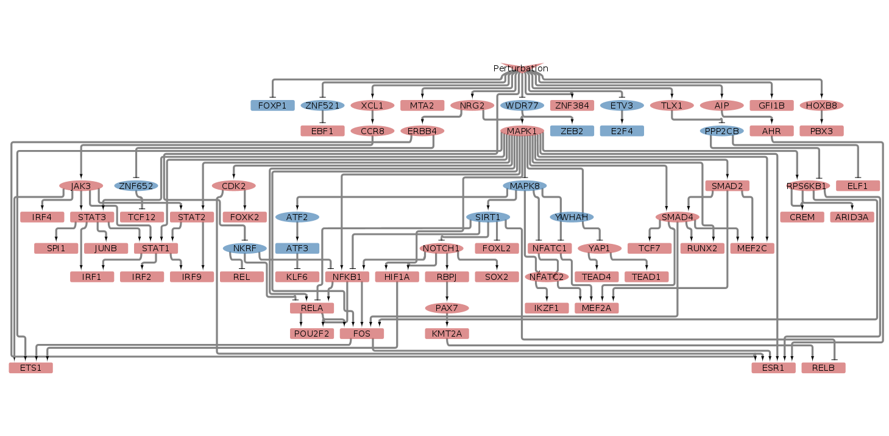
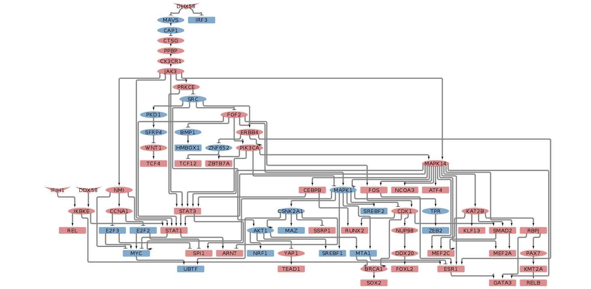
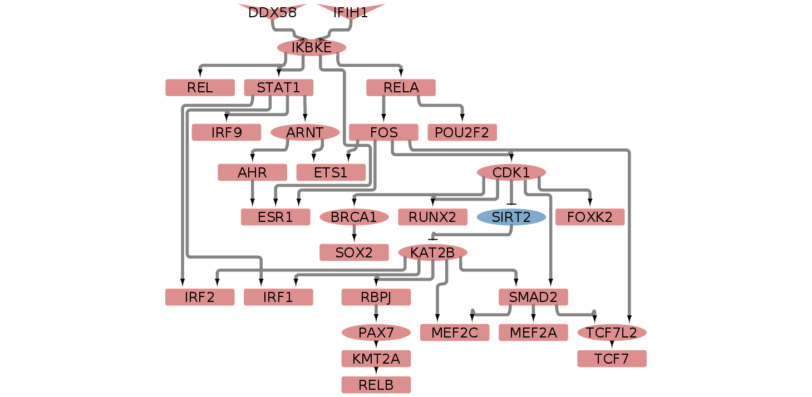
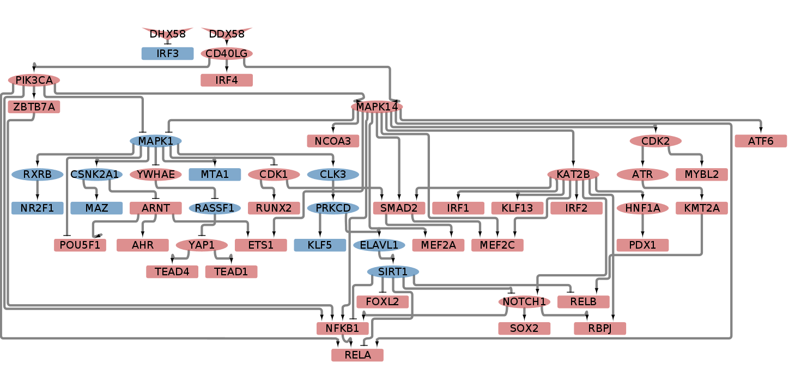

SARS-CoV-2 vs RSV vs HPIV3: running CARNIVAL under different conditions
================
Alberto Valdeolivas: <alberto.valdeolivas@bioquant.uni-heidelberg.de>;
Date:
04/05/2020

### License Info

This program is free software: you can redistribute it and/or modify it
under the terms of the GNU General Public License as published by the
Free Software Foundation, either version 3 of the License, or (at your
option) any later version.

This program is distributed in the hope that it will be useful, but
WITHOUT ANY WARRANTY; without even the implied warranty of
MERCHANTABILITY or FITNESS FOR A PARTICULAR PURPOSE. See the GNU General
Public License for more details.

Please check <http://www.gnu.org/licenses/>.

## Introduction

The present script takes the RNAseq data from the study *"SARS-CoV-2
launches* *a unique transcriptional signature from in vitro, ex vivo,
and in vivo systems"*

<https://www.biorxiv.org/content/10.1101/2020.03.24.004655v1>

<https://www.ncbi.nlm.nih.gov/geo/query/acc.cgi?acc=GSE147507>

The goal of this set of scripts is to compare the transcriptional effect
of different viral infections: SARS-CoV-2, Respiratory syncytial virus
(RSV) and Human parainfluenza virus type 3 (HPIV3). In this script we
use the **Progeny** and **Dorothea** results generated in the previous
script to run CARNIVAL under different perturbations related to the
viral action for the conditions under study:

  - A549 alveolar cancer cell line: mock treated vs infected with
    SARS-CoV-2.

  - A549 alveolar cancer cell line: mock treated vs infected with RSV.

  - A549 alveolar cancer cell line: mock treated vs infected with HPIV3.

## Getting Started

We first load the required libraries.

``` r
library(devtools)
# install_github("saezlab/progeny")
# install_github("saezlab/dorothea")
# install_github('saezlab/CARNIVAL')
library(CARNIVAL)
library(OmnipathR)
library(dplyr)
library(tibble)
library(openxlsx)

## We also define a function to format the CARNIVAL output to cytoscape
OutputCyto <- function(CarnivalResults, outputFile) {
    CarnivalNetwork <- 
        as.data.frame(CarnivalResults$weightedSIF, stringsAsFactors = FALSE) 
    
    CarnivalNetworkNodes <- 
        unique(c(CarnivalNetwork$Node1,CarnivalNetwork$Node2))
    
    CarnivalAttributes <- CarnivalResults$nodesAttributes %>% 
        as.data.frame() %>%
        dplyr::filter(Node %in% CarnivalNetworkNodes) %>%
        dplyr::mutate(NodeType = as.character(NodeType)) %>%
        dplyr::mutate(NodeType=if_else(NodeType =="", "I", NodeType))
            
    nameOutputNetwork <- paste0(outputFile, "Network.sif")
    nameOutputAttributes <-  paste0(outputFile, "Attributes.txt")    
    
    write.table(CarnivalNetwork[,c(1,2,3)], file = nameOutputNetwork,
        quote = FALSE, row.names = FALSE, col.names = FALSE, sep = " ")
    
    write.table(CarnivalAttributes, file = nameOutputAttributes,
        quote = FALSE, row.names = FALSE, col.names = TRUE, sep = "\t")
}
```

We also read pathway and TFs activity scores from the previous script.

``` r
pathways_A549vsCOV2_zscore_inputCarnival <- readRDS(file = 
    "IntermediateFiles/pathways_A549vsCOV2_zscore_inputCarnival.rds")
tf_activities_A549vsCOV2_stat <- 
    readRDS(file = "IntermediateFiles/tf_activities_A549vsCOV2_stat.rds")

pathways_A549vsRSV_zscore_inputCarnival <- readRDS(file = 
    "IntermediateFiles/pathways_A549vsRSV_zscore_inputCarnival.rds")
tf_activities_A549vsRSV_stat <- 
    readRDS(file = "IntermediateFiles/tf_activities_A549vsRSV_stat.rds")

pathways_A549vsHPIV3_zscore_inputCarnival <- readRDS(file = 
    "IntermediateFiles/pathways_A549vsHPIV3_zscore_inputCarnival.rds")
tf_activities_A549vsHPIV3_stat <- 
    readRDS(file = "IntermediateFiles/tf_activities_A549vsHPIV3_stat.rds")
```

## Prior Knowledge Network from Omnipath

**CARNIVAL** aims at finding the most likely signaling paths in a given
situation. In order to do so, it requires a prior knolwdge network that
we extract from Omnipath.

``` r
## the OmniPath PPI interaction network
ia_omnipath <- import_Omnipath_Interactions() %>% as_tibble()

## We also download the other datasets containing interactions
ia_ligrec <- import_LigrecExtra_Interactions() %>% as_tibble()
ia_pwextra <- import_PathwayExtra_Interactions() %>% as_tibble()
ia_kinaseextra <- import_KinaseExtra_Interactions() %>% as_tibble()

## We bind the datasets
interactions <- as_tibble(
    bind_rows(
        ia_omnipath %>% mutate(type = 'ppi'),
        ia_pwextra %>% mutate(type = 'ppi'),
        ia_kinaseextra %>% mutate(type = 'ppi'),
        ia_ligrec %>% mutate(type = 'ppi')))

## I am going to keep only directed interactions (consensus_direction) and 
## signed interactions (consensus_stimulation/consensus_inhibition)
## We transform to the format needed by CARNIVAL. We just keep signed and 
## directed interactions 
SignedDirectedInteractions <- 
    dplyr::filter(interactions, consensus_direction==1) %>%
    filter(consensus_stimulation == 1 | consensus_inhibition == 1)

NetworkCarnival_df <- bind_rows(
  (SignedDirectedInteractions %>%
  filter(consensus_stimulation == 1 & consensus_inhibition == 0) %>%
  transmute(source_genesymbol, interaction = 1, target_genesymbol)),   
  (SignedDirectedInteractions %>%
     filter(consensus_stimulation == 0 & consensus_inhibition == 1) %>%
     transmute(source_genesymbol, interaction = -1, target_genesymbol))) %>%  
  distinct() 

## We transform the network to an igraph object to simplify
NetworkCarnival_igraph <- 
    graph_from_data_frame(NetworkCarnival_df[c(1,3,2)], directed = TRUE) %>% 
    igraph::simplify(remove.multiple = TRUE, remove.loops = TRUE, 
        edge.attr.comb = "first")

## We transform back to the format required by CARNIVAL
NetworkCarnival_df <- igraph::as_data_frame(NetworkCarnival_igraph) %>%
    dplyr::select(from, interaction, to) %>%  
    distinct() 

## We have to be careful with the gene names with a "-". CPLEX gets crazy. 
NetworkCarnival_df$from <- gsub("-","_", NetworkCarnival_df$from)
NetworkCarnival_df$to <- gsub("-","_", NetworkCarnival_df$to)

AllNodesNetwork <- unique(c(NetworkCarnival_df$from, NetworkCarnival_df$to))
```

## Running CARNIVAL

We now run CARNIVAL for the different viral infections on the A549 cell
line under different potential pertubartions associated to the viral
action.

### Selecting the most active TFs

In order to obtain a network that we can visualize and interpret, we
select the top 50 most active/inactive TFs present in our prior
knowledge network.

``` r
### A549 Vs COV2
tf_activities_A549vsCOV2_stat_top50 <- tf_activities_A549vsCOV2_stat %>% 
  as.data.frame() %>% 
  rownames_to_column(var = "GeneID") %>%
  dplyr::filter(GeneID %in% AllNodesNetwork) %>%
  dplyr::arrange(desc(abs(stat))) %>%
  dplyr::top_n(50, wt = abs(stat)) %>%
  column_to_rownames(var = "GeneID") %>%
  t()
saveRDS(colnames(tf_activities_A549vsCOV2_stat_top50), 
  file = "IntermediateFiles/Top50_tf_activities_A549vsCOV2.rds")

### A549 Vs RSV
tf_activities_A549vsRSV_stat_top50 <- tf_activities_A549vsRSV_stat %>% 
  as.data.frame() %>% 
  rownames_to_column(var = "GeneID") %>%
  dplyr::filter(GeneID %in% AllNodesNetwork) %>%
  dplyr::arrange(desc(abs(stat))) %>%
  dplyr::top_n(50, wt = abs(stat)) %>%
  column_to_rownames(var = "GeneID") %>%
  t()
saveRDS(colnames(tf_activities_A549vsRSV_stat_top50), 
  file = "IntermediateFiles/Top50_tf_activities_A549vsRSV.rds")

### A549 Vs HPIV3
tf_activities_A549vsHPIV3_stat_top50 <- tf_activities_A549vsHPIV3_stat %>% 
  as.data.frame() %>% 
  rownames_to_column(var = "GeneID") %>%
  dplyr::filter(GeneID %in% AllNodesNetwork) %>%
  dplyr::arrange(desc(abs(stat))) %>%
  dplyr::top_n(50, wt = abs(stat)) %>%
  column_to_rownames(var = "GeneID") %>%
  t()
saveRDS(colnames(tf_activities_A549vsHPIV3_stat_top50), 
  file = "IntermediateFiles/Top50_tf_activities_A549vsHPIV3.rds")
```

### CARNIVAL without perturbations file

#### SARS-CoV-2 Infection

``` r
CarnivalResults_A549vsCOV2 <-runCARNIVAL(
    solverPath="/opt/ibm/ILOG/CPLEX_Studio129/cplex/bin/x86-64_linux/cplex",
    netObj=NetworkCarnival_df,
    measObj=as.data.frame(tf_activities_A549vsCOV2_stat_top50),
    # inputObj = inputObj,
    # DOTfig=TRUE, 
    dir_name="ResultsCARNIVAL",
    weightObj=t(pathways_A549vsCOV2_zscore_inputCarnival),
    # nodeID = 'gene',
    timelimit = 1200,
    solver = "cplex")
saveRDS(CarnivalResults_A549vsCOV2, 
    file = "ResultsCARNIVAL/A549vsCOV2_noinput.rds")
OutputCyto(CarnivalResults_A549vsCOV2, 
    outputFile="ResultsCARNIVAL/A549vsCOV2_noinput")
```

<br><br>  <br><br>

#### RSV Infection

``` r
CarnivalResults_A549vsRSV <-runCARNIVAL(
    solverPath="/opt/ibm/ILOG/CPLEX_Studio129/cplex/bin/x86-64_linux/cplex",
    netObj=NetworkCarnival_df,
    measObj=as.data.frame(tf_activities_A549vsRSV_stat_top50),
    # inputObj = inputObj,
    # DOTfig=TRUE, 
    dir_name="ResultsCARNIVAL",
    weightObj=t(pathways_A549vsRSV_zscore_inputCarnival),
    # nodeID = 'gene',
    timelimit = 1200,
    solver = "cplex")
saveRDS(CarnivalResults_A549vsRSV, 
    file = "ResultsCARNIVAL/A549vsRSV_noinput.rds")
OutputCyto(CarnivalResults_A549vsRSV, 
    outputFile="ResultsCARNIVAL/A549vsRSV_noinput")
```

<br><br>  <br><br>

#### HPIV3 Infection

``` r
CarnivalResults_A549vsHPIV3 <-runCARNIVAL(
    solverPath="/opt/ibm/ILOG/CPLEX_Studio129/cplex/bin/x86-64_linux/cplex",
    netObj=NetworkCarnival_df,
    measObj=as.data.frame(tf_activities_A549vsHPIV3_stat_top50),
    # inputObj = inputObj,
    # DOTfig=TRUE, 
    dir_name="ResultsCARNIVAL",
    weightObj=t(pathways_A549vsHPIV3_zscore_inputCarnival),
    # nodeID = 'gene',
    timelimit = 1200,
    solver = "cplex")
saveRDS(CarnivalResults_A549vsHPIV3, 
    file = "ResultsCARNIVAL/A549vsHPIV3_noinput.rds")
OutputCyto(CarnivalResults_A549vsHPIV3, 
    outputFile="ResultsCARNIVAL/A549vsHPIV3_noinput")
```

<br><br> 
<br><br>

### CARNIVAL with perturbations on the RIG-I-like receptors

RIG-I-like receptors (retinoic acid-inducible gene-I-like receptors,
RLRs) are a type of intracellular pattern recognition receptor involved
in the recognition of viruses by the innate immune system. RIG-I
(retinoic-acid inducible gene I, also known as DDX58) is the best
characterized receptor within the RIG-I like receptor (RLR) family.
Together with MDA5 and LGP2, this family of cytoplasmic pattern
recognition receptors (PRRs) are sentinels for intracellular viral RNA
that is a product of viral infection. The RLR receptors provide
frontline defence against viral infections in most tissues. (From
wikipedia)

``` r
## MDA5 -> IFIH1 ; LGP2 -> DHX58
RIGIlike_receptors <- c("DDX58", "IFIH1", "DHX58")
NetworkCarnival_df %>% dplyr::filter(from %in% RIGIlike_receptors)
```

    ##     from interaction      to
    ## 1  IFIH1           1   IKBKE
    ## 2  IFIH1           1    TBK1
    ## 3  IFIH1           1    MAVS
    ## 4  IFIH1          -1   DDX58
    ## 5  IFIH1          -1   TRAF3
    ## 6  IFIH1           1 PPIP5K1
    ## 7  DDX58           1   IKBKE
    ## 8  DDX58           1   TRAF2
    ## 9  DDX58          -1   IFIH1
    ## 10 DDX58           1    IRF3
    ## 11 DDX58           1    TBK1
    ## 12 DDX58           1    MAVS
    ## 13 DDX58           1  CD40LG
    ## 14 DDX58          -1   TRAF3
    ## 15 DDX58           1   SCYL1
    ## 16 DDX58           1 PPIP5K1
    ## 17 DHX58          -1   IKBKE
    ## 18 DHX58          -1   IFIH1
    ## 19 DHX58          -1    IRF7
    ## 20 DHX58          -1    IRF3
    ## 21 DHX58          -1    TBK1
    ## 22 DHX58          -1    MAVS
    ## 23 DHX58          -1   DDX58
    ## 24 DHX58          -1   TRAF3

``` r
RIGIlike_receptors_perturbation <- data.frame(DDX58 = 1, IFIH1 = 1, DHX58 = 1)
```

#### SARS-CoV-2 Infection

``` r
CarnivalResults_A549vsCOV2_RIGIlike_receptors <-runCARNIVAL(
    solverPath="/opt/ibm/ILOG/CPLEX_Studio129/cplex/bin/x86-64_linux/cplex",
    netObj=NetworkCarnival_df,
    measObj=as.data.frame(tf_activities_A549vsCOV2_stat_top50),
    inputObj = RIGIlike_receptors_perturbation,
    # DOTfig=TRUE, 
    dir_name="ResultsCARNIVAL",
    weightObj=t(pathways_A549vsCOV2_zscore_inputCarnival),
    # nodeID = 'gene',
    timelimit = 1200,
    solver = "cplex")
saveRDS(CarnivalResults_A549vsCOV2_RIGIlike_receptors, 
  file = "ResultsCARNIVAL/A549vsCOV2_RIGIlike_receptors_input.rds")
OutputCyto(CarnivalResults_A549vsCOV2_RIGIlike_receptors, 
  outputFile="ResultsCARNIVAL/A549vsCOV2_RIGIlike_receptors_input")
```

<br><br>

<br><br>

#### RSV Infection

``` r
CarnivalResults_A549vsRSV_RIGIlike_receptors <-runCARNIVAL(
    solverPath="/opt/ibm/ILOG/CPLEX_Studio129/cplex/bin/x86-64_linux/cplex",
    netObj=NetworkCarnival_df,
    measObj=as.data.frame(tf_activities_A549vsRSV_stat_top50),
    inputObj = RIGIlike_receptors_perturbation,
    # DOTfig=TRUE, 
    dir_name="ResultsCARNIVAL",
    weightObj=t(pathways_A549vsRSV_zscore_inputCarnival),
    # nodeID = 'gene',
    timelimit = 1200,
    solver = "cplex")
saveRDS(CarnivalResults_A549vsRSV_RIGIlike_receptors, 
  file = "ResultsCARNIVAL/A549vsRSV_RIGIlike_receptors_input.rds")
OutputCyto(CarnivalResults_A549vsRSV_RIGIlike_receptors, 
  outputFile="ResultsCARNIVAL/A549vsRSV_RIGIlike_receptors_input")
```

<br><br>

<br><br>

#### HPIV3 Infection

``` r
CarnivalResults_A549vsHPIV3_RIGIlike_receptors <-runCARNIVAL(
    solverPath="/opt/ibm/ILOG/CPLEX_Studio129/cplex/bin/x86-64_linux/cplex",
    netObj=NetworkCarnival_df,
    measObj=as.data.frame(tf_activities_A549vsHPIV3_stat_top50),
    inputObj = RIGIlike_receptors_perturbation,
    # DOTfig=TRUE, 
    dir_name="ResultsCARNIVAL",
    weightObj=t(pathways_A549vsHPIV3_zscore_inputCarnival),
    # nodeID = 'gene',
    timelimit = 1200,
    solver = "cplex")
saveRDS(CarnivalResults_A549vsHPIV3_RIGIlike_receptors, 
  file = "ResultsCARNIVAL/A549vsHPIV3_RIGIlike_receptors_input.rds")
OutputCyto(CarnivalResults_A549vsHPIV3_RIGIlike_receptors, 
  outputFile="ResultsCARNIVAL/A549vsHPIV3_RIGIlike_receptors_input")
```

<br><br>

<br><br>

## Session Info Details

    ## R version 3.6.3 (2020-02-29)
    ## Platform: x86_64-pc-linux-gnu (64-bit)
    ## Running under: Ubuntu 18.04.4 LTS
    ## 
    ## Matrix products: default
    ## BLAS:   /usr/local/lib/R/lib/libRblas.so
    ## LAPACK: /usr/local/lib/R/lib/libRlapack.so
    ## 
    ## locale:
    ##  [1] LC_CTYPE=en_GB.UTF-8       LC_NUMERIC=C              
    ##  [3] LC_TIME=en_GB.UTF-8        LC_COLLATE=en_GB.UTF-8    
    ##  [5] LC_MONETARY=en_GB.UTF-8    LC_MESSAGES=en_GB.UTF-8   
    ##  [7] LC_PAPER=en_GB.UTF-8       LC_NAME=C                 
    ##  [9] LC_ADDRESS=C               LC_TELEPHONE=C            
    ## [11] LC_MEASUREMENT=en_GB.UTF-8 LC_IDENTIFICATION=C       
    ## 
    ## attached base packages:
    ## [1] stats     graphics  grDevices utils     datasets  methods   base     
    ## 
    ## other attached packages:
    ## [1] openxlsx_4.1.4   tibble_3.0.0     dplyr_0.8.5      OmnipathR_1.1.5 
    ## [5] igraph_1.2.5     CARNIVAL_0.99.33 devtools_2.2.2   usethis_1.5.1   
    ## 
    ## loaded via a namespace (and not attached):
    ##  [1] segmented_1.1-0      Category_2.52.1      bitops_1.0-6        
    ##  [4] fs_1.4.1             bit64_0.9-7          httr_1.4.1          
    ##  [7] doParallel_1.0.15    rprojroot_1.3-2      tools_3.6.3         
    ## [10] backports_1.1.5      R6_2.4.1             KernSmooth_2.23-16  
    ## [13] DBI_1.1.0            BiocGenerics_0.32.0  colorspace_1.4-1    
    ## [16] withr_2.1.2          tidyselect_1.0.0     prettyunits_1.1.1   
    ## [19] processx_3.4.2       curl_4.3             bit_1.1-15.2        
    ## [22] compiler_3.6.3       graph_1.64.0         cli_2.0.2           
    ## [25] Biobase_2.46.0       desc_1.2.0           scales_1.1.0        
    ## [28] readr_1.3.1          genefilter_1.68.0    callr_3.4.3         
    ## [31] RBGL_1.62.1          rappdirs_0.3.1       stringr_1.4.0       
    ## [34] digest_0.6.25        mixtools_1.2.0       rmarkdown_2.1       
    ## [37] pkgconfig_2.0.3      htmltools_0.4.0      sessioninfo_1.1.1   
    ## [40] dbplyr_1.4.2         rlang_0.4.5          RSQLite_2.2.0       
    ## [43] viper_1.20.0         zip_2.0.4            RCurl_1.98-1.1      
    ## [46] magrittr_1.5         Matrix_1.2-18        Rcpp_1.0.4          
    ## [49] munsell_0.5.0        S4Vectors_0.24.1     fansi_0.4.1         
    ## [52] lifecycle_0.2.0      stringi_1.4.6        yaml_2.2.1          
    ## [55] UniProt.ws_2.26.0    MASS_7.3-51.5        pkgbuild_1.0.6      
    ## [58] BiocFileCache_1.10.2 grid_3.6.3           blob_1.2.1          
    ## [61] parallel_3.6.3       crayon_1.3.4         lattice_0.20-41     
    ## [64] splines_3.6.3        annotate_1.64.0      hms_0.5.3           
    ## [67] knitr_1.28           ps_1.3.2             pillar_1.4.3        
    ## [70] lpSolve_5.6.15       codetools_0.2-16     stats4_3.6.3        
    ## [73] pkgload_1.0.2        XML_3.99-0.3         glue_1.4.0          
    ## [76] evaluate_0.14        remotes_2.1.1        vctrs_0.2.4         
    ## [79] foreach_1.5.0        testthat_2.3.2       gtable_0.3.0        
    ## [82] purrr_0.3.3          kernlab_0.9-29       assertthat_0.2.1    
    ## [85] ggplot2_3.3.0        xfun_0.12            xtable_1.8-4        
    ## [88] e1071_1.7-3          class_7.3-16         survival_3.1-11     
    ## [91] iterators_1.0.12     AnnotationDbi_1.48.0 memoise_1.1.0       
    ## [94] IRanges_2.20.1       ellipsis_0.3.0       GSEABase_1.48.0
