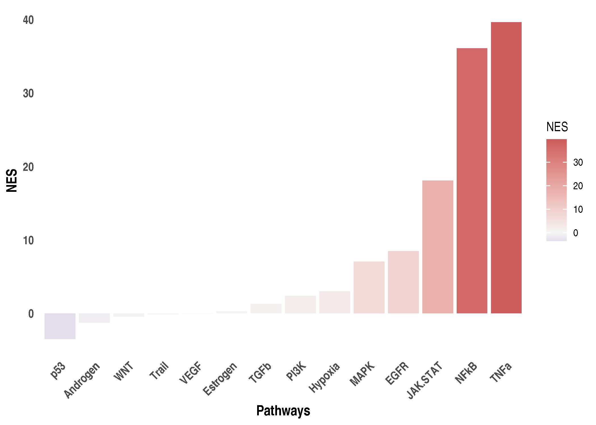
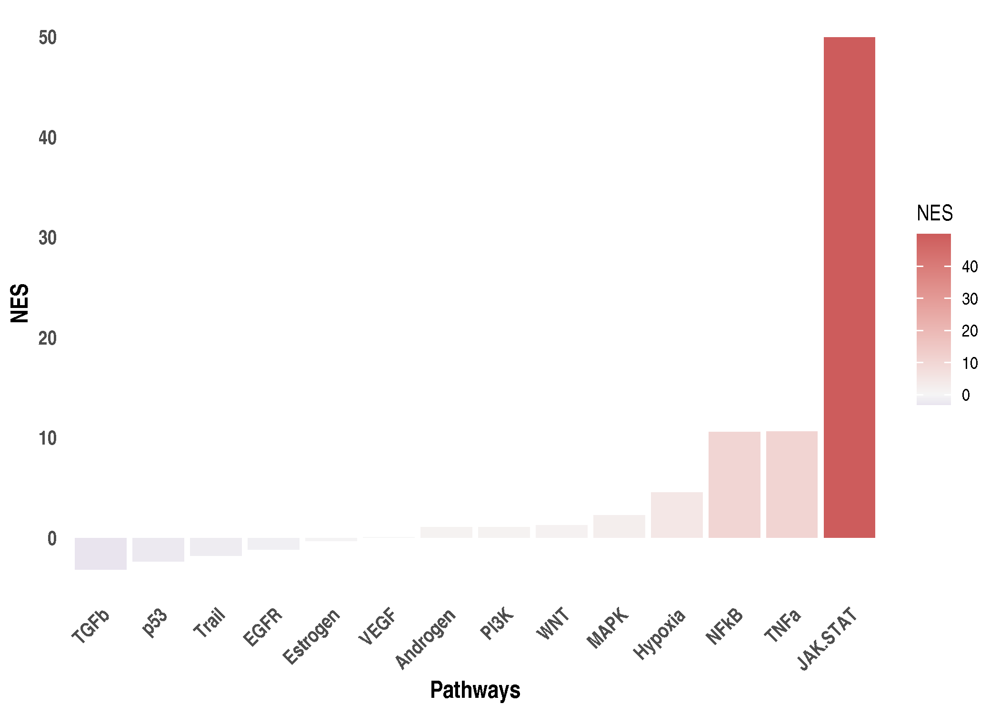

SARS-CoV-2 dataset: Running Progeny and Dorothea
================
Alberto Valdeolivas: <alberto.valdeolivas@bioquant.uni-heidelberg.de>;
Date:
14/04/2020

### License Info

This program is free software: you can redistribute it and/or modify it
under the terms of the GNU General Public License as published by the
Free Software Foundation, either version 3 of the License, or (at your
option) any later version.

This program is distributed in the hope that it will be useful, but
WITHOUT ANY WARRANTY; without even the implied warranty of
MERCHANTABILITY or FITNESS FOR A PARTICULAR PURPOSE. See the GNU General
Public License for more details.

Please check <http://www.gnu.org/licenses/>.

## Introduction

The present script deal with the RNAseq data from the study *"SARS-CoV-2
launches* *a unique transcriptional signature from in vitro, ex vivo,
and in vivo systems"*

<https://www.biorxiv.org/content/10.1101/2020.03.24.004655v1>

<https://www.ncbi.nlm.nih.gov/geo/query/acc.cgi?acc=GSE147507>

It uses the differential analysis results generated in the previous
script to run **Progeny** and **Dorothea** for the four cell lines under
study:

  - Human lung epithelial cells (NHBE): mock treated vs infected with
    SARS-CoV-2.

  - A549 alveolar cancer cell line: mock treated vs infected with
    SARS-CoV-2.

  - A549 cell line does not express ACE2, the receptor used by
    SARS-CoV-2 to penetrate into human cells. Therefore A549 were also
    transduced with ACE2 and then mock treated or infected with
    SARS-CoV-2

  - Calu-3 human lung epithelial cancer cell line: mock treated vs
    infected with SARS-CoV-2.

## Getting Started

We first load the required libraries.

``` r
library(devtools)
# install_github("saezlab/progeny")
# install_github("saezlab/dorothea")
library(progeny)
library(dorothea)
library(tibble)
library(tidyr)
library(dplyr)
library(ggplot2)
library(pheatmap)
```

We also read the differential expression results and normalised counts
from the previous script.

``` r
## Differential expression table
dds_NHBEvsCOV2 <- readRDS("IntermediateFiles/dds_results_NHBEvsCOV2.rds")
dds_A549vsCOV2 <- readRDS("IntermediateFiles/dds_results_A549vsCOV2.rds")
dds_A549ACE2vsCOV2 <- 
  readRDS("IntermediateFiles/dds_results_A549ACE2vsCOV2.rds") 
dds_CALU3vsCOV2 <- readRDS("IntermediateFiles/dds_results_CALU3vsCOV2.rds")

norm_counts_NHBEvsCOV2 <- 
    readRDS("IntermediateFiles/counts_norm_NHBEvsCOV2.rds")
norm_counts_A549vsCOV2 <- 
    readRDS("IntermediateFiles/counts_norm_A549vsCOV2.rds")
norm_counts_A549ACE2vsCOV2 <- 
    readRDS("IntermediateFiles/counts_norm_A549ACE2vsCOV2.rds")
norm_counts_CALU3vsCOV2 <- 
    readRDS("IntermediateFiles/counts_norm_CALU3vsCOV2.rds")
```

## Pathway activity with Progeny

We first estimate the pathway activity using the **Progeny** package.

### NHBE mock treated vs infected with SARS-CoV-2

We first compute **Progeny** scores per every sample (with the
replicates) using the normalised counts. We display the results in a
Heatmap.

``` r
pathways_NHBEvsCOV2_counts <- progeny(norm_counts_NHBEvsCOV2, scale=TRUE, 
    organism="Human", top = 100)
activities_NHBEvsCOV2 <- as.vector(pathways_NHBEvsCOV2_counts)

paletteLength <- 100
myColor <- 
    colorRampPalette(c("darkblue", "whitesmoke","indianred"))(paletteLength)

progenyBreaks <- c(seq(min(activities_NHBEvsCOV2), 0, 
    length.out=ceiling(paletteLength/2) + 1),
    seq(max(activities_NHBEvsCOV2)/paletteLength, 
    max(activities_NHBEvsCOV2), 
    length.out=floor(paletteLength/2)))
```

``` r
progeny_hmap <- pheatmap(t(pathways_NHBEvsCOV2_counts),fontsize=14, 
    fontsize_row = 10, fontsize_col = 10, 
    color=myColor, breaks = progenyBreaks, 
    main = "PROGENy (100)", angle_col = 45,
    treeheight_col = 0,  border_color = NA)
```

<!-- -->

We can see that the different replicates cluster together and clear
different activity patterns between the infected and the mock treated
NHBE lines. To evaluate the significance and sign of these pathway
activities, we can run again **Progeny** using the statistic from the
differential express analysis.

``` r
dds_NHBEvsCOV2_df <- as.data.frame(dds_NHBEvsCOV2) %>% 
    rownames_to_column(var = "GeneID") %>% 
    dplyr::select(GeneID, stat) %>% 
    dplyr::filter(!is.na(stat)) %>% 
    column_to_rownames(var = "GeneID") 

pathways_NHBEvsCOV2_zscore <- t(progeny(as.matrix(dds_NHBEvsCOV2_df), 
    scale=TRUE, organism="Human", top = 100, perm = 10000, z_scores = TRUE))
colnames(pathways_NHBEvsCOV2_zscore) <- "NES"

## I also need to run progeny in such a way to have values between 1 and -1 to
## use as CARNIVAL input
pathways_NHBEvsCOV2_zscore_inputCarnival <- 
  t(progeny(as.matrix(dds_NHBEvsCOV2_df), 
    scale=TRUE, organism="Human", top = 100, perm = 10000, z_scores = FALSE))
colnames(pathways_NHBEvsCOV2_zscore_inputCarnival) <- "Activity"
```

We now display the normalized enrichment scores (NES) in a bar plot.

``` r
pathways_NHBEvsCOV2_zscore_df <- as.data.frame(pathways_NHBEvsCOV2_zscore) %>% 
    rownames_to_column(var = "Pathway") %>%
    dplyr::arrange(NES) %>%
    dplyr::mutate(Pathway = factor(Pathway))
```

``` r
ggplot(pathways_NHBEvsCOV2_zscore_df,aes(x = reorder(Pathway, NES), y = NES)) + 
    geom_bar(aes(fill = NES), stat = "identity") +
    scale_fill_gradient2(low = "darkblue", high = "indianred", 
        mid = "whitesmoke", midpoint = 0) + 
    theme_minimal() +
    theme(axis.title = element_text(face = "bold", size = 12),
        axis.text.x = 
            element_text(angle = 45, hjust = 1, size =10, face= "bold"),
        axis.text.y = element_text(size =10, face= "bold"),
        panel.grid.major = element_blank(), 
        panel.grid.minor = element_blank()) +
    xlab("Pathways")
```

<!-- -->

### A549 mock treated vs infected with SARS-CoV-2

We reproduce the progeny activity analysis for A549 cell line.

We first compute **Progeny** scores per every sample (with the
replicates) using the normalised counts. We display the results in a
Heatmap.

``` r
pathways_A549vsCOV2_counts <- progeny(norm_counts_A549vsCOV2, scale=TRUE, 
    organism="Human", top = 100)
activities_A549vsCOV2 <- as.vector(pathways_A549vsCOV2_counts)

paletteLength <- 100
myColor <- 
    colorRampPalette(c("darkblue", "whitesmoke","indianred"))(paletteLength)

progenyBreaks <- c(seq(min(activities_A549vsCOV2), 0, 
    length.out=ceiling(paletteLength/2) + 1),
    seq(max(activities_A549vsCOV2)/paletteLength, 
    max(activities_A549vsCOV2), 
    length.out=floor(paletteLength/2)))
```

``` r
progeny_hmap <- pheatmap(t(pathways_A549vsCOV2_counts),fontsize=14, 
    fontsize_row = 10, fontsize_col = 10, 
    color=myColor, breaks = progenyBreaks, 
    main = "PROGENy (100)", angle_col = 45,
    treeheight_col = 0,  border_color = NA)
```

<!-- -->

We can see that the different replicates cluster together and clear
different activity patterns between the infected and the mock treated
A549 lines. To evaluate the significance and sign of these pathway
activities, we can run again **Progeny** using the statistic from the
differential express analysis.

``` r
dds_A549vsCOV2_df <- as.data.frame(dds_A549vsCOV2) %>% 
    rownames_to_column(var = "GeneID") %>% 
    dplyr::select(GeneID, stat) %>% 
    dplyr::filter(!is.na(stat)) %>% 
    column_to_rownames(var = "GeneID") 

pathways_A549vsCOV2_zscore <- t(progeny(as.matrix(dds_A549vsCOV2_df), 
    scale=TRUE, organism="Human", top = 100, perm = 10000, z_scores = TRUE))
colnames(pathways_A549vsCOV2_zscore) <- "NES"

## I also need to run progeny in such a way to have values between 1 and -1 to
## use as CARNIVAL input
pathways_A549vsCOV2_zscore_inputCarnival <- 
  t(progeny(as.matrix(dds_A549vsCOV2_df), 
    scale=TRUE, organism="Human", top = 100, perm = 10000, z_scores = FALSE))
colnames(pathways_A549vsCOV2_zscore_inputCarnival) <- "Activity"
```

We now display the normalized enrichment scores (NES) in a bar plot.

``` r
pathways_A549vsCOV2_zscore_df <- as.data.frame(pathways_A549vsCOV2_zscore) %>% 
    rownames_to_column(var = "Pathway") %>%
    dplyr::arrange(NES) %>%
    dplyr::mutate(Pathway = factor(Pathway))
```

``` r
ggplot(pathways_A549vsCOV2_zscore_df,aes(x = reorder(Pathway, NES), y = NES)) + 
    geom_bar(aes(fill = NES), stat = "identity") +
    scale_fill_gradient2(low = "darkblue", high = "indianred", 
        mid = "whitesmoke", midpoint = 0) + 
    theme_minimal() +
    theme(axis.title = element_text(face = "bold", size = 12),
        axis.text.x = 
            element_text(angle = 45, hjust = 1, size =10, face= "bold"),
        axis.text.y = element_text(size =10, face= "bold"),
        panel.grid.major = element_blank(), 
        panel.grid.minor = element_blank()) +
    xlab("Pathways")
```

<!-- -->

### A549 transduced with ACE2 mock treated vs infected with SARS-CoV-2

We reproduce the progeny activity analysis for A549 transduced with ACE2
cell line.

We first compute **Progeny** scores per every sample (with the
replicates) using the normalised counts. We display the results in a
Heatmap.

``` r
pathways_A549ACE2vsCOV2_counts <- progeny(norm_counts_A549ACE2vsCOV2, 
    scale=TRUE, organism="Human", top = 100)
activities_A549ACE2vsCOV2 <- as.vector(pathways_A549ACE2vsCOV2_counts)

paletteLength <- 100
myColor <- 
    colorRampPalette(c("darkblue", "whitesmoke","indianred"))(paletteLength)

progenyBreaks <- c(seq(min(activities_A549ACE2vsCOV2), 0, 
    length.out=ceiling(paletteLength/2) + 1),
    seq(max(activities_A549ACE2vsCOV2)/paletteLength, 
    max(activities_A549ACE2vsCOV2), 
    length.out=floor(paletteLength/2)))
```

``` r
progeny_hmap <- pheatmap(t(pathways_A549ACE2vsCOV2_counts),fontsize=14, 
    fontsize_row = 10, fontsize_col = 10, 
    color=myColor, breaks = progenyBreaks, 
    main = "PROGENy (100)", angle_col = 45,
    treeheight_col = 0,  border_color = NA)
```

<!-- -->

We can see that the different replicates cluster together and clear
different activity patterns between the infected and the mock treated
A549 lines (transduced with ACE2). To evaluate the significance and sign
of these pathway activities, we can run again **Progeny** using the
statistic from the differential express analysis.

``` r
dds_A549ACE2vsCOV2_df <- as.data.frame(dds_A549ACE2vsCOV2) %>% 
    rownames_to_column(var = "GeneID") %>% 
    dplyr::select(GeneID, stat) %>% 
    dplyr::filter(!is.na(stat)) %>% 
    column_to_rownames(var = "GeneID") 

pathways_A549ACE2vsCOV2_zscore <- t(progeny(as.matrix(dds_A549ACE2vsCOV2_df), 
    scale=TRUE, organism="Human", top = 100, perm = 10000, z_scores = TRUE))
colnames(pathways_A549ACE2vsCOV2_zscore) <- "NES"

## I also need to run progeny in such a way to have values between 1 and -1 to
## use as CARNIVAL input
pathways_A549ACE2vsCOV2_zscore_inputCarnival <- 
  t(progeny(as.matrix(dds_A549ACE2vsCOV2_df), 
    scale=TRUE, organism="Human", top = 100, perm = 10000, z_scores = FALSE))
colnames(pathways_A549ACE2vsCOV2_zscore_inputCarnival) <- "Activity"
```

We now display the normalized enrichment scores (NES) in a bar plot.

``` r
pathways_A549ACE2vsCOV2_zscore_df <- as.data.frame(pathways_A549ACE2vsCOV2_zscore) %>% 
    rownames_to_column(var = "Pathway") %>%
    dplyr::arrange(NES) %>%
    dplyr::mutate(Pathway = factor(Pathway))
```

``` r
ggplot(pathways_A549ACE2vsCOV2_zscore_df,aes(x = reorder(Pathway, NES), y = NES)) + 
    geom_bar(aes(fill = NES), stat = "identity") +
    scale_fill_gradient2(low = "darkblue", high = "indianred", 
        mid = "whitesmoke", midpoint = 0) + 
    theme_minimal() +
    theme(axis.title = element_text(face = "bold", size = 12),
        axis.text.x = 
            element_text(angle = 45, hjust = 1, size =10, face= "bold"),
        axis.text.y = element_text(size =10, face= "bold"),
        panel.grid.major = element_blank(), 
        panel.grid.minor = element_blank()) +
    xlab("Pathways")
```

<!-- -->

### CALU-3 mock treated vs infected with SARS-CoV-2

We first compute **Progeny** scores per every sample (with the
replicates) using the normalised counts. We display the results in a
Heatmap.

``` r
pathways_CALU3vsCOV2_counts <- progeny(norm_counts_CALU3vsCOV2, scale=TRUE, 
    organism="Human", top = 100)
activities_CALU3vsCOV2 <- as.vector(pathways_CALU3vsCOV2_counts)

paletteLength <- 100
myColor <- 
    colorRampPalette(c("darkblue", "whitesmoke","indianred"))(paletteLength)

progenyBreaks <- c(seq(min(activities_CALU3vsCOV2), 0, 
    length.out=ceiling(paletteLength/2) + 1),
    seq(max(activities_CALU3vsCOV2)/paletteLength, 
    max(activities_CALU3vsCOV2), 
    length.out=floor(paletteLength/2)))
```

``` r
progeny_hmap <- pheatmap(t(pathways_CALU3vsCOV2_counts),fontsize=14, 
    fontsize_row = 10, fontsize_col = 10, 
    color=myColor, breaks = progenyBreaks, 
    main = "PROGENy (100)", angle_col = 45,
    treeheight_col = 0,  border_color = NA)
```

<!-- -->

We can see that the different replicates cluster together and clear
different activity patterns between the infected and the mock treated
CALU-3 lines. To evaluate the significance and sign of these pathway
activities, we can run again **Progeny** using the statistic from the
differential express analysis.

``` r
dds_CALU3vsCOV2_df <- as.data.frame(dds_CALU3vsCOV2) %>% 
    rownames_to_column(var = "GeneID") %>% 
    dplyr::select(GeneID, stat) %>% 
    dplyr::filter(!is.na(stat)) %>% 
    column_to_rownames(var = "GeneID") 

pathways_CALU3vsCOV2_zscore <- t(progeny(as.matrix(dds_CALU3vsCOV2_df), 
    scale=TRUE, organism="Human", top = 100, perm = 10000, z_scores = TRUE))
colnames(pathways_CALU3vsCOV2_zscore) <- "NES"

## I also need to run progeny in such a way to have values between 1 and -1 to
## use as CARNIVAL input
pathways_CALU3vsCOV2_zscore_inputCarnival <- 
  t(progeny(as.matrix(dds_CALU3vsCOV2_df), 
    scale=TRUE, organism="Human", top = 100, perm = 10000, z_scores = FALSE))
colnames(pathways_CALU3vsCOV2_zscore_inputCarnival) <- "Activity"
```

We now display the normalized enrichment scores (NES) in a bar plot.

``` r
pathways_CALU3vsCOV2_zscore_df <- as.data.frame(pathways_CALU3vsCOV2_zscore) %>% 
    rownames_to_column(var = "Pathway") %>%
    dplyr::arrange(NES) %>%
    dplyr::mutate(Pathway = factor(Pathway))
```

``` r
ggplot(pathways_CALU3vsCOV2_zscore_df,aes(x = reorder(Pathway, NES), y = NES)) + 
    geom_bar(aes(fill = NES), stat = "identity") +
    scale_fill_gradient2(low = "darkblue", high = "indianred", 
        mid = "whitesmoke", midpoint = 0) + 
    theme_minimal() +
    theme(axis.title = element_text(face = "bold", size = 12),
        axis.text.x = 
            element_text(angle = 45, hjust = 1, size =10, face= "bold"),
        axis.text.y = element_text(size =10, face= "bold"),
        panel.grid.major = element_blank(), 
        panel.grid.minor = element_blank()) +
    xlab("Pathways")
```

<!-- -->

## Transcription Factor activity with Dorothea and Viper

Now, we estimate the transcription factor (TF) activity using the
**dorothea** package. We select Dorothea interactions with confidence
level A,B and C.

``` r
## We load Dorothea Regulons
data(dorothea_hs, package = "dorothea")
regulons <- dorothea_hs %>%
  dplyr::filter(confidence %in% c("A", "B","C"))
```

It is to note that for **Dorothea**, we proceed the other way around
than for **Progeny**. We have many TFs so, we cannot visualize all of
them in the same heatmap. That is why, we first compute the TF activity
using the statistcs from the differential expression analysis. This will
allows us to select the TFs whose activity varies the most between the
mock treated and infected samples.

### NHBE mock treated vs infected with SARS-CoV-2

We first run Viper using the statistic from the different expression
analysis.

``` r
dds_NHBEvsCOV2_stat <-  as.data.frame(dds_NHBEvsCOV2) %>% 
    rownames_to_column(var = "GeneID") %>% 
    dplyr::select(GeneID, stat) %>% 
    dplyr::filter(!is.na(stat)) %>% 
    column_to_rownames(var = "GeneID") %>%
    as.matrix()

tf_activities_NHBEvsCOV2_stat <- 
    dorothea::run_viper(as.matrix(dds_NHBEvsCOV2_stat), regulons,
    options =  list(minsize = 5, eset.filter = FALSE, 
    cores = 1, verbose = FALSE, nes = TRUE))
```

We now display the top 25 normalized enrichment scores (NES) for the TF
in a bar plot.

``` r
tf_activities_NHBEvsCOV2_top25 <- tf_activities_NHBEvsCOV2_stat %>%
    as.data.frame() %>% 
    rownames_to_column(var = "GeneID") %>%
    dplyr::rename(NES = "stat") %>%
    dplyr::top_n(25, wt = abs(NES)) %>%
    dplyr::arrange(NES) %>% 
    dplyr::mutate(GeneID = factor(GeneID))
```

``` r
ggplot(tf_activities_NHBEvsCOV2_top25,aes(x = reorder(GeneID, NES), y = NES)) + 
    geom_bar(aes(fill = NES), stat = "identity") +
    scale_fill_gradient2(low = "darkblue", high = "indianred", 
        mid = "whitesmoke", midpoint = 0) + 
    theme_minimal() +
    theme(axis.title = element_text(face = "bold", size = 12),
        axis.text.x = 
            element_text(angle = 45, hjust = 1, size =10, face= "bold"),
        axis.text.y = element_text(size =10, face= "bold"),
        panel.grid.major = element_blank(), 
        panel.grid.minor = element_blank()) +
    xlab("Transcription Factors")
```

<!-- -->

We now compute TFs activities per every sample (with the replicates)
using the normalised counts. We display the results of the previous 25
TFs in a Heatmap.

``` r
tf_activities_NHBEvsCOV2_counts <- 
    dorothea::run_viper(norm_counts_NHBEvsCOV2, regulons,
    options =  list(minsize = 5, eset.filter = FALSE, 
    cores = 1, verbose = FALSE, method = c("scale")))

tf_activities_NHBEvsCOV2_counts_filter <- tf_activities_NHBEvsCOV2_counts %>% 
    as.data.frame() %>% 
    rownames_to_column(var = "GeneID") %>%
    dplyr::filter(GeneID %in% tf_activities_NHBEvsCOV2_top25$GeneID) %>%
    column_to_rownames(var = "GeneID") %>%
    as.matrix()

tf_activities_NHBEvsCOV2 <- as.vector(tf_activities_NHBEvsCOV2_counts_filter)

paletteLength <- 100
myColor <- 
    colorRampPalette(c("darkblue", "whitesmoke","indianred"))(paletteLength)

dorotheaBreaks <- c(seq(min(tf_activities_NHBEvsCOV2), 0, 
    length.out=ceiling(paletteLength/2) + 1),
    seq(max(tf_activities_NHBEvsCOV2)/paletteLength, 
    max(tf_activities_NHBEvsCOV2), 
    length.out=floor(paletteLength/2)))
```

``` r
dorothea_hmap <- pheatmap(tf_activities_NHBEvsCOV2_counts_filter,
    fontsize=14, fontsize_row = 8, fontsize_col = 8, 
    color=myColor, breaks = dorotheaBreaks,
    main = "Dorothea ABC", angle_col = 45,
    treeheight_col = 0,  border_color = NA)
```

<!-- -->

### A549 mock treated vs infected with SARS-CoV-2

We first run Viper using the statistic from the different expression
analysis.

``` r
dds_A549vsCOV2_stat <-  as.data.frame(dds_A549vsCOV2) %>% 
    rownames_to_column(var = "GeneID") %>% 
    dplyr::select(GeneID, stat) %>% 
    dplyr::filter(!is.na(stat)) %>% 
    column_to_rownames(var = "GeneID") %>%
    as.matrix()

tf_activities_A549vsCOV2_stat <- 
    dorothea::run_viper(as.matrix(dds_A549vsCOV2_stat), regulons,
    options =  list(minsize = 5, eset.filter = FALSE, 
    cores = 1, verbose = FALSE, nes = TRUE))
```

We now display the top 25 normalized enrichment scores (NES) for the TF
in a bar plot.

``` r
tf_activities_A549vsCOV2_top25 <- tf_activities_A549vsCOV2_stat %>%
    as.data.frame() %>% 
    rownames_to_column(var = "GeneID") %>%
    dplyr::rename(NES = "stat") %>%
    dplyr::top_n(25, wt = abs(NES)) %>%
    dplyr::arrange(NES) %>% 
    dplyr::mutate(GeneID = factor(GeneID))
```

``` r
ggplot(tf_activities_A549vsCOV2_top25,aes(x = reorder(GeneID, NES), y = NES)) + 
    geom_bar(aes(fill = NES), stat = "identity") +
    scale_fill_gradient2(low = "darkblue", high = "indianred", 
        mid = "whitesmoke", midpoint = 0) + 
    theme_minimal() +
    theme(axis.title = element_text(face = "bold", size = 12),
        axis.text.x = 
            element_text(angle = 45, hjust = 1, size =10, face= "bold"),
        axis.text.y = element_text(size =10, face= "bold"),
        panel.grid.major = element_blank(), 
        panel.grid.minor = element_blank()) +
    xlab("Transcription Factors")
```

<!-- -->

We now compute TFs activities per every sample (with the replicates)
using the normalised counts. We display the results of the previous 25
TFs in a Heatmap.

``` r
tf_activities_A549vsCOV2_counts <- 
    dorothea::run_viper(norm_counts_A549vsCOV2, regulons,
    options =  list(minsize = 5, eset.filter = FALSE, 
    cores = 1, verbose = FALSE, method = c("scale")))

tf_activities_A549vsCOV2_counts_filter <- tf_activities_A549vsCOV2_counts %>% 
    as.data.frame() %>% 
    rownames_to_column(var = "GeneID") %>%
    dplyr::filter(GeneID %in% tf_activities_A549vsCOV2_top25$GeneID) %>%
    column_to_rownames(var = "GeneID") %>%
    as.matrix()

tf_activities_A549vsCOV2 <- as.vector(tf_activities_A549vsCOV2_counts_filter)

paletteLength <- 100
myColor <- 
    colorRampPalette(c("darkblue", "whitesmoke","indianred"))(paletteLength)

dorotheaBreaks <- c(seq(min(tf_activities_A549vsCOV2), 0, 
    length.out=ceiling(paletteLength/2) + 1),
    seq(max(tf_activities_A549vsCOV2)/paletteLength, 
    max(tf_activities_A549vsCOV2), 
    length.out=floor(paletteLength/2)))
```

``` r
dorothea_hmap <- pheatmap(tf_activities_A549vsCOV2_counts_filter,
    fontsize=14, fontsize_row = 8, fontsize_col = 8, 
    color=myColor, breaks = dorotheaBreaks,
    main = "Dorothea ABC", angle_col = 45,
    treeheight_col = 0,  border_color = NA)
```

<!-- -->

### A549 transduced with ACE2 mock treated vs infected with SARS-CoV-2

We first run Viper using the statistic from the different expression
analysis.

``` r
dds_A549ACE2vsCOV2_stat <-  as.data.frame(dds_A549ACE2vsCOV2) %>% 
    rownames_to_column(var = "GeneID") %>% 
    dplyr::select(GeneID, stat) %>% 
    dplyr::filter(!is.na(stat)) %>% 
    column_to_rownames(var = "GeneID") %>%
    as.matrix()

tf_activities_A549ACE2vsCOV2_stat <- 
    dorothea::run_viper(as.matrix(dds_A549ACE2vsCOV2_stat), regulons,
    options =  list(minsize = 5, eset.filter = FALSE, 
    cores = 1, verbose = FALSE, nes = TRUE))
```

We now display the top 25 normalized enrichment scores (NES) for the TF
in a bar plot.

``` r
tf_activities_A549ACE2vsCOV2_top25 <- tf_activities_A549ACE2vsCOV2_stat %>%
    as.data.frame() %>% 
    rownames_to_column(var = "GeneID") %>%
    dplyr::rename(NES = "stat") %>%
    dplyr::top_n(25, wt = abs(NES)) %>%
    dplyr::arrange(NES) %>% 
    dplyr::mutate(GeneID = factor(GeneID))
```

``` r
ggplot(tf_activities_A549ACE2vsCOV2_top25,aes(x = reorder(GeneID, NES), y = NES)) + 
    geom_bar(aes(fill = NES), stat = "identity") +
    scale_fill_gradient2(low = "darkblue", high = "indianred", 
        mid = "whitesmoke", midpoint = 0) + 
    theme_minimal() +
    theme(axis.title = element_text(face = "bold", size = 12),
        axis.text.x = 
            element_text(angle = 45, hjust = 1, size =10, face= "bold"),
        axis.text.y = element_text(size =10, face= "bold"),
        panel.grid.major = element_blank(), 
        panel.grid.minor = element_blank()) +
    xlab("Transcription Factors")
```

<!-- -->

We now compute TFs activities per every sample (with the replicates)
using the normalised counts. We display the results of the previous 25
TFs in a Heatmap.

``` r
tf_activities_A549ACE2vsCOV2_counts <- 
    dorothea::run_viper(norm_counts_A549ACE2vsCOV2, regulons,
    options =  list(minsize = 5, eset.filter = FALSE, 
    cores = 1, verbose = FALSE, method = c("scale")))

tf_activities_A549ACE2vsCOV2_counts_filter <- tf_activities_A549ACE2vsCOV2_counts %>% 
    as.data.frame() %>% 
    rownames_to_column(var = "GeneID") %>%
    dplyr::filter(GeneID %in% tf_activities_A549ACE2vsCOV2_top25$GeneID) %>%
    column_to_rownames(var = "GeneID") %>%
    as.matrix()

tf_activities_A549ACE2vsCOV2 <- as.vector(tf_activities_A549ACE2vsCOV2_counts_filter)

paletteLength <- 100
myColor <- 
    colorRampPalette(c("darkblue", "whitesmoke","indianred"))(paletteLength)

dorotheaBreaks <- c(seq(min(tf_activities_A549ACE2vsCOV2), 0, 
    length.out=ceiling(paletteLength/2) + 1),
    seq(max(tf_activities_A549ACE2vsCOV2)/paletteLength, 
    max(tf_activities_A549ACE2vsCOV2), 
    length.out=floor(paletteLength/2)))
```

``` r
dorothea_hmap <- pheatmap(tf_activities_A549ACE2vsCOV2_counts_filter,
    fontsize=14, fontsize_row = 8, fontsize_col = 8, 
    color=myColor, breaks = dorotheaBreaks,
    main = "Dorothea ABC", angle_col = 45,
    treeheight_col = 0,  border_color = NA)
```

<!-- -->

### CALU-3 mock treated vs infected with SARS-CoV-2

We first run Viper using the statistic from the different expression
analysis.

``` r
dds_CALU3vsCOV2_stat <-  as.data.frame(dds_CALU3vsCOV2) %>% 
    rownames_to_column(var = "GeneID") %>% 
    dplyr::select(GeneID, stat) %>% 
    dplyr::filter(!is.na(stat)) %>% 
    column_to_rownames(var = "GeneID") %>%
    as.matrix()

tf_activities_CALU3vsCOV2_stat <- 
    dorothea::run_viper(as.matrix(dds_CALU3vsCOV2_stat), regulons,
    options =  list(minsize = 5, eset.filter = FALSE, 
    cores = 1, verbose = FALSE, nes = TRUE))
```

We now display the top 25 normalized enrichment scores (NES) for the TF
in a bar plot.

``` r
tf_activities_CALU3vsCOV2_top25 <- tf_activities_CALU3vsCOV2_stat %>%
    as.data.frame() %>% 
    rownames_to_column(var = "GeneID") %>%
    dplyr::rename(NES = "stat") %>%
    dplyr::top_n(25, wt = abs(NES)) %>%
    dplyr::arrange(NES) %>% 
    dplyr::mutate(GeneID = factor(GeneID))
```

``` r
ggplot(tf_activities_CALU3vsCOV2_top25,aes(x = reorder(GeneID, NES), y = NES)) + 
    geom_bar(aes(fill = NES), stat = "identity") +
    scale_fill_gradient2(low = "darkblue", high = "indianred", 
        mid = "whitesmoke", midpoint = 0) + 
    theme_minimal() +
    theme(axis.title = element_text(face = "bold", size = 12),
        axis.text.x = 
            element_text(angle = 45, hjust = 1, size =10, face= "bold"),
        axis.text.y = element_text(size =10, face= "bold"),
        panel.grid.major = element_blank(), 
        panel.grid.minor = element_blank()) +
    xlab("Transcription Factors")
```

<!-- -->

We now compute TFs activities per every sample (with the replicates)
using the normalised counts. We display the results of the previous 25
TFs in a Heatmap.

``` r
tf_activities_CALU3vsCOV2_counts <- 
    dorothea::run_viper(norm_counts_CALU3vsCOV2, regulons,
    options =  list(minsize = 5, eset.filter = FALSE, 
    cores = 1, verbose = FALSE, method = c("scale")))

tf_activities_CALU3vsCOV2_counts_filter <- tf_activities_CALU3vsCOV2_counts %>% 
    as.data.frame() %>% 
    rownames_to_column(var = "GeneID") %>%
    dplyr::filter(GeneID %in% tf_activities_CALU3vsCOV2_top25$GeneID) %>%
    column_to_rownames(var = "GeneID") %>%
    as.matrix()

tf_activities_CALU3vsCOV2 <- as.vector(tf_activities_CALU3vsCOV2_counts_filter)

paletteLength <- 100
myColor <- 
    colorRampPalette(c("darkblue", "whitesmoke","indianred"))(paletteLength)

dorotheaBreaks <- c(seq(min(tf_activities_CALU3vsCOV2), 0, 
    length.out=ceiling(paletteLength/2) + 1),
    seq(max(tf_activities_CALU3vsCOV2)/paletteLength, 
    max(tf_activities_CALU3vsCOV2), 
    length.out=floor(paletteLength/2)))
```

``` r
dorothea_hmap <- pheatmap(tf_activities_CALU3vsCOV2_counts_filter,
    fontsize=14, fontsize_row = 8, fontsize_col = 8, 
    color=myColor, breaks = dorotheaBreaks,
    main = "Dorothea ABC", angle_col = 45,
    treeheight_col = 0,  border_color = NA)
```

<!-- -->

### Saving Results

``` r
saveRDS(pathways_NHBEvsCOV2_counts, 
    file = "IntermediateFiles/pathways_NHBEvsCOV2_counts.rds")
saveRDS(pathways_NHBEvsCOV2_zscore, 
    file = "IntermediateFiles/pathways_NHBEvsCOV2_zscore.rds")
saveRDS(pathways_NHBEvsCOV2_zscore_inputCarnival,
    file = "IntermediateFiles/pathways_NHBEvsCOV2_zscore_inputCarnival.rds")
saveRDS(tf_activities_NHBEvsCOV2_stat, 
    file = "IntermediateFiles/tf_activities_NHBEvsCOV2_stat.rds")
saveRDS(tf_activities_NHBEvsCOV2_counts,
    file = "IntermediateFiles/tf_activities_NHBEvsCOV2_counts.rds")

saveRDS(pathways_A549vsCOV2_counts, 
    file = "IntermediateFiles/pathways_A549vsCOV2_counts.rds")
saveRDS(pathways_A549vsCOV2_zscore,
    file = "IntermediateFiles/pathways_A549vsCOV2_zscore.rds")
saveRDS(pathways_A549vsCOV2_zscore_inputCarnival,
    file = "IntermediateFiles/pathways_A549vsCOV2_zscore_inputCarnival.rds")
saveRDS(tf_activities_A549vsCOV2_stat, 
    file = "IntermediateFiles/tf_activities_A549vsCOV2_stat.rds")
saveRDS(tf_activities_A549vsCOV2_counts, 
    file = "IntermediateFiles/tf_activities_A549vsCOV2_counts.rds")

saveRDS(pathways_A549ACE2vsCOV2_counts, 
    file = "IntermediateFiles/pathways_A549ACE2vsCOV2_counts.rds")
saveRDS(pathways_A549ACE2vsCOV2_zscore,
    file = "IntermediateFiles/pathways_A549ACE2vsCOV2_zscore.rds")
saveRDS(pathways_A549ACE2vsCOV2_zscore_inputCarnival,
    file = "IntermediateFiles/pathways_A549ACE2vsCOV2_zscore_inputCarnival.rds")
saveRDS(tf_activities_A549ACE2vsCOV2_stat, 
    file = "IntermediateFiles/tf_activities_A549ACE2vsCOV2_stat.rds")
saveRDS(tf_activities_A549ACE2vsCOV2_counts, 
    file = "IntermediateFiles/tf_activities_A549ACE2vsCOV2_counts.rds")

saveRDS(pathways_CALU3vsCOV2_counts, 
    file = "IntermediateFiles/pathways_CALU3vsCOV2_counts.rds")
saveRDS(pathways_CALU3vsCOV2_zscore, 
    file = "IntermediateFiles/pathways_CALU3vsCOV2_zscore.rds")
saveRDS(pathways_CALU3vsCOV2_zscore_inputCarnival,
    file = "IntermediateFiles/pathways_CALU3vsCOV2_zscore_inputCarnival.rds")
saveRDS(tf_activities_CALU3vsCOV2_stat, 
    file = "IntermediateFiles/tf_activities_CALU3vsCOV2_stat.rds")
saveRDS(tf_activities_CALU3vsCOV2_counts,
    file = "IntermediateFiles/tf_activities_CALU3vsCOV2_counts.rds")
```

## Session Info Details

    ## R version 3.6.3 (2020-02-29)
    ## Platform: x86_64-pc-linux-gnu (64-bit)
    ## Running under: Ubuntu 18.04.4 LTS
    ## 
    ## Matrix products: default
    ## BLAS:   /usr/local/lib/R/lib/libRblas.so
    ## LAPACK: /usr/local/lib/R/lib/libRlapack.so
    ## 
    ## locale:
    ##  [1] LC_CTYPE=en_GB.UTF-8       LC_NUMERIC=C              
    ##  [3] LC_TIME=en_GB.UTF-8        LC_COLLATE=en_GB.UTF-8    
    ##  [5] LC_MONETARY=en_GB.UTF-8    LC_MESSAGES=en_GB.UTF-8   
    ##  [7] LC_PAPER=en_GB.UTF-8       LC_NAME=C                 
    ##  [9] LC_ADDRESS=C               LC_TELEPHONE=C            
    ## [11] LC_MEASUREMENT=en_GB.UTF-8 LC_IDENTIFICATION=C       
    ## 
    ## attached base packages:
    ## [1] parallel  stats4    stats     graphics  grDevices utils     datasets 
    ## [8] methods   base     
    ## 
    ## other attached packages:
    ##  [1] DESeq2_1.26.0               SummarizedExperiment_1.16.0
    ##  [3] DelayedArray_0.12.0         BiocParallel_1.20.0        
    ##  [5] matrixStats_0.56.0          Biobase_2.46.0             
    ##  [7] GenomicRanges_1.38.0        GenomeInfoDb_1.22.0        
    ##  [9] IRanges_2.20.1              S4Vectors_0.24.1           
    ## [11] BiocGenerics_0.32.0         pheatmap_1.0.12            
    ## [13] ggplot2_3.3.0               dplyr_0.8.5                
    ## [15] tidyr_1.0.2                 tibble_3.0.0               
    ## [17] dorothea_0.99.5             progeny_1.9.6              
    ## [19] devtools_2.2.2              usethis_1.5.1              
    ## 
    ## loaded via a namespace (and not attached):
    ##  [1] colorspace_1.4-1       class_7.3-16           ellipsis_0.3.0        
    ##  [4] rprojroot_1.3-2        htmlTable_1.13.3       XVector_0.26.0        
    ##  [7] base64enc_0.1-3        fs_1.4.1               rstudioapi_0.11       
    ## [10] farver_2.0.3           remotes_2.1.1          ggrepel_0.8.2         
    ## [13] bit64_0.9-7            AnnotationDbi_1.48.0   fansi_0.4.1           
    ## [16] splines_3.6.3          geneplotter_1.64.0     knitr_1.28            
    ## [19] pkgload_1.0.2          Formula_1.2-3          bcellViper_1.22.0     
    ## [22] annotate_1.64.0        kernlab_0.9-29         cluster_2.1.0         
    ## [25] png_0.1-7              compiler_3.6.3         backports_1.1.5       
    ## [28] assertthat_0.2.1       Matrix_1.2-18          cli_2.0.2             
    ## [31] acepack_1.4.1          htmltools_0.4.0        prettyunits_1.1.1     
    ## [34] tools_3.6.3            gtable_0.3.0           glue_1.4.0            
    ## [37] GenomeInfoDbData_1.2.2 Rcpp_1.0.4             vctrs_0.2.4           
    ## [40] xfun_0.12              stringr_1.4.0          ps_1.3.2              
    ## [43] testthat_2.3.2         lifecycle_0.2.0        XML_3.99-0.3          
    ## [46] MASS_7.3-51.5          zlibbioc_1.32.0        scales_1.1.0          
    ## [49] RColorBrewer_1.1-2     yaml_2.2.1             memoise_1.1.0         
    ## [52] gridExtra_2.3          viper_1.20.0           segmented_1.1-0       
    ## [55] rpart_4.1-15           latticeExtra_0.6-29    stringi_1.4.6         
    ## [58] RSQLite_2.2.0          genefilter_1.68.0      desc_1.2.0            
    ## [61] e1071_1.7-3            checkmate_2.0.0        pkgbuild_1.0.6        
    ## [64] rlang_0.4.5            pkgconfig_2.0.3        bitops_1.0-6          
    ## [67] evaluate_0.14          lattice_0.20-41        purrr_0.3.3           
    ## [70] htmlwidgets_1.5.1      labeling_0.3           bit_1.1-15.2          
    ## [73] processx_3.4.2         tidyselect_1.0.0       magrittr_1.5          
    ## [76] R6_2.4.1               Hmisc_4.4-0            DBI_1.1.0             
    ## [79] pillar_1.4.3           foreign_0.8-76         withr_2.1.2           
    ## [82] mixtools_1.2.0         survival_3.1-11        RCurl_1.98-1.1        
    ## [85] nnet_7.3-13            crayon_1.3.4           KernSmooth_2.23-16    
    ## [88] rmarkdown_2.1          jpeg_0.1-8.1           locfit_1.5-9.4        
    ## [91] grid_3.6.3             data.table_1.12.8      blob_1.2.1            
    ## [94] callr_3.4.3            digest_0.6.25          xtable_1.8-4          
    ## [97] munsell_0.5.0          sessioninfo_1.1.1
