```{r setup, include=FALSE, warning=FALSE}
knitr::opts_chunk$set(echo = TRUE)
```

### License Info

This program is free software: you can redistribute it and/or modify it under 
the terms of the GNU General Public License as published by the Free Software 
Foundation, either version 3 of the License, or (at your option) any later 
version.

This program is distributed in the hope that it will be useful, but WITHOUT ANY 
WARRANTY; without even the implied warranty of MERCHANTABILITY or FITNESS FOR 
A PARTICULAR PURPOSE. See the GNU General Public License for more details.

Please check http://www.gnu.org/licenses/.

## Introduction

The present script deal with the RNAseq data from the study *"SARS-CoV-2 launches* 
*a unique transcriptional signature from in vitro, ex vivo, and in vivo systems"* 

<https://www.biorxiv.org/content/10.1101/2020.03.24.004655v1>

<https://www.ncbi.nlm.nih.gov/geo/query/acc.cgi?acc=GSE147507>

It uses the pathway activity scores from **Progeny** and the TFs activity scores 
from **Dorothea** obtained in the previous script to run **CARNIVAL**. In 
addition, CARNIVAL requires a prior knoledge network that would be obtained from 
**Omnipath** via OmnipathR. CARNIVAL is launched using different assumptions 
for the four condiitons under study:

+ Human lung epithelial cells (NHBE): mock treated vs infected with SARS-CoV-2. 

+ A549 alveolar cancer cell line: mock treated vs infected with SARS-CoV-2. 

+ A549 cell line does not express ACE2, the receptor used by SARS-CoV-2 to 
penetrate into human cells. Therefore A549 were also transduced with ACE2 and 
then mock treated or infected with SARS-CoV-2

+ Calu-3 human lung epithelial cancer cell line: mock treated vs 
infected with SARS-CoV-2.   

## Getting Started

We first load the required libraries. 

```{r, message=FALSE}
library(devtools)
# install_github("saezlab/progeny")
# install_github("saezlab/dorothea")
# install_github('saezlab/CARNIVAL')
library(CARNIVAL)
library(OmnipathR)
library(dplyr)
library(tibble)
library(openxlsx)

## We also define a function to format the CARNIVAL output to cytoscape
OutputCyto <- function(CarnivalResults, outputFile) {
    CarnivalNetwork <- 
        as.data.frame(CarnivalResults$weightedSIF, stringsAsFactors = FALSE) 
    
    CarnivalNetworkNodes <- 
        unique(c(CarnivalNetwork$Node1,CarnivalNetwork$Node2))
    
    CarnivalAttributes <- CarnivalResults$nodesAttributes %>% 
        as.data.frame() %>%
        dplyr::filter(Node %in% CarnivalNetworkNodes) %>%
        dplyr::mutate(NodeType = as.character(NodeType)) %>%
        dplyr::mutate(NodeType=if_else(NodeType =="", "I", NodeType))
            
    nameOutputNetwork <- paste0(outputFile, "Network.sif")
    nameOutputAttributes <-  paste0(outputFile, "Attributes.txt")    
    
    write.table(CarnivalNetwork[,c(1,2,3)], file = nameOutputNetwork,
        quote = FALSE, row.names = FALSE, col.names = FALSE, sep = " ")
    
    write.table(CarnivalAttributes, file = nameOutputAttributes,
        quote = FALSE, row.names = FALSE, col.names = TRUE, sep = "\t")
}
```

We also read pathway and TFs activity scores from the previous script. 

```{r}
pathways_NHBEvsCOV2_zscore_inputCarnival <- readRDS(file = 
    "IntermediateFiles/pathways_NHBEvsCOV2_zscore_inputCarnival.rds")
tf_activities_NHBEvsCOV2_stat <- 
    readRDS(file = "IntermediateFiles/tf_activities_NHBEvsCOV2_stat.rds")

pathways_A549vsCOV2_zscore_inputCarnival <- readRDS(file = 
    "IntermediateFiles/pathways_A549vsCOV2_zscore_inputCarnival.rds")
tf_activities_A549vsCOV2_stat <- 
    readRDS(file = "IntermediateFiles/tf_activities_A549vsCOV2_stat.rds")

pathways_A549ACE2vsCOV2_zscore_inputCarnival <- readRDS(file = 
    "IntermediateFiles/pathways_A549ACE2vsCOV2_zscore_inputCarnival.rds")
tf_activities_A549ACE2vsCOV2_stat <- 
    readRDS(file = "IntermediateFiles/tf_activities_A549ACE2vsCOV2_stat.rds")

pathways_CALU3vsCOV2_zscore_inputCarnival <- readRDS(file = 
    "IntermediateFiles/pathways_CALU3vsCOV2_zscore_inputCarnival.rds")
tf_activities_CALU3vsCOV2_stat <- 
    readRDS(file = "IntermediateFiles/tf_activities_CALU3vsCOV2_stat.rds")
```

## Prior Knowledge Network from Omnipath

**CARNIVAL** aims at finding the most likely signaling paths in a given 
situation. In order to do so, it requires a prior knolwdge network that 
we extract from Omnipath. 

```{r, message=FALSE}
## the OmniPath PPI interaction network
ia_omnipath <- import_Omnipath_Interactions() %>% as_tibble()

## We also download the other datasets containing interactions
ia_ligrec <- import_LigrecExtra_Interactions() %>% as_tibble()
ia_pwextra <- import_PathwayExtra_Interactions() %>% as_tibble()
ia_kinaseextra <- import_KinaseExtra_Interactions() %>% as_tibble()

## We bind the datasets
interactions <- as_tibble(
    bind_rows(
        ia_omnipath %>% mutate(type = 'ppi'),
        ia_pwextra %>% mutate(type = 'ppi'),
        ia_kinaseextra %>% mutate(type = 'ppi'),
        ia_ligrec %>% mutate(type = 'ppi')))

## I am going to keep only directed interactions (consensus_direction) and 
## signed interactions (consensus_stimulation/consensus_inhibition)
## We transform to the format needed by CARNIVAL. We just keep signed and 
## directed interactions 
SignedDirectedInteractions <- 
    dplyr::filter(interactions, consensus_direction==1) %>%
    filter(consensus_stimulation == 1 | consensus_inhibition == 1)

NetworkCarnival_df <- bind_rows(
  (SignedDirectedInteractions %>%
  filter(consensus_stimulation == 1 & consensus_inhibition == 0) %>%
  transmute(source_genesymbol, interaction = 1, target_genesymbol)),   
  (SignedDirectedInteractions %>%
     filter(consensus_stimulation == 0 & consensus_inhibition == 1) %>%
     transmute(source_genesymbol, interaction = -1, target_genesymbol))) %>%  
  distinct() 

## We transform the network to an igraph object to simplify
NetworkCarnival_igraph <- 
    graph_from_data_frame(NetworkCarnival_df[c(1,3,2)], directed = TRUE) %>% 
    igraph::simplify(remove.multiple = TRUE, remove.loops = TRUE, 
        edge.attr.comb = "first")

## We transform back to the format required by CARNIVAL
NetworkCarnival_df <- igraph::as_data_frame(NetworkCarnival_igraph) %>%
    dplyr::select(from, interaction, to) %>%  
    distinct() 

## We have to be careful with the gene names with a "-". CPLEX gets crazy. 
NetworkCarnival_df$from <- gsub("-","_", NetworkCarnival_df$from)
NetworkCarnival_df$to <- gsub("-","_", NetworkCarnival_df$to)

AllNodesNetwork <- unique(c(NetworkCarnival_df$from, NetworkCarnival_df$to))
```

## Running CARNIVAL

We now run CARNIVAL for both cell lines, NHBE and A549, under different 
assumptions

### Selecting the most active TFs

In order to obtain a network that we can visualize and interpret, we select 
the top 50 most active/inactive TFs present in our prior knowledge network.

```{r, eval=TRUE, echo=TRUE}
### NHBE
tf_activities_NHBEvsCOV2_stat_top50 <- tf_activities_NHBEvsCOV2_stat %>% 
  as.data.frame() %>% 
  rownames_to_column(var = "GeneID") %>%
  dplyr::filter(GeneID %in% AllNodesNetwork) %>%
  dplyr::arrange(desc(abs(stat))) %>%
  dplyr::top_n(50, wt = abs(stat)) %>%
  column_to_rownames(var = "GeneID") %>%
  t()
saveRDS(colnames(tf_activities_NHBEvsCOV2_stat_top50), 
  file = "IntermediateFiles/Top50_tf_activities_NHBEvsCOV2.rds")

### A549
tf_activities_A549vsCOV2_stat_top50 <- tf_activities_A549vsCOV2_stat %>% 
  as.data.frame() %>% 
  rownames_to_column(var = "GeneID") %>%
  dplyr::filter(GeneID %in% AllNodesNetwork) %>%
  dplyr::arrange(desc(abs(stat))) %>%
  dplyr::top_n(50, wt = abs(stat)) %>%
  column_to_rownames(var = "GeneID") %>%
  t()
saveRDS(colnames(tf_activities_A549vsCOV2_stat_top50), 
  file = "IntermediateFiles/Top50_tf_activities_A549vsCOV2.rds")

### A549 transfected with ACE2
tf_activities_A549ACE2vsCOV2_stat_top50 <- tf_activities_A549ACE2vsCOV2_stat %>% 
  as.data.frame() %>% 
  rownames_to_column(var = "GeneID") %>%
  dplyr::filter(GeneID %in% AllNodesNetwork) %>%
  dplyr::arrange(desc(abs(stat))) %>%
  dplyr::top_n(50, wt = abs(stat)) %>%
  column_to_rownames(var = "GeneID") %>%
  t()
saveRDS(colnames(tf_activities_A549ACE2vsCOV2_stat_top50), 
  file = "IntermediateFiles/Top50_tf_activities_A549ACE2vsCOV2.rds")

### CALU-3
tf_activities_CALU3vsCOV2_stat_top50 <- tf_activities_CALU3vsCOV2_stat %>% 
  as.data.frame() %>% 
  rownames_to_column(var = "GeneID") %>%
  dplyr::filter(GeneID %in% AllNodesNetwork) %>%
  dplyr::arrange(desc(abs(stat))) %>%
  dplyr::top_n(50, wt = abs(stat)) %>%
  column_to_rownames(var = "GeneID") %>%
  t()
saveRDS(colnames(tf_activities_CALU3vsCOV2_stat_top50), 
  file = "IntermediateFiles/Top50_tf_activities_CALU3vsCOV2.rds")
```

### CARNIVAL without perturbations file

#### NHBE cell line

First for the NHBE line:

```{r, message=FALSE, eval=FALSE}
CarnivalResults_NHBEvsCOV2 <-runCARNIVAL(
    solverPath="/opt/ibm/ILOG/CPLEX_Studio129/cplex/bin/x86-64_linux/cplex",
    netObj=NetworkCarnival_df,
    measObj=as.data.frame(tf_activities_NHBEvsCOV2_stat_top50),
    # inputObj = inputObj,
    # DOTfig=TRUE, 
    dir_name="ResultsCARNIVAL",
    weightObj=t(pathways_NHBEvsCOV2_zscore_inputCarnival),
    # nodeID = 'gene',
    timelimit = 1200,
    solver = "cplex")
saveRDS(CarnivalResults_NHBEvsCOV2, file = "ResultsCARNIVAL/NHBE_noinput.rds")
OutputCyto(CarnivalResults_NHBEvsCOV2, 
  outputFile="ResultsCARNIVAL/NHBE_noinput")
```

This is the network after importing CARNIVAL results into cytoscape:

<br><br>
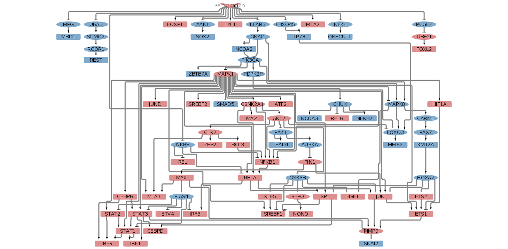
<br><br>

#### A549 cell line

Then for the A549 line:

```{r, message=FALSE, eval=FALSE}
CarnivalResults_A549vsCOV2 <-runCARNIVAL(
    solverPath="/opt/ibm/ILOG/CPLEX_Studio129/cplex/bin/x86-64_linux/cplex",
    netObj=NetworkCarnival_df,
    measObj=as.data.frame(tf_activities_A549vsCOV2_stat_top50),
    # inputObj = inputObj,
    # DOTfig=TRUE, 
    dir_name="ResultsCARNIVAL",
    weightObj=t(pathways_A549vsCOV2_zscore_inputCarnival),
    # nodeID = 'gene',
    timelimit = 1200,
    solver = "cplex")
saveRDS(CarnivalResults_A549vsCOV2, file = "ResultsCARNIVAL/A549_noinput.rds")
OutputCyto(CarnivalResults_A549vsCOV2, 
  outputFile="ResultsCARNIVAL/A549_noinput")
```

<br><br>
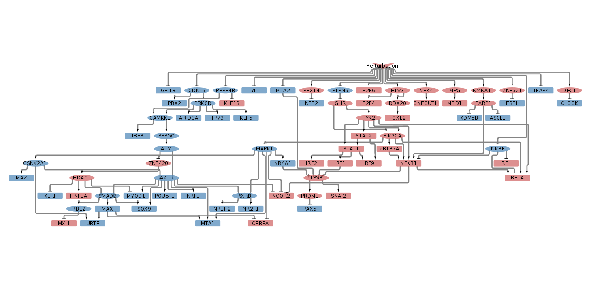
<br><br>

#### A549 cell line transduced with ACE2 

Then for the A549 line transduced with ACE2:

```{r, message=FALSE, eval=FALSE}
CarnivalResults_A549ACE2vsCOV2 <-runCARNIVAL(
    solverPath="/opt/ibm/ILOG/CPLEX_Studio129/cplex/bin/x86-64_linux/cplex",
    netObj=NetworkCarnival_df,
    measObj=as.data.frame(tf_activities_A549ACE2vsCOV2_stat_top50),
    # inputObj = inputObj,
    # DOTfig=TRUE, 
    dir_name="ResultsCARNIVAL",
    weightObj=t(pathways_A549ACE2vsCOV2_zscore_inputCarnival),
    # nodeID = 'gene',
    timelimit = 1200,
    solver = "cplex")
saveRDS(CarnivalResults_A549ACE2vsCOV2, file = "ResultsCARNIVAL/A549ACE2_noinput.rds")
OutputCyto(CarnivalResults_A549ACE2vsCOV2, 
  outputFile="ResultsCARNIVAL/A549ACE2_noinput")
```

<br><br>
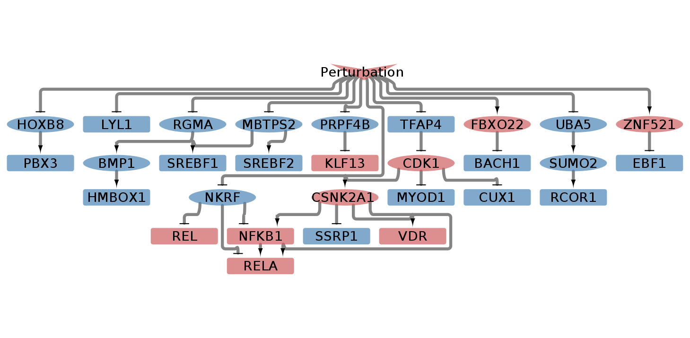
<br><br>

#### CALU-3 cell line

Now for the CALU-3 line:

```{r, message=FALSE, eval=FALSE}
CarnivalResults_CALU3vsCOV2 <-runCARNIVAL(
    solverPath="/opt/ibm/ILOG/CPLEX_Studio129/cplex/bin/x86-64_linux/cplex",
    netObj=NetworkCarnival_df,
    measObj=as.data.frame(tf_activities_CALU3vsCOV2_stat_top50),
    # inputObj = inputObj,
    # DOTfig=TRUE, 
    dir_name="ResultsCARNIVAL",
    weightObj=t(pathways_CALU3vsCOV2_zscore_inputCarnival),
    # nodeID = 'gene',
    timelimit = 1200,
    solver = "cplex")
saveRDS(CarnivalResults_CALU3vsCOV2, file = "ResultsCARNIVAL/CALU3_noinput.rds")
OutputCyto(CarnivalResults_CALU3vsCOV2, 
  outputFile="ResultsCARNIVAL/CALU3_noinput")
```

This is the network after importing CARNIVAL results into cytoscape:

<br><br>
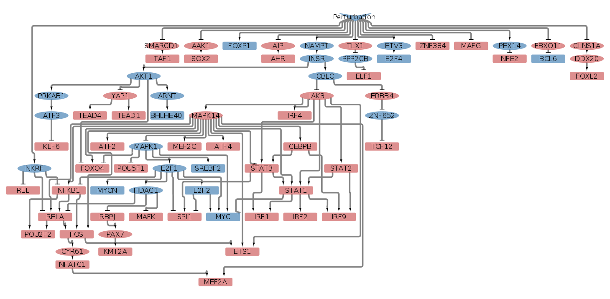
<br><br>


### CARNIVAL with ACE2 perturbation

Angiotensin I converting enzyme 2 (ACE2), is the host receptor by SARS-CoV-2  
to infect human cells. Therefore, we can assume that the signaling downstream
of this receptor could be affected by the infection. Accordingly, we now run
**CARNIVAL** using ACE2 as a perturbation. However, Omnipath has not many 
interactions downstream of ACE2: 

```{r}
NetworkCarnival_df %>% dplyr::filter(from == "ACE2")
```

We therefore decided to manually include into our Omnipath network interactions
whose source is ACE2 from the signaling interactions collected in the Nichenet
paper. The problem is that we do not know the sign of the interaction. I  
consider stimulations.

```{r, message=FALSE}
sig_Network_Nichenet <- 
    readRDS(url("https://zenodo.org/record/3260758/files/signaling_network.rds")) %>% 
    dplyr::filter(from == "ACE2") %>% 
    tibble::add_column(interaction = 1) %>% 
    dplyr::select(from, interaction, to)

NetworkCarnivalACE2_df <- 
  bind_rows(NetworkCarnival_df, sig_Network_Nichenet) %>% 
  dplyr::distinct()

ACE2_perturbation <- data.frame(ACE2 = -1)
```

#### NHBE cell line

We now run **CARNIVAL** for the NHBE line:

```{r, message=FALSE, eval=FALSE}
CarnivalResults_NHBEvsCOV2_ACE2 <-runCARNIVAL(
    solverPath="/opt/ibm/ILOG/CPLEX_Studio129/cplex/bin/x86-64_linux/cplex",
    netObj=NetworkCarnivalACE2_df,
    measObj=as.data.frame(tf_activities_NHBEvsCOV2_stat_top50),
    inputObj = ACE2_perturbation,
    # DOTfig=TRUE, 
    dir_name="ResultsCARNIVAL",
    weightObj=t(pathways_NHBEvsCOV2_zscore_inputCarnival),
    # nodeID = 'gene',
    timelimit = 1200,
    solver = "cplex")
saveRDS(CarnivalResults_NHBEvsCOV2_ACE2, 
  file = "ResultsCARNIVAL/NHBE_ACE2input.rds")
OutputCyto(CarnivalResults_NHBEvsCOV2_ACE2, 
  outputFile="ResultsCARNIVAL/NHBE_ACE2input")
```

<br><br>
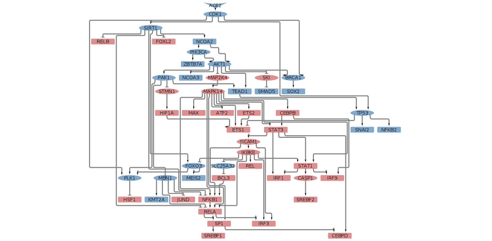
<br><br>

#### A549 cell line

And now for the A549 line:

```{r, message=FALSE, eval=FALSE}
CarnivalResults_A549vsCOV2_ACE2 <-runCARNIVAL(
    solverPath="/opt/ibm/ILOG/CPLEX_Studio129/cplex/bin/x86-64_linux/cplex",
    netObj=NetworkCarnivalACE2_df,
    measObj=as.data.frame(tf_activities_A549vsCOV2_stat_top50),
    inputObj = ACE2_perturbation,
    # DOTfig=TRUE, 
    dir_name="ResultsCARNIVAL",
    weightObj=t(pathways_A549vsCOV2_zscore_inputCarnival),
    # nodeID = 'gene',
    timelimit = 1200,
    solver = "cplex")
saveRDS(CarnivalResults_A549vsCOV2_ACE2, 
  file = "ResultsCARNIVAL/A549_ACE2input.rds")
OutputCyto(CarnivalResults_A549vsCOV2_ACE2, 
  outputFile="ResultsCARNIVAL/A549_ACE2input")
```

<br><br>
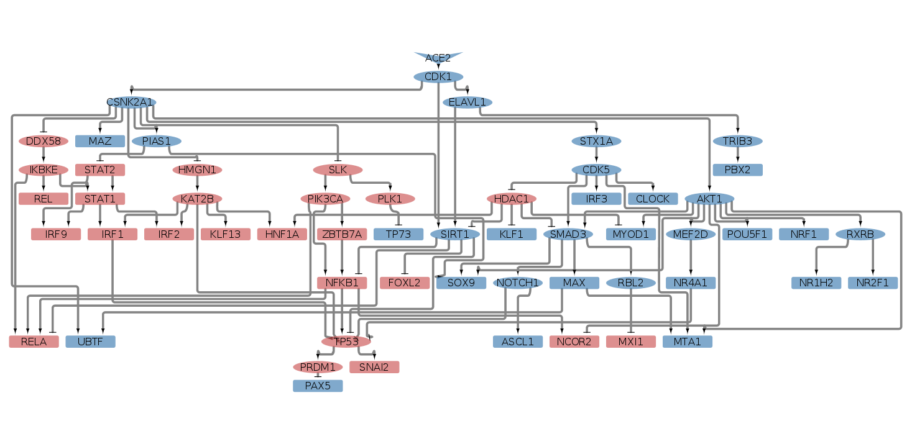
<br><br>

#### A549 cell line transduced with ACE2

And now for the A549 line transduced with ACE2:

```{r, message=FALSE, eval=FALSE}
CarnivalResults_A549ACE2vsCOV2_ACE2 <-runCARNIVAL(
    solverPath="/opt/ibm/ILOG/CPLEX_Studio129/cplex/bin/x86-64_linux/cplex",
    netObj=NetworkCarnivalACE2_df,
    measObj=as.data.frame(tf_activities_A549ACE2vsCOV2_stat_top50),
    inputObj = ACE2_perturbation,
    # DOTfig=TRUE, 
    dir_name="ResultsCARNIVAL",
    weightObj=t(pathways_A549ACE2vsCOV2_zscore_inputCarnival),
    # nodeID = 'gene',
    timelimit = 1200,
    solver = "cplex")
saveRDS(CarnivalResults_A549ACE2vsCOV2_ACE2, 
  file = "ResultsCARNIVAL/A549ACE2_ACE2input.rds")
OutputCyto(CarnivalResults_A549ACE2vsCOV2_ACE2, 
  outputFile="ResultsCARNIVAL/A549ACE2_ACE2input")
```

<br><br>
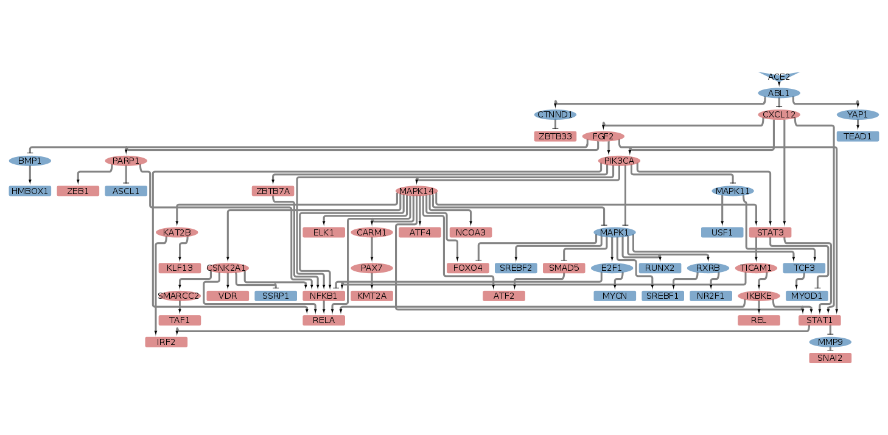
<br><br>

#### CALU-3 cell line

We now run **CARNIVAL** for the CALU-3 line:

```{r, message=FALSE, eval=FALSE}
CarnivalResults_CALU3vsCOV2_ACE2 <-runCARNIVAL(
    solverPath="/opt/ibm/ILOG/CPLEX_Studio129/cplex/bin/x86-64_linux/cplex",
    netObj=NetworkCarnivalACE2_df,
    measObj=as.data.frame(tf_activities_CALU3vsCOV2_stat_top50),
    inputObj = ACE2_perturbation,
    # DOTfig=TRUE, 
    dir_name="ResultsCARNIVAL",
    weightObj=t(pathways_CALU3vsCOV2_zscore_inputCarnival),
    # nodeID = 'gene',
    timelimit = 1200,
    solver = "cplex")
saveRDS(CarnivalResults_CALU3vsCOV2_ACE2, 
  file = "ResultsCARNIVAL/CALU3_ACE2input.rds")
OutputCyto(CarnivalResults_CALU3vsCOV2_ACE2, 
  outputFile="ResultsCARNIVAL/CALU3_ACE2input")
```

<br><br>
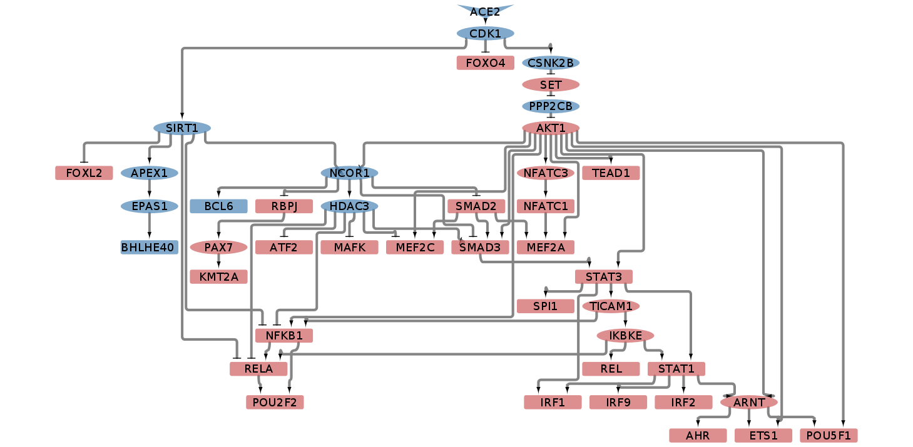
<br><br>

### CARNIVAL with host-virus interaction as Perturbation

We took human-SARS-CoV-2  (host-pathogen protein interactions) from Gordon et 
al. 2020. We consider that the signaling effect of this proteins is perturbed
due to their interaction with viruses proteins.

```{r, message=FALSE, warning=FALSE}
## downloading the host-pathogen interactions from the paper
url_s2 <- paste0(
    'https://www.biorxiv.org/content/biorxiv/early/',
    '2020/03/23/2020.03.22.002386/DC4/embed/media-4.xlsx?download=true')
human_sarscov2_raw <- read.xlsx(url_s2, startRow = 2) %>% 
  as_tibble() %>% 
  dplyr::select(Bait, PreyGene, FoldChange) %>% 
  dplyr::mutate(Bait = sub("SARS-CoV2 ","",Bait))
```

For visualization purposes, I am going to reduce the number of virus-host 
interactions to the top 50 in terms of FoldChange. We consider that the 50 
human proteins are already present in the Omnipath network. 

```{r, eval=TRUE, echo=TRUE}
## Host-virus interactions selection and format
human_sarscov2_top50 <- human_sarscov2_raw %>% 
  dplyr::filter(PreyGene %in% AllNodesNetwork) %>% 
  dplyr::top_n(50, FoldChange) %>%
  tibble::add_column(interaction = -1) %>% 
  dplyr::rename(from = "Bait", to = "PreyGene") %>% 
  dplyr::select(from, interaction, to)
```

We finally merge the host-virus interaction with our CARNIVAL network and we 
define as perturbed the virus proteins. 

```{r}
NetworkCarnivalHostVirus_df <- 
  bind_rows(NetworkCarnival_df, human_sarscov2_top50) %>% 
  dplyr::distinct()

## We have to be careful with the gene names with a "-". CPLEX gets crazy. 
NetworkCarnivalHostVirus_df$from <- 
  gsub("-","_", NetworkCarnivalHostVirus_df$from)
NetworkCarnivalHostVirus_df$to <- 
  gsub("-","_", NetworkCarnivalHostVirus_df$to)

Virusproteins <- unique(human_sarscov2_top50$from)
Virusproteins <-  gsub("-","_", Virusproteins)
HostVirus_perturbation <- 
  data.frame(Virusproteins = rep(1,length(Virusproteins)))
rownames(HostVirus_perturbation) <- Virusproteins
```

#### NHBE cell line

We now run **CARNIVAL** for the NHBE line:

```{r, message=FALSE, eval=FALSE}
CarnivalResults_NHBEvsCOV2_HostVirus <-runCARNIVAL(
    solverPath="/opt/ibm/ILOG/CPLEX_Studio129/cplex/bin/x86-64_linux/cplex",
    netObj=NetworkCarnivalHostVirus_df,
    measObj=as.data.frame(tf_activities_NHBEvsCOV2_stat_top50),
    inputObj = as.data.frame(t(as.matrix(HostVirus_perturbation))),
    # DOTfig=TRUE, 
    dir_name="ResultsCARNIVAL",
    weightObj=t(pathways_NHBEvsCOV2_zscore_inputCarnival),
    # nodeID = 'gene',
    timelimit = 1200,
    solver = "cplex")
saveRDS(CarnivalResults_NHBEvsCOV2_HostVirus, 
  file = "ResultsCARNIVAL/NHBE_HostVirusinput.rds")
OutputCyto(CarnivalResults_NHBEvsCOV2_HostVirus, 
  outputFile="ResultsCARNIVAL/NHBE_HostVirusinput")
```

<br><br>
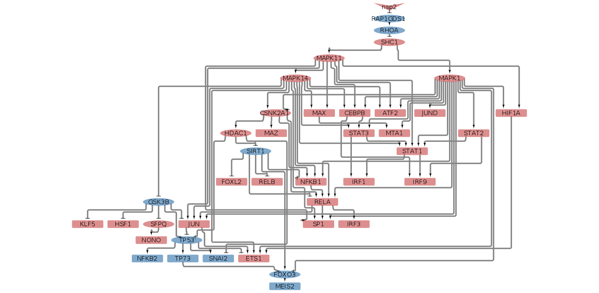
<br><br>

#### A549 cell line

And now for the A549 line:

```{r, message=FALSE, eval=FALSE}
CarnivalResults_A549vsCOV2_HostVirus <-runCARNIVAL(
    solverPath="/opt/ibm/ILOG/CPLEX_Studio129/cplex/bin/x86-64_linux/cplex",
    netObj=NetworkCarnivalHostVirus_df,
    measObj=as.data.frame(tf_activities_A549vsCOV2_stat_top50),
    inputObj = as.data.frame(t(as.matrix(HostVirus_perturbation))),
    # DOTfig=TRUE, 
    dir_name="ResultsCARNIVAL",
    weightObj=t(pathways_A549vsCOV2_zscore_inputCarnival),
    # nodeID = 'gene',
    timelimit = 1200,
    solver = "cplex")
saveRDS(CarnivalResults_A549vsCOV2_HostVirus, 
  file = "ResultsCARNIVAL/A549_HostVirusinput.rds")
OutputCyto(CarnivalResults_A549vsCOV2_HostVirus, 
  outputFile="ResultsCARNIVAL/A549_HostVirusinput")
```

<br><br>
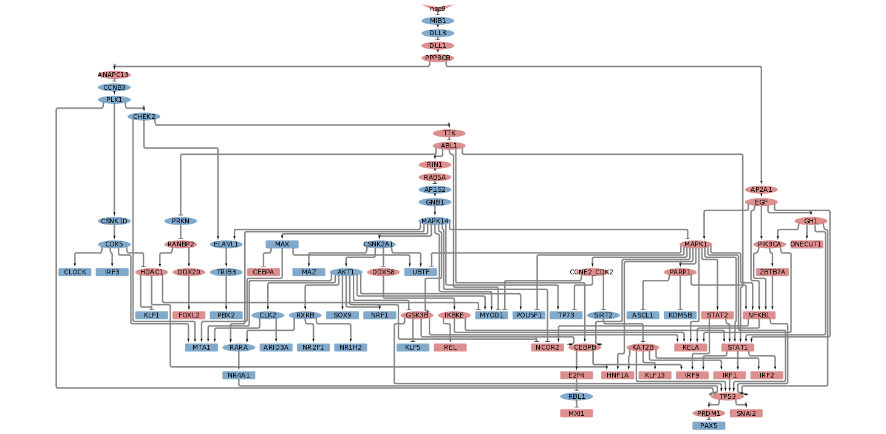
<br><br>

#### A549 cell line transfected with ACE2

And now for the A549 line transfected with ACE2:

```{r, message=FALSE, eval=FALSE}
CarnivalResults_A549ACE2vsCOV2_HostVirus <-runCARNIVAL(
    solverPath="/opt/ibm/ILOG/CPLEX_Studio129/cplex/bin/x86-64_linux/cplex",
    netObj=NetworkCarnivalHostVirus_df,
    measObj=as.data.frame(tf_activities_A549ACE2vsCOV2_stat_top50),
    inputObj = as.data.frame(t(as.matrix(HostVirus_perturbation))),
    # DOTfig=TRUE, 
    dir_name="ResultsCARNIVAL",
    weightObj=t(pathways_A549ACE2vsCOV2_zscore_inputCarnival),
    # nodeID = 'gene',
    timelimit = 1200,
    solver = "cplex")
saveRDS(CarnivalResults_A549ACE2vsCOV2_HostVirus, 
  file = "ResultsCARNIVAL/A549ACE2_HostVirusinput.rds")
OutputCyto(CarnivalResults_A549ACE2vsCOV2_HostVirus, 
  outputFile="ResultsCARNIVAL/A549ACE2_HostVirusinput")
```

<br><br>
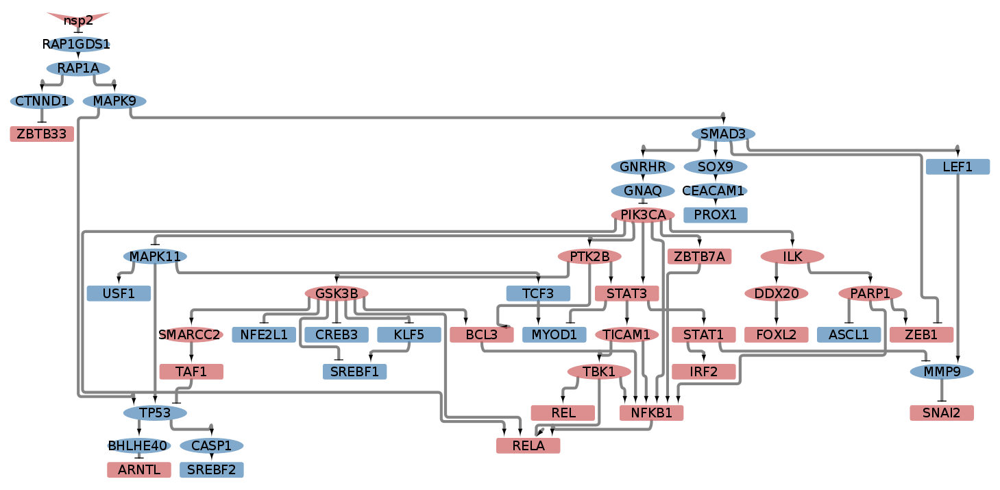
<br><br>

#### CALU-3 cell line

We now run **CARNIVAL** for the CALU-3 line:

```{r, message=FALSE, eval=FALSE}
CarnivalResults_CALU3vsCOV2_HostVirus <-runCARNIVAL(
    solverPath="/opt/ibm/ILOG/CPLEX_Studio129/cplex/bin/x86-64_linux/cplex",
    netObj=NetworkCarnivalHostVirus_df,
    measObj=as.data.frame(tf_activities_CALU3vsCOV2_stat_top50),
    inputObj = as.data.frame(t(as.matrix(HostVirus_perturbation))),
    # DOTfig=TRUE, 
    dir_name="ResultsCARNIVAL",
    weightObj=t(pathways_CALU3vsCOV2_zscore_inputCarnival),
    # nodeID = 'gene',
    timelimit = 1200,
    solver = "cplex")
saveRDS(CarnivalResults_CALU3vsCOV2_HostVirus, 
  file = "ResultsCARNIVAL/CALU3_HostVirusinput.rds")
OutputCyto(CarnivalResults_CALU3vsCOV2_HostVirus, 
  outputFile="ResultsCARNIVAL/CALU3_HostVirusinput")
```

<br><br>
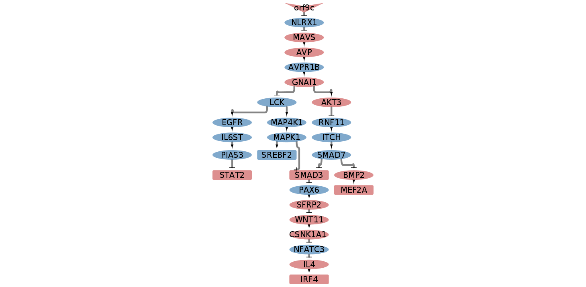
<br><br>

## Session Info Details

```{r, echo=FALSE, eval=TRUE}
sessionInfo()
```

